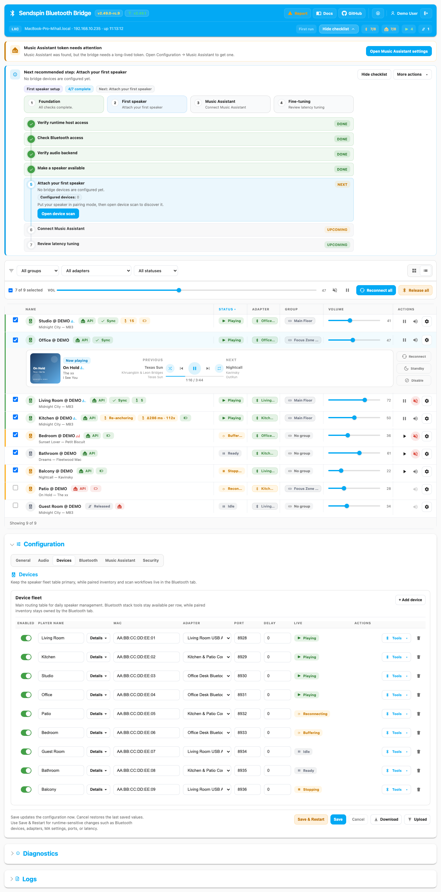

# [Sendspin](https://www.sendspin-audio.com/) Bluetooth Bridge

[](https://github.com/trudenboy/sendspin-bt-bridge/releases/latest)
[](https://github.com/trudenboy/sendspin-bt-bridge/actions/workflows/ci.yml)
[](https://github.com/trudenboy/sendspin-bt-bridge/pkgs/container/sendspin-bt-bridge)
[](https://analytics.home-assistant.io/apps/)
[](https://github.com/trudenboy/sendspin-bt-bridge/stargazers)
[](LICENSE)
[](https://sendspin-demo.onrender.com)

**🏠 [Landing Page](https://sendspin-bt-bridge.pages.dev/)** · **📖 [Documentation](https://trudenboy.github.io/sendspin-bt-bridge/)** · **🚀 [Live Demo](https://sendspin-demo.onrender.com)** · **RU [Русская версия](README.ru.md)**

[Changelog](CHANGELOG.md) · [Roadmap](ROADMAP.md) · [Contributing](CONTRIBUTING.md) · [Security](SECURITY.md)

Turn Bluetooth speakers and headphones into native [Music Assistant](https://www.music-assistant.io/) [Sendspin](https://www.music-assistant.io/player-support/sendspin/) players.

Sendspin Bluetooth Bridge is a local-first, headless-friendly bridge for Home Assistant, Docker, Raspberry Pi, and LXC deployments. Each Bluetooth device appears in Music Assistant as its own player, with web UI management, diagnostics, and multi-room-friendly deployment options.



## What it does

- Turns ordinary Bluetooth speakers and headphones into Music Assistant players.
- Bridges multiple devices at once, with BridgeOrchestrator coordinating one isolated playback subprocess per speaker.
- Adds a web UI for setup, Bluetooth pairing workflows, diagnostics, logs, and config backup.
- Guides setup and recovery with an onboarding checklist, operator guidance banners, and action-oriented troubleshooting.
- Supports Home Assistant addon, Docker, Raspberry Pi, Proxmox VE LXC, and OpenWrt LXC deployments.
- Helps you scale beyond one room by running multiple bridge instances against the same MA server.


## What you need

- A Bluetooth speaker or headphones — any A2DP-capable device works.
- A [Music Assistant](https://www.music-assistant.io/) server (v2.3+) with the [Sendspin provider](https://www.music-assistant.io/player-support/sendspin/) enabled.
- A Linux host with a USB or built-in Bluetooth adapter — Raspberry Pi, NUC, Proxmox VM, or a Home Assistant OS installation.

No command-line setup required. The web UI handles Bluetooth scanning, pairing, and Music Assistant configuration entirely from the browser.

### Tested on

| Platform | Hardware | Audio system |
|----------|----------|-------------|
| Home Assistant OS 17+ | Proxmox VM, Raspberry Pi 4/5 | PulseAudio 17 |
| Ubuntu 22.04 / 24.04 | x86_64, aarch64 | PulseAudio / PipeWire |
| Proxmox VE 8.x LXC | x86_64 | PulseAudio |
| OpenWrt 23+ LXC | aarch64, armv7 | PulseAudio |

## Runtime modes

The project now has two practical runtime modes:

- **Production mode** — real Bluetooth, PulseAudio/PipeWire, and Music Assistant integration.
- **Demo mode** — deterministic UI/test stand for docs, screenshots, and offline UX review.

Run the local demo from the repository root:

```bash
DEMO_MODE=true python sendspin_client.py
```

Then open `http://127.0.0.1:8080/`. Demo mode ships a stable nine-player fixture with onboarding, diagnostics, logs, group state, and MA metadata preloaded, so contributors can document and review the UI without live hardware.

## Quick start: Home Assistant

The fastest path is the Home Assistant addon.

[](https://my.home-assistant.io/redirect/supervisor_add_addon_repository/?repository_url=https%3A%2F%2Fgithub.com%2Ftrudenboy%2Fsendspin-bt-bridge)

1. Add the repository to Home Assistant.
2. Install **Sendspin Bluetooth Bridge** from the Add-on Store.
3. Start the addon and open the web UI from the HA sidebar.
4. Add your Bluetooth speakers, then use **Configuration → Music Assistant** to connect or reconfigure Music Assistant. The dashboard onboarding checklist and recovery hints point to the next safe step.

Full Home Assistant guide: <https://trudenboy.github.io/sendspin-bt-bridge/installation/ha-addon/>

## Quick start: Docker

```bash
git clone https://github.com/trudenboy/sendspin-bt-bridge.git
cd sendspin-bt-bridge
docker compose up -d
```

Open `http://<host-ip>:8080/` and follow the onboarding checklist. Full Docker guide: <https://trudenboy.github.io/sendspin-bt-bridge/installation/docker/>

## Choose your deployment

| Deployment | Best for | Install path | Docs |
|---|---|---|---|
| **Home Assistant Addon** | HAOS / Supervised users | Add-on Store | [Open guide](https://trudenboy.github.io/sendspin-bt-bridge/installation/ha-addon/) |
| **Docker** | Generic Linux hosts | `docker compose up -d` | [Open guide](https://trudenboy.github.io/sendspin-bt-bridge/installation/docker/) |
| **Raspberry Pi** | Pi-based installs | Docker-based setup | [Open guide](https://trudenboy.github.io/sendspin-bt-bridge/installation/raspberry-pi/) |
| **Proxmox / OpenWrt LXC** | Appliances, routers, lightweight hosts | Host bootstrap script | [Open guide](https://trudenboy.github.io/sendspin-bt-bridge/installation/lxc/) |

## Key capabilities

- **Synchronized streaming** — uses the [Sendspin](https://www.music-assistant.io/player-support/sendspin/) protocol to deliver lossless audio with time-aligned playback, so grouped speakers stay in sync across rooms.
- **No console required** — scan for Bluetooth devices, pair them, and connect to Music Assistant entirely from the web UI. No `bluetoothctl`, no config files, no SSH.
- **Deep Music Assistant integration** — now playing, album art, transport controls, group volume, shuffle and repeat — all synced in real time through a persistent connection to the MA server.
- **Home Assistant automations** — every Bluetooth speaker becomes a Music Assistant player entity visible in HA. Use it in automations, scripts, scenes, dashboards, and with voice assistants.
- **Reliable Bluetooth** — automatic reconnection, disconnect detection, and device health monitoring keep your speakers connected without manual intervention.
- **Guided setup and recovery** — built-in onboarding, recovery guidance, and diagnostics-driven bug reporting reduce the amount of trial-and-error during setup and troubleshooting.
- **Stable demo stand** — the public live demo and `DEMO_MODE=true python sendspin_client.py` provide a repeatable UI, screenshot, and test environment without Bluetooth hardware.
- **Multi-room ready** — run one bridge per room or one bridge with many speakers. Multiple bridges share the same Music Assistant server for whole-home audio.
- **Five deployment options** — Home Assistant addon, Docker, Raspberry Pi, Proxmox VE LXC, and OpenWrt LXC — same bridge, same web UI, same features everywhere.
- **REST API and live updates** — 60+ automation-friendly endpoints with real-time SSE status stream for custom dashboards and integrations.

## Roadmap at a glance

The roadmap is now aligned with the **v3 wave**, starting from the shipped `v2.46.x` runtime instead of an older refactor wishlist.

- **Already landed as baseline:** the operator guidance and recovery polish wave that made mature installs calmer and bulk actions more deliberate.
- **Now:** land backend abstraction plus config schema v2 as the foundation for multi-backend work.
- **Next major product step:** ship USB DAC and wired audio players as the first adjacent backend, with custom PulseAudio sink tooling following where it unlocks real room layouts.
- **Then:** add audio health visibility, signal-path clarity, and guided delay tuning so Bluetooth and wired players share the same observability story.
- **After that:** expand into AI-assisted diagnostics and deployment planning, and only later into centralized multi-bridge fleet management.

See [`ROADMAP.md`](ROADMAP.md) for the full phased v3 plan and guardrails.

## Runtime contracts

The bridge now treats a few runtime surfaces as operator-facing contracts:

- **Lifecycle publication** — startup and shutdown move through explicit `bridge.startup.started`, `bridge.startup.failed`, `bridge.startup.completed`, `bridge.shutdown.started`, and `bridge.shutdown.completed` events. The same phases are reflected in `startup_progress` and `runtime_info`.
- **Diagnostics and telemetry** — `/api/diagnostics` and `/api/bridge/telemetry` are the canonical runtime inspection endpoints. They include `startup_progress`, `runtime_info`, hook delivery status, and `contract_versions` for the config schema and subprocess IPC protocol.
- **Subprocess IPC** — parent/daemon JSON-line envelopes always carry `protocol_version` from `services/ipc_protocol.py`. Compatibility checks happen at the envelope layer instead of silently reshaping messages.
- **Runtime hooks** — `/api/hooks` delivers the same internal bridge and device events that power diagnostics, so lifecycle automations can subscribe to a stable event stream instead of scraping logs.

## Operator UX

- **Onboarding and recovery** — the header guidance surfaces a five-step setup checklist, recovery notices, and safe next actions such as reconnecting a speaker or reclaiming Bluetooth management after a release.
- **Music Assistant reconfigure flow** — reopen **Configuration → Music Assistant** at any time to reconnect or move to another MA instance. In the Home Assistant addon, **Sign in with Home Assistant** can silently mint or reuse the MA token through Ingress when available, then falls back to the regular HA login flow.
- **Support-first diagnostics** — **Submit bug report** downloads masked diagnostics and opens GitHub with a suggested description prefilled from current diagnostics, recovery guidance, and recent issue logs.

## Documentation map

Use the docs site for the full guides and reference:

- [Installation](https://trudenboy.github.io/sendspin-bt-bridge/installation/ha-addon/)
- [Configuration](https://trudenboy.github.io/sendspin-bt-bridge/configuration/)
- [Web UI](https://trudenboy.github.io/sendspin-bt-bridge/web-ui/)
- [Devices](https://trudenboy.github.io/sendspin-bt-bridge/devices/)
- [API Reference](https://trudenboy.github.io/sendspin-bt-bridge/api/)
- [Troubleshooting](https://trudenboy.github.io/sendspin-bt-bridge/troubleshooting/)
- [Architecture](https://trudenboy.github.io/sendspin-bt-bridge/architecture/)
- [Test stand](https://trudenboy.github.io/sendspin-bt-bridge/test-stand/)

## Community and support

- [GitHub Issues](https://github.com/trudenboy/sendspin-bt-bridge/issues)
- [Music Assistant community discussion](https://github.com/orgs/music-assistant/discussions/5061)
- [Home Assistant community thread](https://community.home-assistant.io/t/sendspin-bluetooth-bridge-turn-any-bt-speaker-into-an-ma-player-and-ha/993762)
- [Discord channel](https://discord.com/channels/330944238910963714/1479933490991599836)

## Project links

- [Contributing](CONTRIBUTING.md)
- [Roadmap](ROADMAP.md)
- [License (MIT)](LICENSE)
- [Changelog](CHANGELOG.md)
- [Security Policy](SECURITY.md)
- [Code of Conduct](CODE_OF_CONDUCT.md)
- [History](HISTORY.md)
