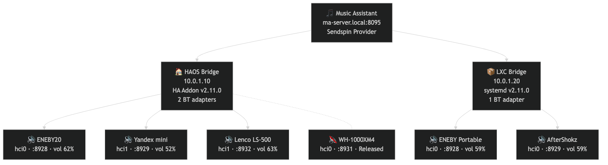

# Sendspin Bluetooth Bridge

[Читать на русском](README.ru.md) · [📖 Documentation](https://trudenboy.github.io/sendspin-bt-bridge/) · [📋 History](HISTORY.md)

A Bluetooth bridge for [Music Assistant](https://www.music-assistant.io/) — connects your Bluetooth speakers to the MA Sendspin protocol. Runs as a Docker container, a Home Assistant addon, or a native LXC container on Proxmox VE / OpenWrt. Designed for headless systems.

## Features

- **Sendspin Protocol**: Full support for Music Assistant's native Sendspin streaming protocol
- **Multi-device**: Bridge multiple Bluetooth speakers simultaneously, each appearing as its own MA player
- **Auto-reconnect**: Monitors speaker connections every 10 s and reconnects automatically
- **HA-aligned Web UI**: Dashboard styled to match Home Assistant/Music Assistant — CSS design tokens, automatic dark/light theme, Roboto font; live theme injection when opened via HA Ingress
- **Four deployment options**: Home Assistant addon, Docker Compose, Proxmox LXC, or OpenWrt LXC
- **PipeWire & PulseAudio**: Auto-detects the host audio system
- **Audio format display**: Codec, sample rate, and bit depth shown per device (e.g. `flac 48000Hz/24-bit/2ch`)
- **Group controls**: Volume and mute controls across multiple players from the web UI
- **MA API integration**: Rich now-playing data (track, artist, album, queue position) and transport controls (prev/next/shuffle/repeat) sourced from the MA REST API — works for both syncgroup members and solo players
- **BT adapter management**: Auto-detect adapters with manual override; pin each speaker to a specific adapter
- **Per-device latency compensation**: `static_delay_ms` field to compensate A2DP buffer latency
- **Diagnostics endpoint**: `/api/diagnostics` returns structured health info — adapters, sinks, D-Bus status, per-device state
- **Multiple bridge instances**: Run several bridge instances (containers/LXC/addons) against the same MA server — each registers its own set of players independently
- **Web UI authentication** — optional password protection and HA 2FA login


<br><br>

<br><br>


---

## Multi-bridge deployment

Run multiple bridge instances pointing at the same Music Assistant server to cover every room — each bridge handles the speakers within its Bluetooth range.

[](https://trudenboy.github.io/sendspin-bt-bridge/diagrams/multiroom-diagram/)

### Live topology example

Two bridge instances connected to one MA server — an HA addon on HAOS (4 speakers, 2 BT adapters) and a Docker container on a Proxmox LXC (2 speakers, 1 adapter). All active speakers are grouped into a single sync group for synchronized playback.



---

## Deployment Options

| | Home Assistant Addon | Docker Compose | Proxmox LXC | OpenWrt LXC |
|---|---|---|---|---|
| Install method | HA Addon Store (one-click) | `docker compose up` | One-line script | One-line script |
| Bluetooth | Host bluetoothd via D-Bus | Host bluetoothd via D-Bus | Own bluetoothd inside LXC | Host bluetoothd via D-Bus |
| Audio | HA Supervisor bridge | Host PulseAudio/PipeWire | Own PulseAudio inside LXC | Own PulseAudio inside LXC |
| Config UI | HA panel + web UI | Web UI at :8080 | Web UI at :8080 | Web UI at :8080 |
| Config changes | Addon restart | Container restart | `systemctl restart` | `systemctl restart` |

---

## Option A — Home Assistant Addon

### Install

**1. Add the addon repository to Home Assistant:**

[](https://my.home-assistant.io/redirect/supervisor_add_addon_repository/?repository_url=https%3A%2F%2Fgithub.com%2Ftrudenboy%2Fsendspin-bt-bridge)

Or manually: **Settings → Add-ons → Add-on store → ⋮ → Repositories** → add `https://github.com/trudenboy/sendspin-bt-bridge`

**2.** Find **Sendspin Bluetooth Bridge** in the store and click **Install**.

### Configure

In the addon **Configuration** tab:

```yaml
sendspin_server: auto          # or your MA hostname/IP
sendspin_port: 9000
bluetooth_devices:
  - mac: "AA:BB:CC:DD:EE:FF"
    player_name: "Living Room Speaker"
  - mac: "11:22:33:44:55:66"
    player_name: "Kitchen Speaker"
    adapter: hci1              # optional — only needed for multi-adapter setups
    static_delay_ms: -500      # optional — A2DP latency compensation in ms
```

The addon exposes the web UI via **HA Ingress** (no port forwarding needed) and appears in the HA sidebar. The UI automatically picks up your HA theme (light/dark) via the Ingress `setTheme` postMessage API.

### Requirements

- Home Assistant OS or Supervised
- Bluetooth adapter accessible to the host
- Music Assistant server running on your network (any host)

### Audio routing (HA OS)

The addon requests `audio: true` in its manifest so HA Supervisor injects `PULSE_SERVER` automatically. No manual socket configuration is needed.

---

## Option B — Docker Compose

### Prerequisites

- Docker and Docker Compose
- Bluetooth speakers **paired** with the host before starting the container
- Music Assistant server running on your network

### Pair speakers on the host first

```bash
bluetoothctl
scan on
pair  XX:XX:XX:XX:XX:XX
trust XX:XX:XX:XX:XX:XX
connect XX:XX:XX:XX:XX:XX
exit
```

### docker-compose.yml

```yaml
services:
  sendspin-client:
    image: ghcr.io/trudenboy/sendspin-bt-bridge:latest
    container_name: sendspin-client
    restart: unless-stopped
    network_mode: host
    privileged: true

    volumes:
      - /var/run/dbus:/var/run/dbus
      - /run/user/1000/pulse:/run/user/1000/pulse   # PulseAudio
      - /etc/docker/Sendspin:/config

    environment:
      - SENDSPIN_SERVER=auto
      - TZ=Australia/Melbourne
      - WEB_PORT=8080

    devices:
      - /dev/bus/usb:/dev/bus/usb

    cap_add:
      - NET_ADMIN
      - NET_RAW
      - SYS_ADMIN
```

Create config directory and start:

```bash
sudo mkdir -p /etc/docker/Sendspin
docker compose up -d
```

> **Migrating from an earlier install?** The image was previously published as `ghcr.io/loryanstrant/sendspin-client`. Update your compose file or pull command to `ghcr.io/trudenboy/sendspin-bt-bridge:latest`.

Access the web UI at `http://your-host-ip:8080` to add Bluetooth devices and set the MA server.

---

## Option C — Proxmox VE (LXC)

Run as a **native LXC container** — no Docker required. The container uses the **host's `bluetoothd` via a D-Bus bridge** (AF_BLUETOOTH is not available in LXC namespaces), with `pulseaudio --system` and `avahi-daemon` running inside the container.

For full documentation, prerequisites, manual install steps, pairing instructions, and monitoring commands, see **[lxc/README.md](lxc/README.md)**.

### One-line install (on the Proxmox host as root)

```bash
bash <(curl -fsSL https://raw.githubusercontent.com/trudenboy/sendspin-bt-bridge/main/lxc/proxmox-create.sh)
```

Or download and review first:

```bash
curl -fsSL https://raw.githubusercontent.com/trudenboy/sendspin-bt-bridge/main/lxc/proxmox-create.sh -o proxmox-create.sh
less proxmox-create.sh
bash proxmox-create.sh
```

The script interactively prompts for container ID, hostname, RAM, disk, network, and USB Bluetooth passthrough.

### Manual steps (Proxmox UI)

1. Create a new **privileged** LXC container (**Ubuntu 24.04**, 512 MB RAM, 4 GB disk)
2. Start the container and open a shell (`pct enter <CTID>`)
3. Run the installer:
   ```bash
   bash <(curl -fsSL https://raw.githubusercontent.com/trudenboy/sendspin-bt-bridge/main/lxc/install.sh)
   ```
4. Append to `/etc/pve/lxc/<CTID>.conf` on the **Proxmox host**:
   ```
   lxc.apparmor.profile: unconfined
   lxc.cgroup2.devices.allow: c 166:* rwm
   lxc.cgroup2.devices.allow: c 13:* rwm
   lxc.cgroup2.devices.allow: c 10:232 rwm
   lxc.mount.entry: /run/dbus bt-dbus none bind,create=dir 0 0
   lxc.cgroup2.devices.allow: c 189:* rwm
   ```
5. Restart the container: `pct restart <CTID>`

### Bluetooth pairing inside the LXC

```bash
pct enter <CTID>
btctl
power on
scan on
pair  XX:XX:XX:XX:XX:XX
trust XX:XX:XX:XX:XX:XX
connect XX:XX:XX:XX:XX:XX
exit
```

Then add the device in `/config/config.json` and restart the service:

```bash
pct exec <CTID> -- systemctl restart sendspin-client
```

### Key monitoring commands

```bash
pct exec <CTID> -- journalctl -u sendspin-client -f
pct exec <CTID> -- systemctl status sendspin-client pulseaudio-system avahi-daemon --no-pager
pct exec <CTID> -- pactl list sinks short
pct exec <CTID> -- btctl show
```

---

## Option D — OpenWrt LXC

Run as a **native LXC container** on OpenWrt-based routers (Turris Omnia, x86 OpenWrt, etc.) — no Docker required. The container uses the **host's `bluetoothd` via a D-Bus bridge** with `pulseaudio --system` inside the container.

For full documentation, prerequisites, manual install steps, and known issues, see **[lxc/openwrt/README.md](lxc/openwrt/README.md)**.

**Requirements:** ≥1 GB RAM, ≥2 GB free storage, USB Bluetooth adapter.

### One-line install (on OpenWrt host as root)

```sh
wget -qO- https://raw.githubusercontent.com/trudenboy/sendspin-bt-bridge/main/lxc/openwrt/create.sh | sh
```

Or download and review first:

```sh
wget https://raw.githubusercontent.com/trudenboy/sendspin-bt-bridge/main/lxc/openwrt/create.sh
less create.sh
sh create.sh
```

The script installs LXC and Bluetooth packages via `opkg`, creates an Ubuntu 24.04 container, configures D-Bus bridge and cgroup rules, runs the in-container installer, and installs a procd init.d script for autostart.

### Key monitoring commands

```sh
lxc-attach -n sendspin -- journalctl -u sendspin-client -f
lxc-attach -n sendspin -- systemctl status sendspin-client pulseaudio-system --no-pager
lxc-attach -n sendspin -- pactl list sinks short
lxc-attach -n sendspin -- btctl show
```

---

## Configuration

### Multi-device config (`/config/config.json`)

The recommended way to configure multiple speakers:

```json
{
  "SENDSPIN_NAME": "Sendspin-Bridge",
  "SENDSPIN_SERVER": "auto",
  "SENDSPIN_PORT": "9000",
  "BLUETOOTH_DEVICES": [
    {
      "mac": "80:99:E7:C2:0B:D3",
      "player_name": "Living Room",
      "adapter": "hci0"
    },
    {
      "mac": "FC:58:FA:EB:08:6C",
      "player_name": "Kitchen",
      "adapter": "hci1"
    }
  ],
  "TZ": "Australia/Melbourne"
}
```

Each device in `BLUETOOTH_DEVICES` spawns an independent Sendspin player and Bluetooth manager. Both appear as separate players in Music Assistant.

The `adapter` field is optional — omit it if you only have one Bluetooth adapter. Set it to `hci0`, `hci1`, etc. when you have multiple adapters and want to pin a speaker to a specific one.

### Legacy single-device config (still supported)

```json
{
  "SENDSPIN_SERVER": "auto",
  "BLUETOOTH_MAC": "AA:BB:CC:DD:EE:FF"
}
```

### Environment Variables

| Variable | Default | Description |
|----------|---------|-------------|
| `SENDSPIN_NAME` | `Docker-{hostname}` | Base player name shown in Music Assistant |
| `SENDSPIN_SERVER` | `auto` | MA server hostname/IP; `auto` uses mDNS discovery |
| `SENDSPIN_PORT` | `9000` | MA Sendspin WebSocket port |
| `BLUETOOTH_MAC` | `` | Single speaker MAC (legacy; use `BLUETOOTH_DEVICES` in config.json instead) |
| `TZ` | `Australia/Melbourne` | Container timezone |
| `WEB_PORT` | `8080` | Web interface port |
| `MA_API_URL` | `` | Music Assistant REST API base URL (e.g. `http://192.168.1.10:8123`) — enables now-playing metadata and transport controls |
| `MA_API_TOKEN` | `` | HA long-lived access token for the MA API |
| `VOLUME_VIA_MA` | `true` | Route volume/mute through MA API; `false` = direct PulseAudio |
| `LOG_LEVEL` | `INFO` | Log verbosity (`INFO` or `DEBUG`); changeable at runtime via API |

Environment variables are overridden by values in `/config/config.json` if the file exists.

### Web Interface

The web UI at `http://your-host:8080` (or via HA Ingress) provides:

- **HA-aligned design**: CSS custom properties matching HA design tokens; automatic dark/light theme via `prefers-color-scheme`; live theme sync when opened inside HA Ingress
- **Per-device cards**: Connection status, playback state, audio format (codec/rate/depth), sync status, volume slider, mute toggle
- **Reconnect / Re-pair buttons**: Trigger manual reconnect or full re-pair without restarting
- **Group controls**: Set volume or mute across all devices at once
- **BT scan**: Scan for nearby audio devices and add them to config directly from the UI
- **BT adapter panel**: View detected adapters, set adapter per device
- **Configuration page**: Edit server address, add/remove Bluetooth devices, IANA timezone autocomplete
- **System info**: IP address, hostname, uptime, audio sink status, per-player WebSocket URL

---

## Architecture

The bridge runs as a **multi-process application**: one main process manages Bluetooth, the web API, and Music Assistant integration, while each configured speaker gets its own isolated subprocess with a dedicated PulseAudio context (`PULSE_SINK`).

```
┌─────────────────────────────────────┐
│     Music Assistant Server          │
│  (built-in Sendspin provider)       │
└──────────────┬──────────────────────┘
               │ WebSocket ws://<ma>:9000/sendspin
               │
┌──────────────▼──────────────────────┐
│     Sendspin Bluetooth Bridge       │
│                                     │
│  ┌─────────────────────────────┐    │
│  │  SendspinClient (per device)│    │
│  │  · daemon subprocess        │    │
│  │    (PULSE_SINK=bt_sink)     │    │
│  │  · playback state tracking  │    │
│  │  · volume sync via IPC      │    │
│  └─────────────────────────────┘    │
│  ┌─────────────────────────────┐    │
│  │  BluetoothManager           │    │
│  │  · bluetoothctl interface   │    │
│  │  · auto-reconnect every 10s │    │
│  │  · PipeWire/PulseAudio sink │    │
│  └─────────────────────────────┘    │
│  ┌─────────────────────────────┐    │
│  │  Web Interface (Flask/8080) │    │
│  │  · status dashboard         │    │
│  │  · config editor            │    │
│  │  · group controls           │    │
│  └─────────────────────────────┘    │
└──────────┬──────────────────────────┘
           │ Bluetooth A2DP
    ┌──────┴──────┐
    │  Speaker 1  │  Speaker 2  │  ...
    └─────────────┘
```

📖 **Full architecture documentation** with Mermaid diagrams — process model, IPC protocol, audio routing, Bluetooth state machine, MA integration, auth, and graceful degradation:
**[trudenboy.github.io/sendspin-bt-bridge/architecture/](https://trudenboy.github.io/sendspin-bt-bridge/architecture/)**

---

## Troubleshooting

### Bluetooth speaker won't connect

```bash
# Docker
docker exec -it sendspin-client bluetoothctl info XX:XX:XX:XX:XX:XX

# Pair manually
docker exec -it sendspin-client bluetoothctl
pair XX:XX:XX:XX:XX:XX
trust XX:XX:XX:XX:XX:XX
connect XX:XX:XX:XX:XX:XX

# Check logs
docker logs -f sendspin-client
```

### Can't connect to Music Assistant

1. Verify `SENDSPIN_SERVER` is correct or use `auto`
2. Ensure `network_mode: host` is set (required for mDNS)
3. Check MA logs for incoming Sendspin connections
4. Verify port 9000 is reachable from the host

### Audio routing issues (Docker)

The container needs access to the host audio socket. Add to `docker-compose.yml`:

```yaml
volumes:
  - /run/user/1000/pulse:/run/user/1000/pulse
environment:
  - PULSE_SERVER=unix:/run/user/1000/pulse/native
```

For PipeWire:
```yaml
volumes:
  - /run/user/1000/pipewire-0:/run/user/1000/pipewire-0
```

### Diagnostics

`GET /api/diagnostics` returns a JSON snapshot of the system state — adapters detected, PulseAudio sinks, D-Bus availability, and per-device status. Useful for remote debugging without shell access.

```bash
curl http://your-host:8080/api/diagnostics | python3 -m json.tool
```

### No audio sink after Bluetooth connects

The app tries several naming patterns automatically:
- `bluez_output.{MAC}.1` (PipeWire)
- `bluez_output.{MAC}.a2dp-sink`
- `bluez_sink.{MAC}.a2dp_sink` (PulseAudio)
- `bluez_sink.{MAC}`

List available sinks to confirm which is active:

```bash
docker exec -it sendspin-client pactl list short sinks
```

---

## Development

```bash
# Clone
git clone https://github.com/trudenboy/sendspin-bt-bridge.git
cd sendspin-bt-bridge

# Build and run locally
docker compose up --build

# View logs
docker logs -f sendspin-client

# Run without Docker (requires system BT/audio packages)
pip install -r requirements.txt
python sendspin_client.py
```

### Project structure

| File / Directory | Purpose |
|---|---|
| `sendspin_client.py` | Core orchestration — `SendspinClient`, `BluetoothManager` instantiation, `main()` |
| `bluetooth_manager.py` | `BluetoothManager` — BT pairing/connection/reconnect via `bluetoothctl` subprocess |
| `config.py` | Configuration management — `load_config()`, `DEFAULT_CONFIG`, `VERSION`, auth helpers |
| `state.py` | Shared runtime state — client list, SSE signaling, scan jobs, MA group/now-playing cache |
| `mpris.py` | MPRIS D-Bus integration — advertises each player to the host media bus |
| `web_interface.py` | Flask app entry point — registers blueprints, starts Waitress server |
| `routes/api.py` | All `/api/*` REST endpoints |
| `routes/views.py` | HTML page renders |
| `routes/auth.py` | Optional web UI password protection |
| `services/daemon_process.py` | Subprocess entry point — each speaker runs here with its own `PULSE_SINK` |
| `services/bridge_daemon.py` | `BridgeDaemon` subclass — handles Sendspin events inside each subprocess |
| `services/ma_monitor.py` | Persistent MA WebSocket monitor — subscribes to `player_queue_updated` events |
| `services/ma_client.py` | MA REST API helpers — group discovery, group play |
| `services/bluetooth.py` | BT helpers — `bt_remove_device()`, `persist_device_enabled()` |
| `services/pulse.py` | PulseAudio async helpers — sink discovery, stream routing correction |
| `scripts/translate_ha_config.py` | HA addon options.json → config.json translator (called by entrypoint.sh) |
| `entrypoint.sh` | Container startup — D-Bus, audio socket detection, HA config translation, app launch |
| `Dockerfile` | Container image |
| `docker-compose.yml` | Docker Compose orchestration |
| `ha-addon/config.yaml` | Home Assistant addon manifest |
| `ha-addon/Dockerfile` | HA addon image (thin wrapper over main image) |
| `ha-addon/run.sh` | HA entry point |
| `ha-addon/translations/en.yaml` | HA UI labels |
| `lxc/` | LXC install scripts (Proxmox and OpenWrt) |
| `docs-site/` | Astro Starlight documentation site (deployed to GitHub Pages) |

---

## Contributing

1. Fork the repository
2. Create a feature branch off `integration`
3. Make your changes
4. Submit a pull request against `integration`

---

## Credits

- Built for [Music Assistant](https://www.music-assistant.io/)
- Uses the `sendspin` CLI from the MA project
- Inspired by [sendspin-go](https://github.com/Sendspin/sendspin-go)
- Originally forked from [loryanstrant/Sendspin-client](https://github.com/loryanstrant/Sendspin-client)
- Born from the MA community discussion: [Sendspin Bluetooth Bridge #4677](https://github.com/orgs/music-assistant/discussions/4677)

## Support

- **Issues**: [GitHub Issues](https://github.com/trudenboy/sendspin-bt-bridge/issues)
- **Original discussion**: [music-assistant/discussions #4677](https://github.com/orgs/music-assistant/discussions/4677)
- **Music Assistant community**: [Discord](https://discord.gg/kaVm8hGpne)

## License

MIT License — see [LICENSE](LICENSE) for details.

---

## Changelog

See [CHANGELOG.md](CHANGELOG.md) for the full version history.

For a narrative history of the project's evolution (architecture decisions, milestones, v1 → v2 migration), see [HISTORY.md](HISTORY.md).
