## Overview

`sendspin-bt-bridge` is a **multi-process Python bridge** that connects Music Assistant's Sendspin audio protocol to Bluetooth speakers. Each configured speaker runs in its own **isolated subprocess** with a dedicated PulseAudio context, while the main runtime coordinates lifecycle, web/API surfaces, Bluetooth recovery, and Music Assistant integration. Current releases also include HA-aware channel detection plus top-level and per-device port planning (`WEB_PORT`, `BASE_LISTEN_PORT`, `listen_port`).

```
┌─────────────────────────────────────────────────────────────────┐
│                   Docker / LXC / HA Addon                       │
│                                                                 │
│  ┌──────────────────────────────────────────────────────────┐   │
│  │              Main Python Process                         │   │
│  │  sendspin_client.py  ·  asyncio event loop               │   │
│  │  Flask/Waitress API  ·  BluetoothManager × N             │   │
│  │  MaMonitor  ·  state.py                                   │   │
│  └───────────────┬──────────────────────────────────────────┘   │
│                  │ asyncio.create_subprocess_exec (per device)  │
│        ┌─────────┼─────────┐                                    │
│        ▼         ▼         ▼                                    │
│  ┌──────────┐ ┌──────────┐ ┌──────────┐                        │
│  │ daemon   │ │ daemon   │ │ daemon   │  PULSE_SINK=bluez_sink… │
│  │ process  │ │ process  │ │ process  │  per subprocess         │
│  │ ENEBY20  │ │ Yandex   │ │ Lenco    │                        │
│  └────┬─────┘ └────┬─────┘ └────┬─────┘                        │
│       │             │             │                              │
│       └──── Sendspin WebSocket ───┘                             │
│             (aiosendspin / Music Assistant)                      │
└─────────────────────────────────────────────────────────────────┘
         │                        │
    Bluetooth                PulseAudio / PipeWire
    (bluetoothctl             (bluez_sink.XX.a2dp_sink)
     + D-Bus)
```

---

## Component Map


```mermaid
graph TD
    subgraph "Container / Host"
        EP[entrypoint.sh<br/>D-Bus · Audio · HA config]
        EP --> MP

        subgraph "Main Process — sendspin_client.py"
            MP[main&#40;&#41;<br/>asyncio event loop]
            MP --> BO[BridgeOrchestrator]
            BO --> CFG[config.py<br/>load_config · port/channel defaults]
            BO --> LS[BridgeLifecycleState<br/>startup/runtime publication]
            BO --> MIS[BridgeMaIntegrationService<br/>MA URL/token/groups]
            BO --> SC[SendspinClient × N]
            BO --> BM[BluetoothManager × N]
            BO --> WS[Waitress HTTP server<br/>daemon thread]
            BO --> MM[MaMonitor<br/>asyncio task]
            BO --> UC[update_checker<br/>asyncio task]

            SC -->|delegates| SUBSVC[SubprocessCommand / IPC / Stderr / Stop services]
            SUBSVC <-->|JSON stdin/stdout| DP
            SC --> PH[PlaybackHealthMonitor]
            SC --> SEB[StatusEventBuilder]
            SC --- ST[state.py<br/>shared runtime state]
            BM --- ST
            LS --- ST
            MM --> ST
            UC --> ST

            WS --> FLASK[Flask app<br/>web_interface.py]
            FLASK --> BP_API[routes/api.py<br/>Blueprint]
            FLASK --> BP_BT[routes/api_bt.py<br/>Blueprint]
            FLASK --> BP_MA[routes/api_ma.py<br/>Blueprint]
            FLASK --> BP_CFG[routes/api_config.py<br/>Blueprint]
            FLASK --> BP_STS[routes/api_status.py<br/>Blueprint]
            FLASK --> BP_VIEW[routes/views.py<br/>Blueprint]
            FLASK --> BP_AUTH[routes/auth.py<br/>Blueprint]
        end

        subgraph "Subprocess per Device"
            DP[daemon_process.py<br/>asyncio event loop]
            DP --> BD[BridgeDaemon<br/>services/bridge_daemon.py]
            BD --> SD[SendspinDaemon<br/>sendspin-cli]
            SD <-->|WebSocket| MA[Music Assistant]
            BD --> PA[PulseAudio context<br/>PULSE_SINK=bluez_sink…]
        end

        subgraph "services/"
            SVC_BT[bluetooth.py<br/>BT helpers]
            SVC_PA[pulse.py<br/>PulseAudio helpers]
            SVC_MAC[ma_client.py<br/>MA REST API]
            SVC_IPC[ipc_protocol.py<br/>protocol_version envelope]
        end

        BM --> SVC_BT
        BM --> SVC_PA
        BD --> SVC_PA
        MM --> SVC_MAC
        BP_API --> SVC_MAC
        SUBSVC --> SVC_IPC
    end

    BT_HW[Bluetooth Hardware<br/>hci0 / hci1 / …]
    PA_HW[PulseAudio / PipeWire]

    BM <-->|bluetoothctl + D-Bus| BT_HW
    PA --> PA_HW
    BT_HW <-->|A2DP| SPK[Bluetooth Speaker]
    PA_HW --> SPK
```

---

## Process Architecture

### Main Process

The runtime entrypoint (`sendspin_client.py` `main()`) stays intentionally thin. Bridge-wide sequencing now lives in `BridgeOrchestrator`, which loads config, resolves channel-aware defaults, publishes lifecycle state, boots the web server, initializes optional MA integration, and assembles the long-running runtime tasks.

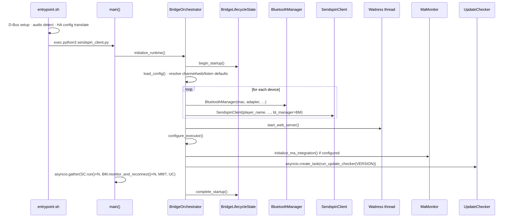
```mermaid
sequenceDiagram
    participant SH as entrypoint.sh
    participant MP as main()
    participant BO as BridgeOrchestrator
    participant LS as BridgeLifecycleState
    participant BM as BluetoothManager
    participant SC as SendspinClient
    participant WS as Waitress thread
    participant MM as MaMonitor
    participant UC as UpdateChecker

    SH->>SH: D-Bus setup · audio detect · HA config translate
    SH->>MP: exec python3 sendspin_client.py
    MP->>BO: initialize_runtime()
    BO->>LS: begin_startup()
    BO->>BO: load_config() · resolve channel/web/listen defaults
    loop for each device
        BO->>BM: BluetoothManager(mac, adapter, …)
        BO->>SC: SendspinClient(player_name, …, bt_manager=BM)
    end
    BO->>WS: start_web_server()
    BO->>BO: configure_executor()
    BO->>MM: initialize_ma_integration() if configured
    BO->>UC: asyncio.create_task(run_update_checker(VERSION))
    MP->>MP: asyncio.gather(SC.run()×N, BM.monitor_and_reconnect()×N, MM?, UC)
    BO->>LS: complete_startup()
```

### Bridge-wide orchestration and service seams

`BridgeOrchestrator` is now the runtime seam between bootstrap and the long-lived bridge. `sendspin_client.py` builds the orchestrator, calls `initialize_runtime()`, then hands the returned `RuntimeBootstrap` into `run_bridge_lifecycle()`.

| Seam | Responsibility | Operator-visible contract |
|---|---|---|
| `RuntimeBootstrap` | Normalized config, delivery channel, effective ports, latency, log level, and bridge-wide toggles | Feeds `/api/config`, `/api/startup-progress`, and channel-aware startup logging |
| `DeviceBootstrap` | Active clients plus `disabled_devices` filtered out of runtime startup | Explains why disabled devices appear in UI/diagnostics but do not get a daemon or listen port |
| `MaBootstrap` | Resolved MA URL/token plus optional `MaMonitor` task | Determines whether MA groups, now-playing, and queue control can go live |
| `BridgeLifecycleState` | Publishes startup/shutdown milestones into shared state | Drives `/api/startup-progress`, `/api/runtime-info`, diagnostics, and the dashboard progress banner |
| `EventHookRegistry` | Holds runtime-scoped webhook subscriptions and recent deliveries | Powers `/api/hooks` and the `event_hooks` block inside `/api/bridge/telemetry` and `/api/diagnostics` |

Lifecycle methods run in this order during a normal startup:

1. `initialize_runtime()` → loads config, resolves add-on track defaults, sets timezone/log level, and calls `begin_startup()`.
2. `initialize_devices()` → filters configured devices, creates `SendspinClient` / `BluetoothManager` pairs, and publishes runtime/device inventory.
3. `start_web_server()` + `configure_executor()` → publishes clients, starts Waitress, publishes the main loop, and marks the web phase ready.
4. `install_signal_handlers()` → wires `SIGTERM` / `SIGINT` to `graceful_shutdown()`.
5. `initialize_ma_integration()` → resolves MA credentials, preloads groups, and optionally starts `MaMonitor`.
6. `assemble_runtime_tasks()` / `complete_startup()` → starts long-running tasks and marks startup complete.

The startup-progress contract exposed to operators is intentionally fixed at **6 steps**:

| Step | Phase | Published by | Message |
|---|---|---|---|
| 1 | `config` | `begin_startup()` | `Loading configuration` |
| 2 | `runtime` | `publish_runtime_prepared()` | `Runtime configuration prepared` |
| 3 | `devices` | `publish_device_registry()` | `Device registry prepared` |
| 4 | `web` | `publish_main_loop()` | `Web interface and event loop ready` |
| 5 | `integrations` | `publish_ma_integration()` | `Music Assistant integrations initialized` |
| 6 | `ready` / `shutdown` | `complete_startup()` or shutdown publishers | `Startup complete`, `Shutdown in progress`, or `Shutdown complete` |

If any bootstrap phase raises, `publish_startup_failure()` marks `/api/startup-progress` with `status: error` plus a `startup_phase` detail. On shutdown, the same final step is reused with `status: stopping` and then `status: stopped`.

`/api/bridge/telemetry` is deliberately narrower than `/api/diagnostics`: it returns bridge environment details (`uptime_seconds`, RSS, Python/platform/audio/BlueZ info), the current `startup_progress`, `runtime_info`, live subprocess health, and the current hook registry snapshot. `/api/hooks` registrations are **runtime-only** (not persisted in config) and deliveries are filtered by optional `categories` / `event_types`.

### Per-Device Subprocess

Each `SendspinClient.run()` spawns `daemon_process.py` as an **isolated subprocess**. The subprocess gets `PULSE_SINK=bluez_sink.<MAC>.a2dp_sink` injected into its environment before any PulseAudio connection is made — so audio routes correctly from the very first sample, without needing `move-sink-input`.

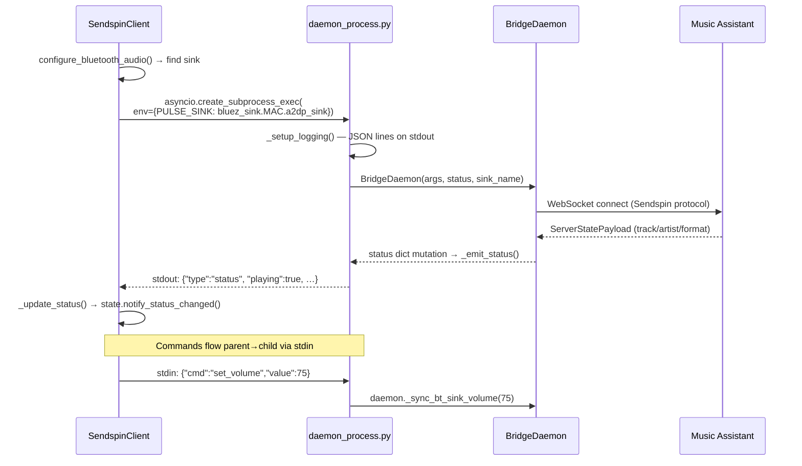
```mermaid
sequenceDiagram
    participant SC as SendspinClient
    participant DP as daemon_process.py
    participant BD as BridgeDaemon
    participant MA as Music Assistant

    SC->>SC: configure_bluetooth_audio() → find sink
    SC->>DP: asyncio.create_subprocess_exec(<br/>env={PULSE_SINK: bluez_sink.MAC.a2dp_sink})
    DP->>DP: _setup_logging() — JSON lines on stdout
    DP->>BD: BridgeDaemon(args, status, sink_name)
    BD->>MA: WebSocket connect (Sendspin protocol)
    MA-->>BD: ServerStatePayload (track/artist/format)
    BD-->>DP: status dict mutation → _emit_status()
    DP-->>SC: stdout: {"type":"status", "playing":true, …}
    SC->>SC: _update_status() → state.notify_status_changed()
    Note over SC,DP: Commands flow parent→child via stdin
    SC->>DP: stdin: {"cmd":"set_volume","value":75}
    DP->>BD: daemon._sync_bt_sink_volume(75)
```

---

## IPC Protocol (stdin / stdout)

All inter-process communication between the main process and each daemon subprocess uses **newline-delimited JSON envelopes** defined by `services.ipc_protocol`.

The current contract stamps envelopes with `protocol_version: 1`, but the parent and child remain backward-compatible with legacy messages that omit the field.

### Subprocess → Parent (stdout)

| `type` | Fields | When |
|---|---|---|
| `status` | Full `DeviceStatus` dict + `protocol_version` | On any state change (de-duplicated) |
| `log` | `level`, `name`, `msg`, `protocol_version` | Every forwarded log record |
| `error` | `message`, `details?`, `protocol_version` | Fatal daemon/bootstrap failures that deserve structured surfacing |

```json
{"type": "status", "protocol_version": 1, "playing": true, "volume": 75, "current_track": "Mooncalf"}
{"type": "log", "protocol_version": 1, "level": "info", "name": "__main__", "msg": "[ENEBY20] Stream started"}
{"type": "error", "protocol_version": 1, "message": "Unsupported sink", "details": {"sink": "bluez_sink..."}}
```

`SubprocessIpcService` parses these envelopes, applies protocol-version warnings, and routes status/log/error payloads back into `SendspinClient` state.

### Parent → Subprocess (stdin)

| `cmd` | Extra fields | Effect |
|---|---|---|
| `set_volume` | `value: int`, `protocol_version` | Sets PA sink volume + notifies MA |
| `set_mute` | `muted: bool`, `protocol_version` | Toggles mute |
| `stop` | `protocol_version` | Clean shutdown |
| `pause` / `play` | `protocol_version` | Sends `MediaCommand` to MA |
| `reconnect` | `protocol_version` | Disconnects from MA (triggers reconnect) |
| `set_log_level` | `level: str`, `protocol_version` | Changes root logger level immediately |

```json
{"cmd": "set_volume", "value": 60, "protocol_version": 1}
{"cmd": "stop", "protocol_version": 1}
```

`SubprocessCommandService` serializes command envelopes, while `SubprocessStopService` coordinates graceful stop / terminate fallback during restart or shutdown.

---

## Audio Routing

The critical insight: **each subprocess gets its own PulseAudio client context** with `PULSE_SINK` pre-set. This eliminates the race condition where audio would start on the default sink before the bridge moved it.

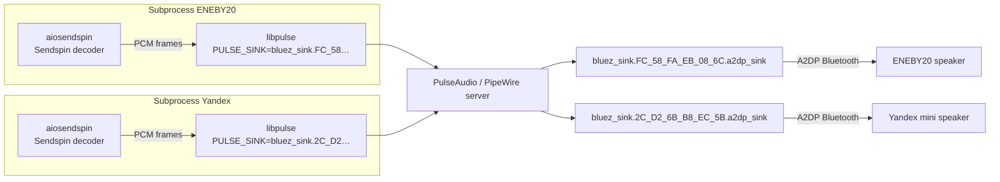
```mermaid
graph LR
    subgraph "Subprocess ENEBY20"
        A1[aiosendspin<br/>Sendspin decoder] -->|PCM frames| PA1[libpulse<br/>PULSE_SINK=bluez_sink.FC_58…]
    end
    subgraph "Subprocess Yandex"
        A2[aiosendspin<br/>Sendspin decoder] -->|PCM frames| PA2[libpulse<br/>PULSE_SINK=bluez_sink.2C_D2…]
    end

    PA1 --> PAS[PulseAudio / PipeWire server]
    PA2 --> PAS

    PAS --> S1[bluez_sink.FC_58_FA_EB_08_6C.a2dp_sink]
    PAS --> S2[bluez_sink.2C_D2_6B_B8_EC_5B.a2dp_sink]

    S1 -->|A2DP Bluetooth| SPK1[ENEBY20 speaker]
    S2 -->|A2DP Bluetooth| SPK2[Yandex mini speaker]
```

### Sink Discovery

`BluetoothManager.configure_bluetooth_audio()` tries four sink name patterns in order until `pactl list short sinks` confirms one exists:

```
bluez_output.{MAC_UNDERSCORED}.1          # PipeWire
bluez_output.{MAC_UNDERSCORED}.a2dp-sink  # PipeWire alt
bluez_sink.{MAC_UNDERSCORED}.a2dp_sink    # PulseAudio (HAOS)
bluez_sink.{MAC_UNDERSCORED}              # PulseAudio fallback
```

Retries up to **3×** with 3-second delays (the A2DP sink takes a few seconds to appear after BT connects).

### PA Rescue-Streams Correction

When Bluetooth reconnects, PulseAudio's `module-rescue-streams` may move sink-inputs to the default sink. `BridgeDaemon._ensure_sink_routing()` corrects this once per stream start — guarded by `_sink_routed` flag to prevent re-anchor feedback loops.

### Volume Control (Single-Writer Architecture)

Volume and mute are controlled through a **single-writer model**: only `bridge_daemon` (running inside each subprocess) writes to PulseAudio. This eliminates feedback loops where multiple writers would compete and cause volume bouncing.

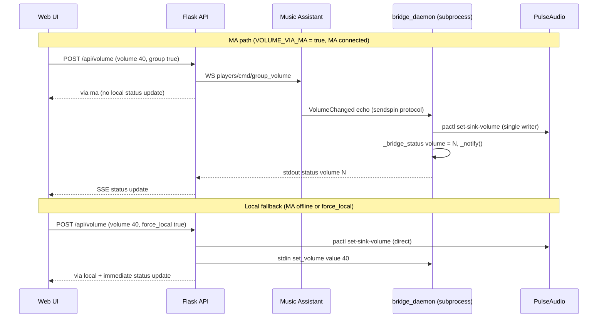
```mermaid
sequenceDiagram
    participant UI as Web UI
    participant API as Flask API
    participant MA as Music Assistant
    participant BD as bridge_daemon (subprocess)
    participant PA as PulseAudio

    Note over UI,PA: MA path (VOLUME_VIA_MA = true, MA connected)
    UI->>API: POST /api/volume (volume 40, group true)
    API->>MA: WS players/cmd/group_volume
    API-->>UI: via ma (no local status update)
    MA->>BD: VolumeChanged echo (sendspin protocol)
    BD->>PA: pactl set-sink-volume (single writer)
    BD->>BD: _bridge_status volume = N, _notify()
    BD-->>API: stdout status volume N
    API-->>UI: SSE status update

    Note over UI,PA: Local fallback (MA offline or force_local)
    UI->>API: POST /api/volume (volume 40, force_local true)
    API->>PA: pactl set-sink-volume (direct)
    API->>BD: stdin set_volume value 40
    API-->>UI: via local + immediate status update
```

**Group volume routing:**

| Device type | Method | Behavior |
|---|---|---|
| In MA sync group | MA `group_volume` (one call per unique group) | Proportional delta — preserves relative volumes between speakers |
| Solo (no sync group) | Direct PulseAudio (`pactl`) | Exact value — slider value = speaker volume |

The `VOLUME_VIA_MA` config option (default: `true`) controls whether volume changes are routed through MA. Set to `false` to always use direct PulseAudio, which bypasses MA entirely but means the MA UI won't reflect volume changes made from the bridge.

`MUTE_VIA_MA` (default: `false`) controls mute routing independently. When `false`, mute commands go directly to PulseAudio for instant response. When `true`, mute is routed through the MA API — useful for keeping the MA UI in sync but adds network latency.

---

## Bluetooth Management

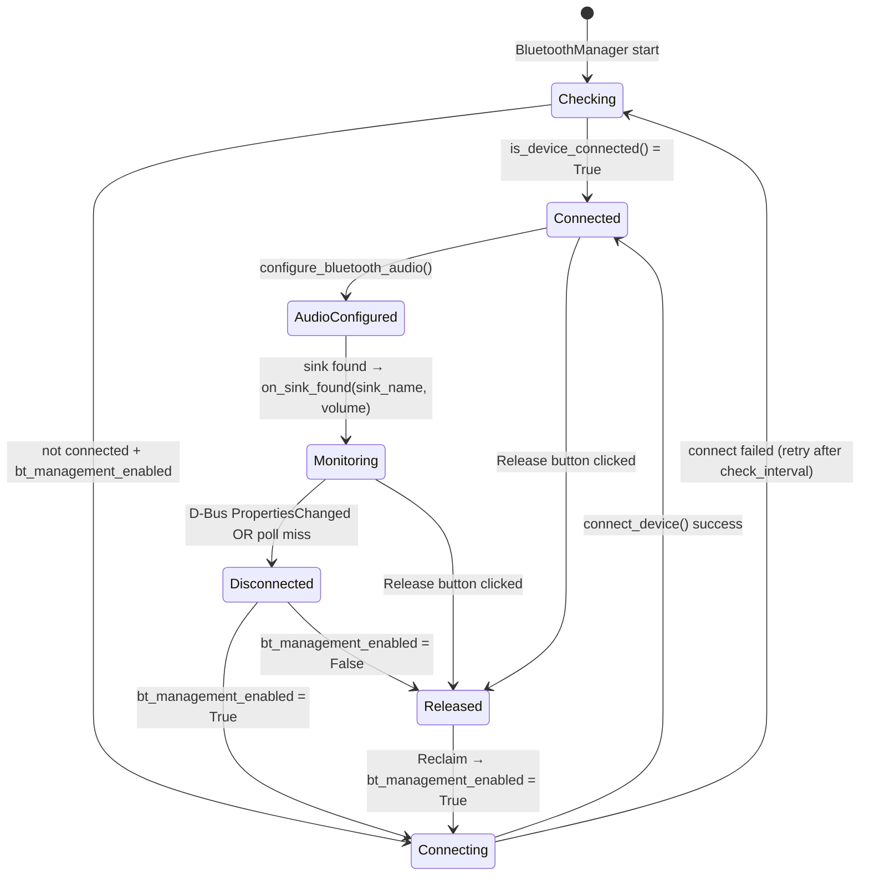
```mermaid
stateDiagram-v2
    [*] --> Checking: BluetoothManager start

    Checking --> Connected: is_device_connected() = True
    Checking --> Connecting: not connected + bt_management_enabled

    Connecting --> Connected: connect_device() success
    Connecting --> Checking: connect failed (retry after check_interval)

    Connected --> AudioConfigured: configure_bluetooth_audio()
    AudioConfigured --> Monitoring: sink found → on_sink_found(sink_name, volume)

    Monitoring --> Disconnected: D-Bus PropertiesChanged OR poll miss
    Disconnected --> Connecting: bt_management_enabled = True
    Disconnected --> Released: bt_management_enabled = False

    Released --> Connecting: Reclaim → bt_management_enabled = True

    Monitoring --> Released: Release button clicked
    Connected --> Released: Release button clicked
```

### Connection Flow

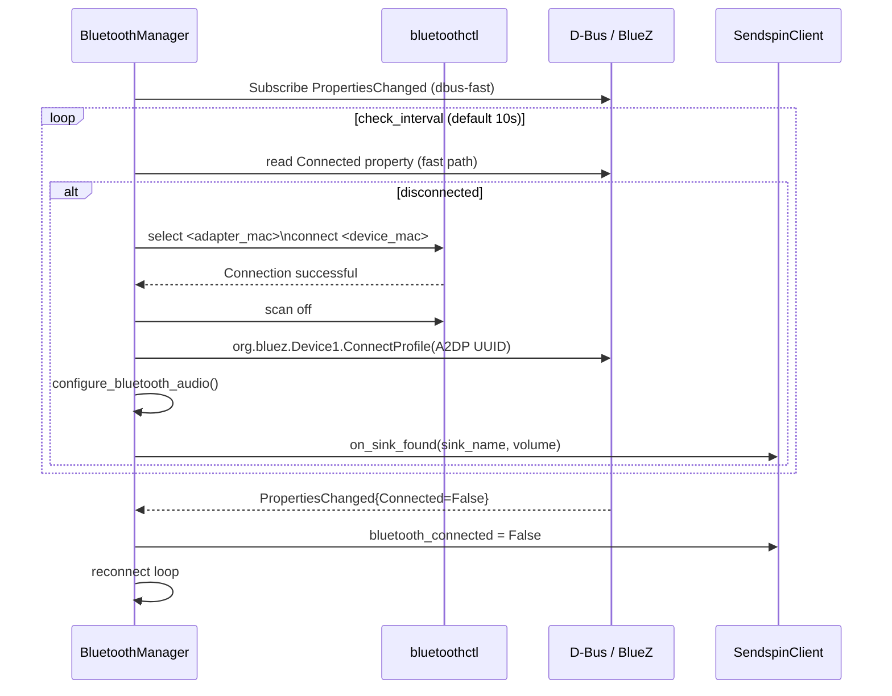
```mermaid
sequenceDiagram
    participant BM as BluetoothManager
    participant BC as bluetoothctl
    participant DBUS as D-Bus / BlueZ
    participant SC as SendspinClient

    BM->>DBUS: Subscribe PropertiesChanged (dbus-fast)
    loop check_interval (default 10s)
        BM->>DBUS: read Connected property (fast path)
        alt disconnected
            BM->>BC: select <adapter_mac>\nconnect <device_mac>
            BC-->>BM: Connection successful
            BM->>BC: scan off
            BM->>DBUS: org.bluez.Device1.ConnectProfile(A2DP UUID)
            BM->>BM: configure_bluetooth_audio()
            BM->>SC: on_sink_found(sink_name, volume)
        end
    end
    DBUS-->>BM: PropertiesChanged{Connected=False}
    BM->>SC: bluetooth_connected = False
    BM->>BM: reconnect loop
```

### SBC Codec Forcing

When `prefer_sbc: true`, after every connect `BluetoothManager` runs:
```bash
pactl send-message /card/<card>/bluez5/set_codec a2dp_sink SBC
```
This forces the simplest mandatory A2DP codec, reducing CPU load on slow hardware. Requires PulseAudio 15+.

### D-Bus Instant Disconnect Detection

`bluetooth_manager.py` uses `dbus-fast` (async) to subscribe to `org.freedesktop.DBus.Properties.PropertiesChanged` on the device path `/org/bluez/<hci>/dev_XX_XX_XX_XX_XX_XX`. This gives **instant** disconnect detection instead of waiting for the next poll cycle.

Falls back to `bluetoothctl` polling if `dbus-fast` is unavailable.

---

## Music Assistant Integration

### Sendspin Protocol (per subprocess)

Each subprocess connects to MA as a **Sendspin player** via WebSocket. The `BridgeDaemon` overrides key `SendspinDaemon` methods to intercept callbacks and update the shared status dict.

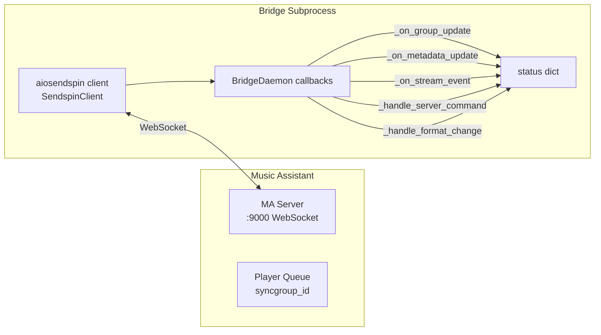
```mermaid
graph LR
    subgraph "Music Assistant"
        MA_SRV[MA Server<br/>:9000 WebSocket]
        MA_QUEUE[Player Queue<br/>syncgroup_id]
    end

    subgraph "Bridge Subprocess"
        AC[aiosendspin client<br/>SendspinClient]
        BD[BridgeDaemon callbacks]
        AC <-->|WebSocket| MA_SRV
        AC --> BD
        BD -->|_on_group_update| STATUS[status dict]
        BD -->|_on_metadata_update| STATUS
        BD -->|_on_stream_event| STATUS
        BD -->|_handle_server_command| STATUS
        BD -->|_handle_format_change| STATUS
    end
```

### MA REST API Integration (MaMonitor)

When `MA_API_URL` and `MA_API_TOKEN` are configured, `BridgeMaIntegrationService.initialize()` resolves credentials, preloads sync groups, and starts `MaMonitor` when `MA_WEBSOCKET_MONITOR` is enabled. In add-on mode, the service can auto-target the local MA add-on URL (`http://localhost:8095`) before falling back to saved config.

`MaMonitor` keeps a persistent connection to MA's `/ws` endpoint and updates shared MA runtime state (`groups`, now-playing, queue metadata) without polling the Sendspin transport path.

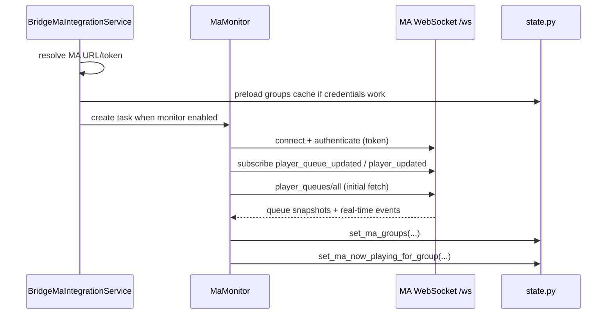
```mermaid
sequenceDiagram
    participant MIS as BridgeMaIntegrationService
    participant MM as MaMonitor
    participant MA as MA WebSocket /ws
    participant ST as state.py

    MIS->>MIS: resolve MA URL/token
    MIS->>ST: preload groups cache if credentials work
    MIS->>MM: create task when monitor enabled
    MM->>MA: connect + authenticate (token)
    MM->>MA: subscribe player_queue_updated / player_updated
    MM->>MA: player_queues/all (initial fetch)
    MA-->>MM: queue snapshots + real-time events
    MM->>ST: set_ma_groups(...)
    MM->>ST: set_ma_now_playing_for_group(...)
```

### MA auth, reconfigure, and add-on constraints

The operator-facing auth flows are intentionally split by runtime context:

| Flow | Endpoint(s) | Contract |
|---|---|---|
| Direct MA credentials | `POST /api/ma/login` | Accepts `url`, `username`, `password`; if `url` is omitted the bridge tries saved config, `SENDSPIN_SERVER`, connected Sendspin hosts, then mDNS |
| HA popup flow | `GET /api/ma/ha-auth-page` | Returns a self-contained HTML popup page, not JSON; the popup handles HA login/MFA and posts the result back to the opener |
| HA credentials flow | `POST /api/ma/ha-login` | MFA-aware two-step contract with `step: init` and `step: mfa`; a successful `done` response saves the MA token and triggers rediscovery |
| Silent add-on auth | `POST /api/ma/ha-silent-auth` | Requires add-on runtime plus `{ha_token, ma_url}`; reuses an existing MA token when it already matches the same MA instance |
| Reconfigure after auth | `POST /api/ma/rediscover` + result endpoint | Re-runs syncgroup discovery asynchronously; there is no separate “disconnect MA” endpoint |

Add-on mode has two important constraints:

- `ha-silent-auth` is only meaningful when the bridge is running inside Home Assistant with `SUPERVISOR_TOKEN` and MA is reachable through add-on ingress.
- The installed add-on track (`stable`, `rc`, `beta`) is derived from runtime environment/hostname, not from `UPDATE_CHANNEL`; changing update preferences does not switch the installed add-on variant.

### Group Resume Flow

When MA resumes a syncgroup (for example after a device reconnect), the bridge can trigger group playback through the MA control plane. Queue commands are asynchronous at the HTTP layer: the API returns a `job_id` plus an optimistic now-playing prediction, and final confirmation arrives through `MaMonitor` / async job state.

```
POST /api/ma/queue/cmd
  {"action": "next", "syncgroup_id": "ma-syncgroup-abc123"}

→ resolve queue target from syncgroup_id / player_id / group_id
→ optimistic now-playing patch stored under op_id
→ background job sends MA command
→ monitor confirmation updates shared now-playing cache
```

### Passwordless MA Auth (Addon Mode)

In HA addon mode, the bridge can mint an MA API token through MA's Ingress JSONRPC when the UI supplies a valid HA token, so operators do not have to paste a long-lived MA token manually.

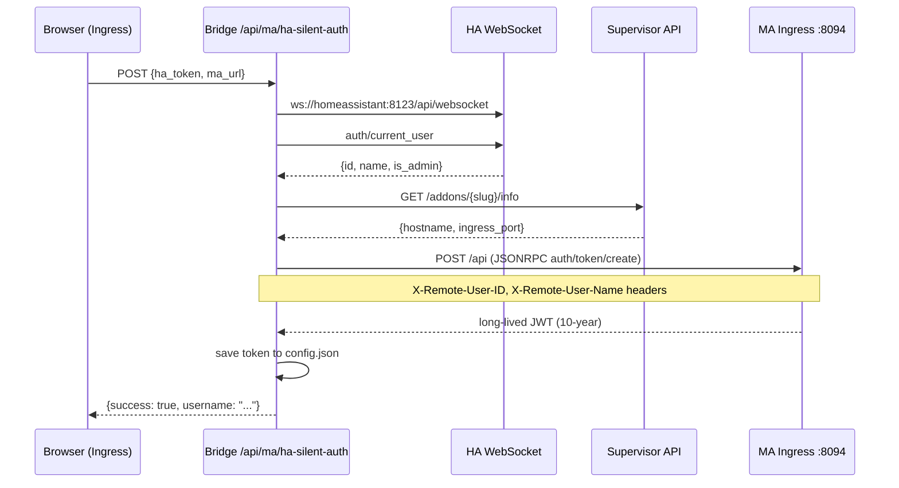
```mermaid
sequenceDiagram
    participant UI as Browser (Ingress)
    participant API as Bridge /api/ma/ha-silent-auth
    participant HA as HA WebSocket
    participant SUP as Supervisor API
    participant MA as MA Ingress :8094

    UI->>API: POST {ha_token, ma_url}
    API->>HA: ws://homeassistant:8123/api/websocket
    API->>HA: auth/current_user
    HA-->>API: {id, name, is_admin}
    API->>SUP: GET /addons/{slug}/info
    SUP-->>API: {hostname, ingress_port}
    API->>MA: POST /api (JSONRPC auth/token/create)
    Note over API,MA: X-Remote-User-ID, X-Remote-User-Name headers
    MA-->>API: long-lived JWT (10-year)
    API->>API: save token to config.json
    API-->>UI: {success: true, username: "..."}
```

---

## State Management

`state.py` is the **single source of truth** for shared runtime state, accessed by the Flask API threads, the asyncio loop, and D-Bus callbacks concurrently.


```mermaid
graph TD
    subgraph "state.py"
        CL[clients: list&#91;SendspinClient&#93;]
        CL_LOCK[_clients_lock: threading.Lock]
        SSE[_status_version: int<br/>_status_condition: threading.Condition]
        SCAN[scan_jobs: dict<br/>TTL = 2 min]
        GROUPS[_ma_groups: list&#91;dict&#93;<br/>_now_playing: dict]
        ADAPTER[_adapter_cache: str<br/>_adapter_cache_lock: threading.Lock]
    end

    SC[SendspinClient._update_status&#40;&#41;] -->|notify_status_changed&#40;&#41;| SSE
    FLASK[Flask /api/status/stream] -->|wait on Condition| SSE
    MM[MaMonitor] -->|set_ma_groups / set_now_playing| GROUPS
    BP_API[routes/api.py] -->|get_clients&#40;&#41;| CL
    BP_API -->|create_scan_job / finish_scan_job| SCAN
```

### SSE Real-Time Updates

`GET /api/status/stream` uses **Server-Sent Events** with `threading.Condition` to push live status to the web UI without polling:

```python
# Server side (state.py)
def notify_status_changed():
    with _status_condition:
        _status_version += 1
        _status_condition.notify_all()

# Flask SSE handler (api_status.py)
def api_status_stream():
    def generate():
        last_version = 0
        while True:
            with _status_condition:
                _status_condition.wait_for(lambda: _status_version > last_version, timeout=25)
                last_version = _status_version
            yield f"data: {json.dumps(get_client_status())}\n\n"
    return Response(generate(), mimetype="text/event-stream")
```

Events are batched with a **100 ms debounce window** — `notify_status_changed()` coalesces rapid-fire updates (e.g., volume slider drag, multiple devices reconnecting) into a single SSE push to prevent event storms.

The initial SSE response includes a **2 KB padding SSE comment block** before the first `data:` event so HA Ingress and similar proxies flush the stream immediately instead of buffering the first payload.

---

## Web API

The Flask app created in `web_interface.py` is served by **Waitress** and split across API blueprints so playback, Bluetooth, MA integration, configuration, and status/diagnostics can evolve independently.

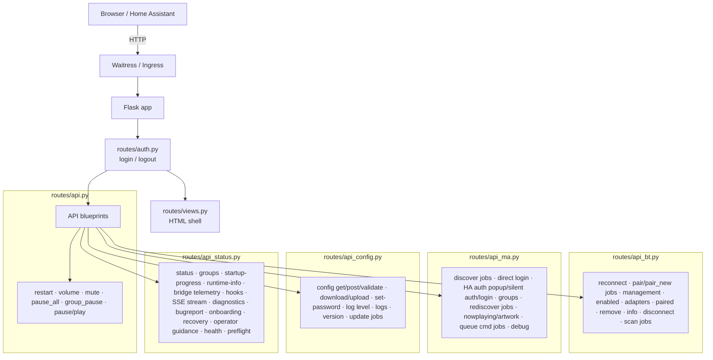
```mermaid
graph TD
    CLIENT[Browser / Home Assistant] -->|HTTP| WAITRESS[Waitress / Ingress]
    WAITRESS --> FLASK[Flask app]
    FLASK --> AUTH[routes/auth.py<br/>login / logout]
    AUTH --> VIEW[routes/views.py<br/>HTML shell]
    AUTH --> API_MOD[API blueprints]

    subgraph "routes/api.py"
        API_MOD --> CTRL[restart · volume · mute · pause_all · group_pause · pause/play]
    end

    subgraph "routes/api_bt.py"
        API_MOD --> BT[reconnect · pair/pair_new jobs · management · enabled · adapters · paired · remove · info · disconnect · scan jobs]
    end

    subgraph "routes/api_ma.py"
        API_MOD --> MAAPI[discover jobs · direct login · HA auth popup/silent auth/login · groups · rediscover jobs · nowplaying/artwork · queue cmd jobs · debug]
    end

    subgraph "routes/api_config.py"
        API_MOD --> CFG[config get/post/validate · download/upload · set-password · log level · logs · version · update jobs]
    end

    subgraph "routes/api_status.py"
        API_MOD --> STATUS[status · groups · startup-progress · runtime-info · bridge telemetry · hooks · SSE stream · diagnostics · bugreport · onboarding · recovery · operator guidance · health · preflight]
    end
```

### Operator guidance surfaces

The dashboard's setup and recovery UI is driven by three read-only API surfaces built from current config, preflight checks, startup progress, and live device health:

- `/api/onboarding/assistant` returns first-run setup checks plus a five-step checklist ordered as `bluetooth`, `audio`, `sink_verification`, `ma_auth`, `latency`.
- `/api/recovery/assistant` returns actionable issues, per-device traces, safe actions, a latency assistant, and a known-good test path summary.
- `/api/operator/guidance` merges onboarding + recovery into the top banner/header contract: `header_status`, optional `banner`, optional `onboarding_card`, and grouped issues.

`/api/status` embeds the same operator-guidance payload so the live dashboard can render one bridge snapshot without fanning out to extra calls.

### Diagnostics, bug reports, telemetry, and hooks

The diagnostics surface is layered on purpose:

- `/api/diagnostics` is the comprehensive masked read model: environment, contract versions, devices, MA integration, sink inputs, subprocesses, assistants, telemetry, and hook state.
- `/api/bridge/telemetry` is the lighter bridge-health view used for runtime resource inspection.
- `/api/bugreport` packages diagnostics into `markdown_short`, `text_full`, the masked `report`, and an editable `suggested_description` seeded from recent issue logs, Bluetooth health, subprocess state, D-Bus / bluetoothd health, MA connectivity, and recovery guidance.
- `/api/hooks` manages runtime-scoped outgoing webhooks. Hooks are validated to allow only absolute public `http(s)` targets; loopback, `.local`, and private-network destinations are rejected.

### Async BT Scan

Bluetooth scan is a 10-second blocking operation. The API handles it asynchronously:

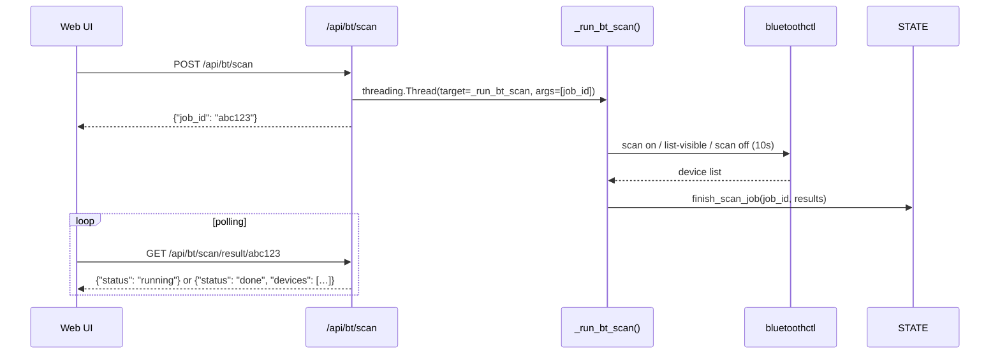
```mermaid
sequenceDiagram
    participant UI as Web UI
    participant API as /api/bt/scan
    participant SCAN as _run_bt_scan()
    participant BC as bluetoothctl

    UI->>API: POST /api/bt/scan
    API->>SCAN: threading.Thread(target=_run_bt_scan, args=[job_id])
    API-->>UI: {"job_id": "abc123"}
    SCAN->>BC: scan on / list-visible / scan off (10s)
    BC-->>SCAN: device list
    SCAN->>STATE: finish_scan_job(job_id, results)
    loop polling
        UI->>API: GET /api/bt/scan/result/abc123
        API-->>UI: {"status": "running"} or {"status": "done", "devices": […]}
    end
```

### Operator guidance and bug-report assembly

`routes/api_status.py` now does more than expose raw status snapshots:

- **Onboarding assistant** turns runtime/config state into step-by-step setup guidance.
- **Recovery assistant** groups actionable runtime issues such as disconnected speakers, released devices, and missing sinks.
- **Operator guidance** is the top-level UI contract used by the header and notice stack to decide what to surface first.
- **Bug report assembly** packages masked diagnostics and recent issue-worthy logs into both machine-readable data and an editable `suggested_description` for the GitHub issue flow.

This means the UI guidance, diagnostics download, and bug-report dialog all share the same runtime truth instead of deriving their own heuristics independently in the browser.

---

## Configuration System


```mermaid
graph TD
    subgraph "config.py"
        LOAD[load_config&#40;&#41;<br/>reads config.json]
        SAVE[save_device_volume&#40;&#41;<br/>debounced 1s write]
        UPDATE[update_config&#40;&#41;<br/>validated merge]
        PORTS[detect_ha_addon_channel&#40;&#41;<br/>resolve_web_port / resolve_base_listen_port]
        LOCK[config_lock<br/>threading.Lock]
    end

    subgraph "config.json fields"
        GLOBAL[Global:<br/>SENDSPIN_SERVER · SENDSPIN_PORT · WEB_PORT · BASE_LISTEN_PORT<br/>PULSE_LATENCY_MSEC · BT_CHECK_INTERVAL · BT_MAX_RECONNECT_FAILS<br/>UPDATE_CHANNEL · CHECK_UPDATES · AUTO_UPDATE<br/>MA_API_URL · MA_API_TOKEN · MA_WEBSOCKET_MONITOR<br/>LOG_LEVEL · AUTH_PASSWORD_HASH · SECRET_KEY · CONFIG_SCHEMA_VERSION]
        DEVICES[Bluetooth Devices:<br/>player_name · mac · adapter · listen_host · listen_port<br/>static_delay_ms · preferred_format · keepalive_silence<br/>keepalive_interval · enabled · LAST_VOLUME]
        ADAPTERS[Bluetooth Adapters:<br/>id · mac · name]
    end

    JSON["/config/config.json"] --> LOAD
    LOAD --> GLOBAL
    LOAD --> DEVICES
    LOAD --> ADAPTERS
    BP_CFG[POST /api/config<br/>POST /api/config/validate] --> UPDATE
    UPDATE -->|thread-safe| JSON
    SAVE -->|thread-safe| JSON
    PORTS --> LOAD

    subgraph "HA Addon Path"
        HA_OPT["/data/options.json<br/>written by HA Supervisor"]
        HA_SCRIPT[scripts/translate_ha_config.py]
        HA_OPT --> HA_SCRIPT
        HA_SCRIPT -->|generates| HA_JSON["/data/config.json"]
        HA_JSON --> LOAD
    end
```

### Channel-aware defaults and add-on semantics

In Home Assistant add-on mode, `detect_ha_addon_channel()` infers the installed add-on track from the container hostname suffix and resolves fixed per-track defaults:

| Track | Effective web port | Default player port base |
|---|---|---|
| `stable` | `8080` | `8928` |
| `rc` | `8081` | `9028` |
| `beta` | `8082` | `9128` |

`UPDATE_CHANNEL` is separate: it only controls release polling and operator messaging for updates. It does **not** change the installed HA add-on track.

Two operator-facing details matter here:

- `GET /api/config` reports `_delivery_channel`, `_effective_web_port`, and `_effective_base_listen_port`; in add-on mode it intentionally returns `WEB_PORT: null` because ingress owns the external port contract.
- `resolve_additional_web_port()` currently returns `None`, so the bridge does **not** expose a second direct listener in add-on mode today.

Per-device defaults are also resolved here: when a Bluetooth device omits `listen_port`, the bridge uses `BASE_LISTEN_PORT + device_index`, and when it omits `preferred_format`, the device daemon starts with `flac:44100:16:2`.

### Config Load → Device Spawn


```mermaid
flowchart TD
    CF[config.json] -->|load_config&#40;&#41;| CONFIG
    CONFIG --> DEVS[BLUETOOTH_DEVICES list]
    DEVS --> D1[device 0]
    DEVS --> D2[device 1]
    DEVS --> DN[device N]

    D1 --> BM1[BluetoothManager<br/>mac · adapter · check_interval<br/>prefer_sbc · max_fails]
    D1 --> SC1[SendspinClient<br/>player_name · listen_port<br/>static_delay_ms · keepalive]

    BM1 -.->|bt_manager=| SC1

    SC1 --> RUN1[SC.run&#40;&#41;<br/>asyncio loop]
    RUN1 --> MON1[monitor_and_reconnect&#40;&#41;<br/>asyncio loop]
    RUN1 --> SUB1[daemon subprocess<br/>PULSE_SINK=…]
```

---

## Startup Sequence

The coarse startup diagram below is still accurate, but the operator-visible lifecycle contract is now defined by `BridgeOrchestrator` + `BridgeLifecycleState`, not by ad-hoc logging inside `sendspin_client.py`.

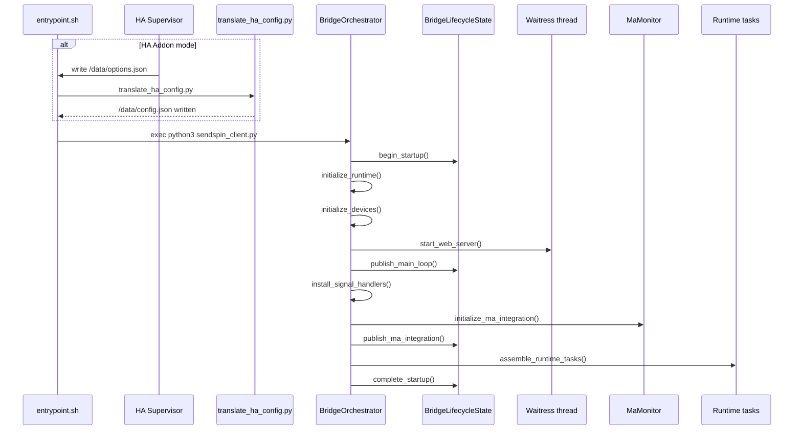
```mermaid
sequenceDiagram
    participant SH as entrypoint.sh
    participant HA as HA Supervisor
    participant TR as translate_ha_config.py
    participant BO as BridgeOrchestrator
    participant LS as BridgeLifecycleState
    participant WS as Waitress thread
    participant MM as MaMonitor
    participant RT as Runtime tasks

    alt HA Addon mode
        HA->>SH: write /data/options.json
        SH->>TR: translate_ha_config.py
        TR-->>SH: /data/config.json written
    end

    SH->>BO: exec python3 sendspin_client.py
    BO->>LS: begin_startup()
    BO->>BO: initialize_runtime()
    BO->>BO: initialize_devices()
    BO->>WS: start_web_server()
    BO->>LS: publish_main_loop()
    BO->>BO: install_signal_handlers()
    BO->>MM: initialize_ma_integration()
    BO->>LS: publish_ma_integration()
    BO->>RT: assemble_runtime_tasks()
    BO->>LS: complete_startup()
```

The runtime and operator contracts to rely on are:

- `/api/startup-progress` is the canonical machine-readable startup state. It exposes `status`, `phase`, `current_step`, `total_steps`, `percent`, `message`, timestamps, and a `details` object carrying phase-specific metadata.
- `/api/runtime-info` explains whether the bridge is running in production or demo/mock mode and which runtime layers are mocked.
- Startup failures are surfaced through `publish_startup_failure()` with `status: error` and a `details.startup_phase` marker.
- `graceful_shutdown()` mutes active sinks, stops clients, clears the published main loop, and updates startup progress to `stopping` / `stopped` so the UI can distinguish shutdown from a crash.

---

## Authentication

The web UI supports **optional password protection** via `routes/auth.py`. Authentication is disabled by default (`AUTH_ENABLED = False`) and enabled the moment a password is set via the Configuration panel.

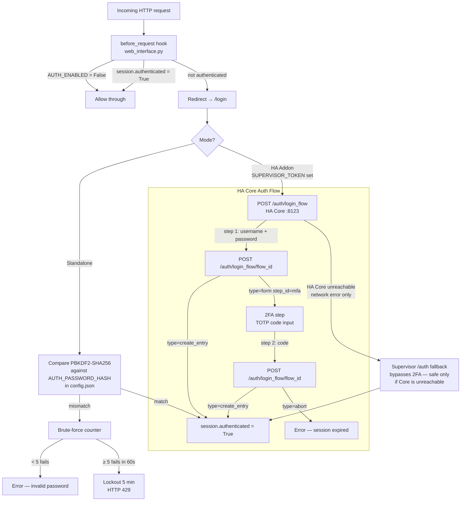
```mermaid
flowchart TD
    REQ[Incoming HTTP request] --> HOOK[before_request hook<br/>web_interface.py]
    HOOK -->|AUTH_ENABLED = False| PASS[Allow through]
    HOOK -->|session.authenticated = True| PASS
    HOOK -->|not authenticated| LOGIN[Redirect → /login]

    LOGIN --> MODE{Mode?}
    MODE -->|Standalone| PBKDF2[Compare PBKDF2-SHA256<br/>against AUTH_PASSWORD_HASH<br/>in config.json]
    MODE -->|HA Addon<br/>SUPERVISOR_TOKEN set| HA_FLOW

    subgraph "HA Core Auth Flow"
        HA_FLOW[POST /auth/login_flow<br/>HA Core :8123]
        HA_FLOW -->|step 1: username + password| HA_STEP[POST /auth/login_flow/flow_id]
        HA_STEP -->|type=create_entry| OK[session.authenticated = True]
        HA_STEP -->|type=form step_id=mfa| MFA[2FA step<br/>TOTP code input]
        MFA -->|step 2: code| HA_STEP2[POST /auth/login_flow/flow_id]
        HA_STEP2 -->|type=create_entry| OK
        HA_STEP2 -->|type=abort| FAIL[Error — session expired]
    end

    HA_FLOW -->|HA Core unreachable<br/>network error only| SUPER[Supervisor /auth fallback<br/>bypasses 2FA — safe only<br/>if Core is unreachable]
    SUPER --> OK

    PBKDF2 -->|match| OK
    PBKDF2 -->|mismatch| BF[Brute-force counter]
    BF -->|< 5 fails| FAIL2[Error — invalid password]
    BF -->|≥ 5 fails in 60s| LOCK[Lockout 5 min<br/>HTTP 429]
```

### Brute-Force Protection

In-memory rate limiter (`_failed` dict in `routes/auth.py`) tracks failures per client IP:

| Threshold | Window | Action |
|---|---|---|
| 5 failed attempts | 60 seconds | IP locked out for 5 minutes |
| 1 successful login | — | Failure counter cleared |
| 5-minute lockout expires | — | Counter reset automatically |

### HA Addon Auth (2FA-aware)

When `SUPERVISOR_TOKEN` is present, the bridge authenticates against **HA Core** (not just the Supervisor API) to support **2FA / TOTP**:

1. Start a login flow via `POST {HA_CORE_URL}/auth/login_flow`
2. Submit credentials via `POST {HA_CORE_URL}/auth/login_flow/{flow_id}`
3. If the response is `type=form, step_id=mfa` → prompt for TOTP code
4. Submit code via another flow step

**Fallback to Supervisor `/auth`** is only used if HA Core is **network-unreachable** (DNS failure, connection refused). If HA Core responds with an HTTP error, the fallback is **blocked** to prevent MFA bypass.

### Session

Flask server-side session with a randomly generated `SECRET_KEY` stored in `config.json`. The key persists across restarts (generated once on first start and saved). Session cookies are `HttpOnly` and expire when the browser closes.

---

## Keepalive Silence

Some Bluetooth speakers auto-disconnect after a period of silence. When `keepalive_interval` (≥ 30 s) is configured for a device, the main process periodically sends a short burst of silent PCM audio to prevent disconnection.

```
device.keepalive_interval = 30  →  silence burst every 30 s
device.keepalive_interval = 0   →  disabled (default)
```

---

## Graceful Degradation

The bridge is designed to remain functional when optional system libraries or services are unavailable. Each optional dependency has a defined fallback:

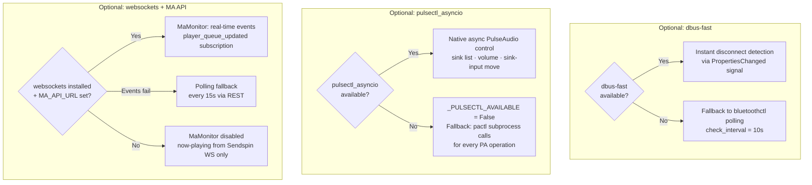
```mermaid
graph TD
    subgraph "Optional: dbus-fast"
        DBUS_CHK{dbus-fast<br/>available?}
        DBUS_CHK -->|Yes| DBUS_ON[Instant disconnect detection<br/>via PropertiesChanged signal]
        DBUS_CHK -->|No| DBUS_OFF[Fallback to bluetoothctl polling<br/>check_interval = 10s]
    end

    subgraph "Optional: pulsectl_asyncio"
        PA_CHK{pulsectl_asyncio<br/>available?}
        PA_CHK -->|Yes| PA_ON[Native async PulseAudio control<br/>sink list · volume · sink-input move]
        PA_CHK -->|No| PA_OFF[_PULSECTL_AVAILABLE = False<br/>Fallback: pactl subprocess calls<br/>for every PA operation]
    end

    subgraph "Optional: websockets + MA API"
        WS_CHK{websockets installed<br/>+ MA_API_URL set?}
        WS_CHK -->|Yes| WS_ON[MaMonitor: real-time events<br/>player_queue_updated subscription]
        WS_CHK -->|Events fail| WS_POLL[Polling fallback<br/>every 15s via REST]
        WS_CHK -->|No| WS_OFF[MaMonitor disabled<br/>now-playing from Sendspin WS only]
    end
```

| Optional Dependency | Flag / Check | Full Mode | Degraded Mode |
|---|---|---|---|
| `dbus-fast` (async D-Bus) | `ImportError` on import | Instant BT disconnect via `PropertiesChanged` signal | `bluetoothctl` polling every `check_interval` (10 s) |
| `pulsectl_asyncio` | `_PULSECTL_AVAILABLE` | Native async PulseAudio: sink list, volume, move sink-inputs | All PA operations fall back to `pactl` subprocess calls |
| `websockets` + `MA_API_URL` configured | `ImportError` + config check | Real-time MA events (`player_queue_updated`) | Polling every 15 s; if MA API not configured, MaMonitor disabled entirely |

> **Note:** All fallbacks are logged at `WARNING` or `INFO` level at startup so operators can diagnose which features are active. Check container logs for lines like `"pulsectl_asyncio unavailable — falling back to pactl subprocess"` or `"D-Bus monitor unavailable — using bluetoothctl polling"`.

---

## Thread & Task Model


```mermaid
graph TD
    subgraph "Main Thread — asyncio event loop"
        EL[asyncio.get_event_loop&#40;&#41;]
        EL --> T1[SendspinClient.run&#40;&#41; × N<br/>coroutine]
        EL --> T2[BluetoothManager.monitor_and_reconnect&#40;&#41; × N<br/>coroutine]
        EL --> T3[MaMonitor.run&#40;&#41;<br/>coroutine]
        T1 --> T4[_read_subprocess_output&#40;&#41;<br/>asyncio.Task]
        T1 --> T5[_read_subprocess_stderr&#40;&#41;<br/>asyncio.Task]
        T1 --> T6[_status_monitor_loop&#40;&#41;<br/>asyncio.Task]
        T2 --> T7[run_in_executor&#40;bluetoothctl&#41;<br/>ThreadPoolExecutor]
    end

    subgraph "Daemon Thread — Waitress"
        WT[waitress.serve&#40;&#41;<br/>WSGI thread pool]
        WT --> W1[Flask request handler × M<br/>WSGI worker threads]
    end

    subgraph "Background Threads"
        BT1[_run_bt_scan&#40;&#41;<br/>threading.Thread<br/>per scan request]
    end

    LOCK[threading.Lock<br/>state._clients_lock<br/>config.config_lock<br/>SendspinClient._status_lock]

    W1 <-->|acquire| LOCK
    T7 <-->|acquire| LOCK
```

> **Note:** All `bluetoothctl` subprocess calls in the async BT monitor loop are dispatched via `loop.run_in_executor(None, …)` to avoid blocking the event loop. The `_bt_executor` is a dedicated `ThreadPoolExecutor(max_workers=2)`.

---

## Reliability Subsystems

### Zombie Playback Watchdog

The main process runs a periodic status monitor (`_status_monitor_loop`) that detects **zombie playback** — situations where `playing=True` but `streaming=False` for more than 15 seconds. This catches broken audio pipelines where the sendspin connection is alive but no audio data flows.

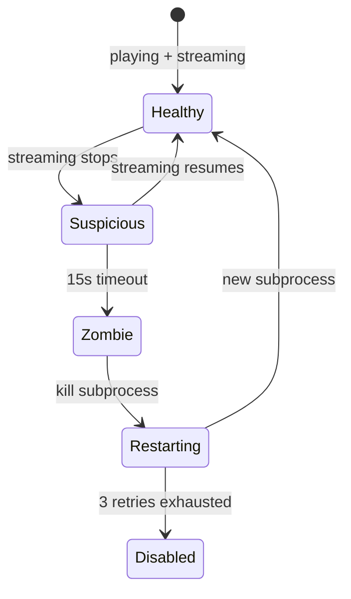
```mermaid
stateDiagram-v2
    [*] --> Healthy: playing + streaming
    Healthy --> Suspicious: streaming stops
    Suspicious --> Healthy: streaming resumes
    Suspicious --> Zombie: 15s timeout
    Zombie --> Restarting: kill subprocess
    Restarting --> Healthy: new subprocess
    Restarting --> Disabled: 3 retries exhausted
```

On detection, the subprocess is killed and restarted, up to 3 retries. After 3 failures, the watchdog stops retrying for that device.

### BT Churn Isolation

Optional feature (`BT_CHURN_THRESHOLD`, default 0 = disabled) that tracks reconnection frequency per device within a sliding window (`BT_CHURN_WINDOW`, default 300 s). If a device reconnects more than the threshold within the window, BT management is automatically disabled for that device — preventing a flaky speaker from consuming adapter time and destabilizing other speakers.

---

## Dependency Graph

```mermaid
graph LR
    SC[sendspin_client.py] --> BM[bluetooth_manager.py]
    SC --> ST[state.py]
    SC --> CFG[config.py]
    SC --> SVC_BD[services/bridge_daemon.py]

    WI[web_interface.py] --> FLASK[Flask + Waitress]
    WI --> R_API[routes/api.py]
    WI --> R_BT[routes/api_bt.py]
    WI --> R_MA[routes/api_ma.py]
    WI --> R_CFG[routes/api_config.py]
    WI --> R_STS[routes/api_status.py]
    WI --> R_VIEW[routes/views.py]
    WI --> R_AUTH[routes/auth.py]

    R_API --> ST
    R_API --> CFG
    R_MA --> SVC_MAC[services/ma_client.py]
    R_BT --> SVC_BT[services/bluetooth.py]

    BM --> SVC_PA[services/pulse.py]
    BM --> SVC_BT

    SVC_BD --> SVC_PA
    SVC_BD --> SENDSPIN[sendspin-cli<br/>aiosendspin]

    DP[services/daemon_process.py] --> SVC_BD
    DP --> SENDSPIN

    ST --> MM[services/ma_monitor.py]
    MM --> SVC_MAC

    SC --> UC[services/update_checker.py]
    UC -.->|GitHub API| GH[(GitHub Releases)]

    DEMO[demo/__init__.py] -.->|patches| SC
    DEMO -.->|patches| BM
    DEMO -.->|patches| SVC_PA
    DEMO_SIM[demo/simulator.py] --> ST
    DEMO_FIX[demo/fixtures.py] --> DEMO

    CFG -.->|config.json| JSON[(config.json)]
    HA_SCRIPT[scripts/translate_ha_config.py] -.->|options.json→config.json| JSON
```

---

## External Dependencies

| Package | Role |
|---|---|
| `aiosendspin` | Async Sendspin WebSocket client library |
| `sendspin` (local) | CLI + daemon runner (`SendspinDaemon`) |
| `Flask` + `Waitress` | Web UI and REST API server |
| `pulsectl_asyncio` | Async PulseAudio control (sink routing, volume) |
| `dbus-fast` | Async D-Bus for instant BT disconnect detection |
| `websockets` | MA API WebSocket connection in `MaMonitor` |
| `aiohttp` / `httpx` | MA REST API calls in `ma_client.py` |
| `bluetoothctl` | System BT management (subprocess) |
| `pactl` | Audio sink discovery (subprocess, legacy path) |

---

## C4 Context Diagram

High-level view of sendspin-bt-bridge and its external interactions.

```mermaid
C4Context
    title System Context — Sendspin Bluetooth Bridge

    Person(user, "User", "Controls speakers via<br/>web UI or HA dashboard")

    System(bridge, "Sendspin BT Bridge", "Multi-process Python service<br/>bridging MA audio → BT speakers")

    System_Ext(ma, "Music Assistant", "Music streaming server<br/>Sendspin protocol (WS + FLAC)")
    System_Ext(ha, "Home Assistant", "Smart home platform<br/>Addon host / Auth provider")
    System_Ext(bt, "Bluetooth Speakers", "A2DP audio sinks<br/>via BlueZ / PulseAudio")
    System_Ext(github, "GitHub Releases", "Version update checks<br/>API polling hourly")

    Rel(user, bridge, "Web UI / REST API", "HTTP / SSE")
    Rel(user, ha, "HA Dashboard", "HTTP")
    Rel(bridge, ma, "Sendspin WebSocket", "WS + FLAC/RAW")
    Rel(bridge, ma, "MA REST API", "HTTP")
    Rel(bridge, bt, "A2DP audio stream", "Bluetooth")
    Rel(bridge, ha, "Ingress / Auth", "HTTP")
    Rel(bridge, github, "Update check", "HTTPS")
    Rel(ha, ma, "Integration", "API")
```

---

## IPC Sequence — Volume Change

End-to-end flow when a user adjusts volume via the web UI.

```mermaid
sequenceDiagram
    participant UI as Web UI (browser)
    participant API as Flask API<br/>routes/api.py
    participant SC as SendspinClient
    participant DP as daemon_process.py<br/>(subprocess)
    participant PA as PulseAudio
    participant MA as Music Assistant

    UI->>API: POST /api/volume {mac, volume: 60}
    API->>SC: send_command({cmd: set_volume, value: 60})
    SC->>DP: stdin JSON: {"cmd":"set_volume","value":60}
    DP->>PA: pulsectl set_sink_volume(60)
    PA-->>DP: OK
    DP->>MA: MediaCommand.VOLUME_SET (if VOLUME_VIA_MA)
    DP-->>SC: stdout JSON: {"type":"status","volume":60}
    SC->>SC: _update_status({volume: 60})
    SC->>SC: save_device_volume(mac, 60) [debounced 1s]
    SC-->>API: notify_status_changed()
    API-->>UI: SSE event: {"volume": 60, ...}
```

---

## Update Checker Flow

Background version polling now uses **channel-aware release resolution** instead of the stable-only `releases/latest` endpoint.

```mermaid
flowchart TD
    START([main&#40;&#41; startup]) --> DELAY[Wait 30s<br/>let app initialize]
    DELAY --> LOADCFG[load_config&#40;&#41; · normalize UPDATE_CHANNEL]
    LOADCFG --> FETCH[Fetch GitHub Releases list<br/>api.github.com/repos/.../releases?per_page=100]
    FETCH --> FILTER[Ignore drafts · keep tags for chosen channel]
    FILTER --> PICK[Pick highest semver<br/>stable / rc / beta lane]
    PICK --> CMP{remote > current?}

    CMP -->|Yes| FOUND[Store update info in state.py<br/>version · url · body · channel]
    CMP -->|No| CLEAR[Clear update_available]

    FOUND --> BADGE[UI: channel-aware update badge]
    CLEAR --> SLEEP
    BADGE --> SLEEP[Sleep 3600s]
    SLEEP --> LOADCFG

    subgraph "User-triggered"
        BADGE --> CLICK[User opens update modal]
        CLICK --> MODAL{GET /api/update/info<br/>detect runtime}
        MODAL -->|systemd / LXC| LXC_BTN["POST /api/update/apply<br/>queues upgrade.sh via systemd-run"]
        MODAL -->|docker| DOCKER_CMD["Show channel-aware image guidance<br/>pull stable / rc / beta tag"]
        MODAL -->|ha_addon| HA_MSG["Direct to HA Add-ons UI<br/>installed track updates there"]
    end
```

For Home Assistant, the installed add-on track still determines what the Supervisor updates. The in-app `UPDATE_CHANNEL` preference only changes which GitHub release lane is highlighted in bridge UI/API surfaces.

## Demo Mode Architecture

When `DEMO_MODE=true`, the bridge runs with fully emulated hardware (v2.23.0+).

```mermaid
graph TD
    subgraph "Demo Mode Patches — demo/__init__.py"
        INSTALL["install(config)<br/>Called from main()"]
        INSTALL --> BT_PATCH[Patch BluetoothManager<br/>Simulated connect/disconnect<br/>Random battery levels]
        INSTALL --> PULSE_PATCH[Patch services.pulse<br/>Dict-backed volume/mute state<br/>per-sink tracking]
        INSTALL --> CLIENT_PATCH[Patch SendspinClient<br/>No real subprocess<br/>_FakeProc sentinel]
        INSTALL --> MA_PATCH[Patch MA commands<br/>send_player_cmd → noop<br/>ma_group_play → group propagate]
        INSTALL --> FIXTURES[Load fixtures.py<br/>5 devices + 3 sync groups<br/>BT adapters + MA discovery]
    end

    subgraph "Demo Simulator — demo/simulator.py"
        SIM[run_simulator] --> TRACKS[Curated playlist<br/>10 real tracks with metadata]
        SIM --> CYCLE[Rotate tracks per device<br/>Update elapsed_ms each tick]
        SIM --> PLAY_PAUSE[Random play/pause transitions<br/>Realistic timing]
    end

    subgraph "Result"
        WEB[Web UI at :8080<br/>All features work]
        SSE[SSE updates<br/>Real-time status changes]
        API[REST API<br/>42 endpoints respond]
    end

    INSTALL --> SIM
    SIM --> WEB
    SIM --> SSE
    SIM --> API
```
