## Overview

`sendspin-bt-bridge` is a **multi-process Python bridge** that connects Music Assistant's Sendspin audio protocol to Bluetooth speakers. Each configured speaker runs in its own **isolated subprocess** with a dedicated PulseAudio context, ensuring correct audio routing without cross-device interference.

```
┌─────────────────────────────────────────────────────────────────┐
│                   Docker / LXC / HA Addon                       │
│                                                                 │
│  ┌──────────────────────────────────────────────────────────┐   │
│  │              Main Python Process                         │   │
│  │  sendspin_client.py  ·  asyncio event loop               │   │
│  │  Flask/Waitress API  ·  BluetoothManager × N             │   │
│  │  MaMonitor  ·  state.py                                   │   │
│  └───────────────┬──────────────────────────────────────────┘   │
│                  │ asyncio.create_subprocess_exec (per device)  │
│        ┌─────────┼─────────┐                                    │
│        ▼         ▼         ▼                                    │
│  ┌──────────┐ ┌──────────┐ ┌──────────┐                        │
│  │ daemon   │ │ daemon   │ │ daemon   │  PULSE_SINK=bluez_sink… │
│  │ process  │ │ process  │ │ process  │  per subprocess         │
│  │ ENEBY20  │ │ Yandex   │ │ Lenco    │                        │
│  └────┬─────┘ └────┬─────┘ └────┬─────┘                        │
│       │             │             │                              │
│       └──── Sendspin WebSocket ───┘                             │
│             (aiosendspin / Music Assistant)                      │
└─────────────────────────────────────────────────────────────────┘
         │                        │
    Bluetooth                PulseAudio / PipeWire
    (bluetoothctl             (bluez_sink.XX.a2dp_sink)
     + D-Bus)
```

---

## Component Map


```mermaid
graph TD
    subgraph "Container / Host"
        EP[entrypoint.sh<br/>D-Bus · Audio · HA config]
        EP --> MP

        subgraph "Main Process — sendspin_client.py"
            MP[main&#40;&#41;<br/>asyncio event loop]
            MP --> SC[SendspinClient × N]
            MP --> BM[BluetoothManager × N]
            MP --> WS[Waitress HTTP server<br/>daemon thread]
            MP --> MM[MaMonitor<br/>asyncio task]

            SC -->|asyncio subprocess| DP
            SC <-->|JSON stdin/stdout| DP
            SC --- ST[state.py<br/>shared runtime state]
            BM --- ST

            WS --> FLASK[Flask app<br/>web_interface.py]
            FLASK --> BP_API[routes/api.py<br/>Blueprint]
            FLASK --> BP_BT[routes/api_bt.py<br/>Blueprint]
            FLASK --> BP_MA[routes/api_ma.py<br/>Blueprint]
            FLASK --> BP_CFG[routes/api_config.py<br/>Blueprint]
            FLASK --> BP_STS[routes/api_status.py<br/>Blueprint]
            FLASK --> BP_VIEW[routes/views.py<br/>Blueprint]
            FLASK --> BP_AUTH[routes/auth.py<br/>Blueprint]
            BP_API --> ST

            MM --> ST
        end

        subgraph "Subprocess per Device"
            DP[daemon_process.py<br/>asyncio event loop]
            DP --> BD[BridgeDaemon<br/>services/bridge_daemon.py]
            BD --> SD[SendspinDaemon<br/>sendspin-cli]
            SD <-->|WebSocket| MA[Music Assistant]
            BD --> PA[PulseAudio context<br/>PULSE_SINK=bluez_sink…]
        end

        subgraph "services/"
            SVC_BT[bluetooth.py<br/>BT helpers]
            SVC_PA[pulse.py<br/>pulsectl_asyncio]
            SVC_MAC[ma_client.py<br/>MA REST API]
        end

        BM --> SVC_BT
        BM --> SVC_PA
        BD --> SVC_PA
        MM --> SVC_MAC
        BP_API --> SVC_MAC

        subgraph "config.py"
            CFG[load_config&#40;&#41;<br/>save_device_volume&#40;&#41;<br/>config.json]
        end

        SC --> CFG
        BP_API --> CFG
    end

    BT_HW[Bluetooth Hardware<br/>hci0 / hci1 / …]
    PA_HW[PulseAudio / PipeWire]

    BM <-->|bluetoothctl + D-Bus| BT_HW
    PA --> PA_HW
    BT_HW <-->|A2DP| SPK[Bluetooth Speaker]
    PA_HW --> SPK
```

---

## Process Architecture

### Main Process

The main process (`sendspin_client.py` `main()`) runs a single **asyncio event loop** on the main thread and a **Waitress HTTP server** on a daemon thread. All async operations (BT monitoring, subprocess I/O, MA WebSocket) share the same event loop.

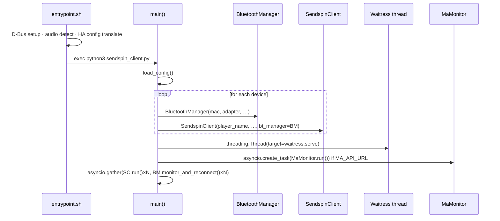
```mermaid
sequenceDiagram
    participant SH as entrypoint.sh
    participant MP as main()
    participant BM as BluetoothManager
    participant SC as SendspinClient
    participant WS as Waitress thread
    participant MM as MaMonitor

    SH->>SH: D-Bus setup · audio detect · HA config translate
    SH->>MP: exec python3 sendspin_client.py
    MP->>MP: load_config()
    loop for each device
        MP->>BM: BluetoothManager(mac, adapter, …)
        MP->>SC: SendspinClient(player_name, …, bt_manager=BM)
    end
    MP->>WS: threading.Thread(target=waitress.serve)
    MP->>MM: asyncio.create_task(MaMonitor.run()) if MA_API_URL
    MP->>MP: asyncio.gather(SC.run()×N, BM.monitor_and_reconnect()×N)
```

### Per-Device Subprocess

Each `SendspinClient.run()` spawns `daemon_process.py` as an **isolated subprocess**. The subprocess gets `PULSE_SINK=bluez_sink.<MAC>.a2dp_sink` injected into its environment before any PulseAudio connection is made — so audio routes correctly from the very first sample, without needing `move-sink-input`.

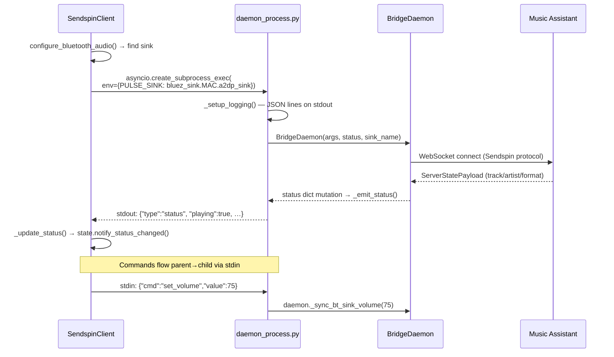
```mermaid
sequenceDiagram
    participant SC as SendspinClient
    participant DP as daemon_process.py
    participant BD as BridgeDaemon
    participant MA as Music Assistant

    SC->>SC: configure_bluetooth_audio() → find sink
    SC->>DP: asyncio.create_subprocess_exec(<br/>env={PULSE_SINK: bluez_sink.MAC.a2dp_sink})
    DP->>DP: _setup_logging() — JSON lines on stdout
    DP->>BD: BridgeDaemon(args, status, sink_name)
    BD->>MA: WebSocket connect (Sendspin protocol)
    MA-->>BD: ServerStatePayload (track/artist/format)
    BD-->>DP: status dict mutation → _emit_status()
    DP-->>SC: stdout: {"type":"status", "playing":true, …}
    SC->>SC: _update_status() → state.notify_status_changed()
    Note over SC,DP: Commands flow parent→child via stdin
    SC->>DP: stdin: {"cmd":"set_volume","value":75}
    DP->>BD: daemon._sync_bt_sink_volume(75)
```

---

## IPC Protocol (stdin / stdout)

All inter-process communication between the main process and each daemon subprocess uses **newline-delimited JSON**.

### Subprocess → Parent (stdout)

| `type` | Fields | When |
|---|---|---|
| `status` | Full `DeviceStatus` dict (all fields) | On any state change (de-duplicated) |
| `log` | `level`, `name`, `msg` | Every log record |

```json
{"type": "status", "playing": true, "volume": 75, "current_track": "Mooncalf", …}
{"type": "log", "level": "info", "name": "__main__", "msg": "[ENEBY20] Stream started"}
```

### Parent → Subprocess (stdin)

| `cmd` | Extra fields | Effect |
|---|---|---|
| `set_volume` | `value: int` | Sets PA sink volume + notifies MA |
| `set_mute` | `muted: bool` | Toggles mute |
| `stop` | — | Clean shutdown |
| `pause` / `play` | — | Sends `MediaCommand` to MA |
| `reconnect` | — | Disconnects from MA (triggers reconnect) |
| `set_log_level` | `level: str` | Changes root logger level immediately |

```json
{"cmd": "set_volume", "value": 60}
{"cmd": "stop"}
```

---

## Audio Routing

The critical insight: **each subprocess gets its own PulseAudio client context** with `PULSE_SINK` pre-set. This eliminates the race condition where audio would start on the default sink before the bridge moved it.

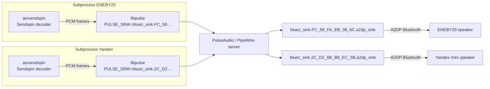
```mermaid
graph LR
    subgraph "Subprocess ENEBY20"
        A1[aiosendspin<br/>Sendspin decoder] -->|PCM frames| PA1[libpulse<br/>PULSE_SINK=bluez_sink.FC_58…]
    end
    subgraph "Subprocess Yandex"
        A2[aiosendspin<br/>Sendspin decoder] -->|PCM frames| PA2[libpulse<br/>PULSE_SINK=bluez_sink.2C_D2…]
    end

    PA1 --> PAS[PulseAudio / PipeWire server]
    PA2 --> PAS

    PAS --> S1[bluez_sink.FC_58_FA_EB_08_6C.a2dp_sink]
    PAS --> S2[bluez_sink.2C_D2_6B_B8_EC_5B.a2dp_sink]

    S1 -->|A2DP Bluetooth| SPK1[ENEBY20 speaker]
    S2 -->|A2DP Bluetooth| SPK2[Yandex mini speaker]
```

### Sink Discovery

`BluetoothManager.configure_bluetooth_audio()` tries four sink name patterns in order until `pactl list short sinks` confirms one exists:

```
bluez_output.{MAC_UNDERSCORED}.1          # PipeWire
bluez_output.{MAC_UNDERSCORED}.a2dp-sink  # PipeWire alt
bluez_sink.{MAC_UNDERSCORED}.a2dp_sink    # PulseAudio (HAOS)
bluez_sink.{MAC_UNDERSCORED}              # PulseAudio fallback
```

Retries up to **3×** with 3-second delays (the A2DP sink takes a few seconds to appear after BT connects).

### PA Rescue-Streams Correction

When Bluetooth reconnects, PulseAudio's `module-rescue-streams` may move sink-inputs to the default sink. `BridgeDaemon._ensure_sink_routing()` corrects this once per stream start — guarded by `_sink_routed` flag to prevent re-anchor feedback loops.

### Volume Control (Single-Writer Architecture)

Volume and mute are controlled through a **single-writer model**: only `bridge_daemon` (running inside each subprocess) writes to PulseAudio. This eliminates feedback loops where multiple writers would compete and cause volume bouncing.

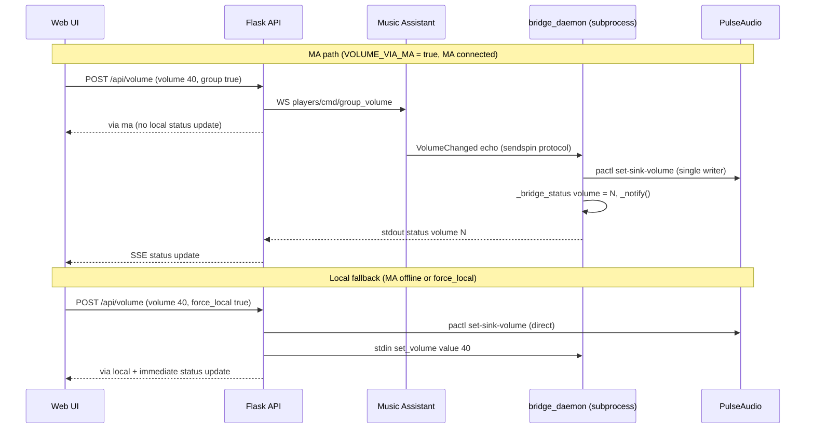
```mermaid
sequenceDiagram
    participant UI as Web UI
    participant API as Flask API
    participant MA as Music Assistant
    participant BD as bridge_daemon (subprocess)
    participant PA as PulseAudio

    Note over UI,PA: MA path (VOLUME_VIA_MA = true, MA connected)
    UI->>API: POST /api/volume (volume 40, group true)
    API->>MA: WS players/cmd/group_volume
    API-->>UI: via ma (no local status update)
    MA->>BD: VolumeChanged echo (sendspin protocol)
    BD->>PA: pactl set-sink-volume (single writer)
    BD->>BD: _bridge_status volume = N, _notify()
    BD-->>API: stdout status volume N
    API-->>UI: SSE status update

    Note over UI,PA: Local fallback (MA offline or force_local)
    UI->>API: POST /api/volume (volume 40, force_local true)
    API->>PA: pactl set-sink-volume (direct)
    API->>BD: stdin set_volume value 40
    API-->>UI: via local + immediate status update
```

**Group volume routing:**

| Device type | Method | Behavior |
|---|---|---|
| In MA sync group | MA `group_volume` (one call per unique group) | Proportional delta — preserves relative volumes between speakers |
| Solo (no sync group) | Direct PulseAudio (`pactl`) | Exact value — slider value = speaker volume |

The `VOLUME_VIA_MA` config option (default: `true`) controls whether volume changes are routed through MA. Set to `false` to always use direct PulseAudio, which bypasses MA entirely but means the MA UI won't reflect volume changes made from the bridge.

`MUTE_VIA_MA` (default: `false`) controls mute routing independently. When `false`, mute commands go directly to PulseAudio for instant response. When `true`, mute is routed through the MA API — useful for keeping the MA UI in sync but adds network latency.

---

## Bluetooth Management

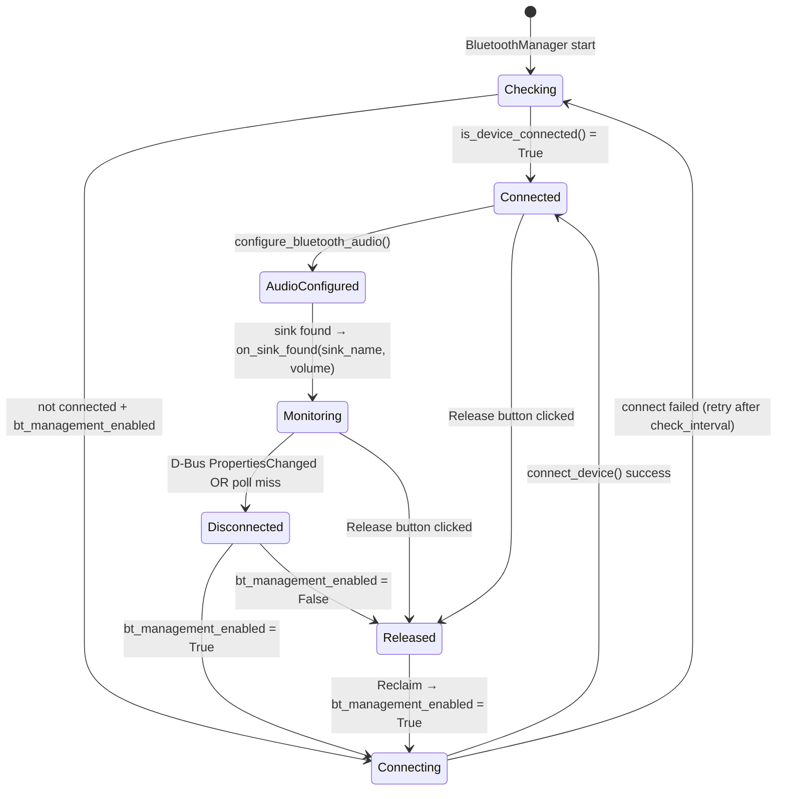
```mermaid
stateDiagram-v2
    [*] --> Checking: BluetoothManager start

    Checking --> Connected: is_device_connected() = True
    Checking --> Connecting: not connected + bt_management_enabled

    Connecting --> Connected: connect_device() success
    Connecting --> Checking: connect failed (retry after check_interval)

    Connected --> AudioConfigured: configure_bluetooth_audio()
    AudioConfigured --> Monitoring: sink found → on_sink_found(sink_name, volume)

    Monitoring --> Disconnected: D-Bus PropertiesChanged OR poll miss
    Disconnected --> Connecting: bt_management_enabled = True
    Disconnected --> Released: bt_management_enabled = False

    Released --> Connecting: Reclaim → bt_management_enabled = True

    Monitoring --> Released: Release button clicked
    Connected --> Released: Release button clicked
```

### Connection Flow

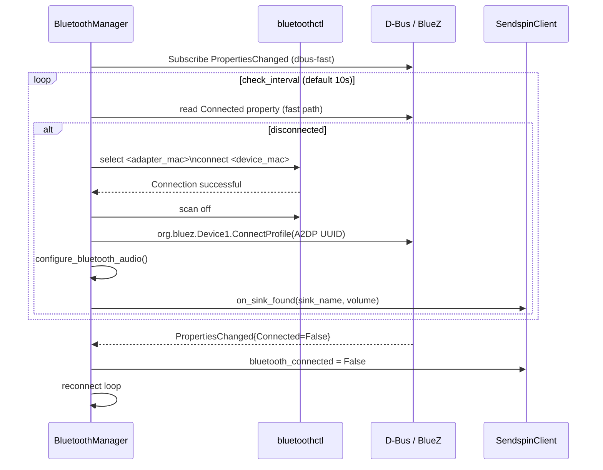
```mermaid
sequenceDiagram
    participant BM as BluetoothManager
    participant BC as bluetoothctl
    participant DBUS as D-Bus / BlueZ
    participant SC as SendspinClient

    BM->>DBUS: Subscribe PropertiesChanged (dbus-fast)
    loop check_interval (default 10s)
        BM->>DBUS: read Connected property (fast path)
        alt disconnected
            BM->>BC: select <adapter_mac>\nconnect <device_mac>
            BC-->>BM: Connection successful
            BM->>BC: scan off
            BM->>DBUS: org.bluez.Device1.ConnectProfile(A2DP UUID)
            BM->>BM: configure_bluetooth_audio()
            BM->>SC: on_sink_found(sink_name, volume)
        end
    end
    DBUS-->>BM: PropertiesChanged{Connected=False}
    BM->>SC: bluetooth_connected = False
    BM->>BM: reconnect loop
```

### SBC Codec Forcing

When `prefer_sbc: true`, after every connect `BluetoothManager` runs:
```bash
pactl send-message /card/<card>/bluez5/set_codec a2dp_sink SBC
```
This forces the simplest mandatory A2DP codec, reducing CPU load on slow hardware. Requires PulseAudio 15+.

### D-Bus Instant Disconnect Detection

`bluetooth_manager.py` uses `dbus-fast` (async) to subscribe to `org.freedesktop.DBus.Properties.PropertiesChanged` on the device path `/org/bluez/<hci>/dev_XX_XX_XX_XX_XX_XX`. This gives **instant** disconnect detection instead of waiting for the next poll cycle.

Falls back to `bluetoothctl` polling if `dbus-fast` is unavailable.

---

## Music Assistant Integration

### Sendspin Protocol (per subprocess)

Each subprocess connects to MA as a **Sendspin player** via WebSocket. The `BridgeDaemon` overrides key `SendspinDaemon` methods to intercept callbacks and update the shared status dict.

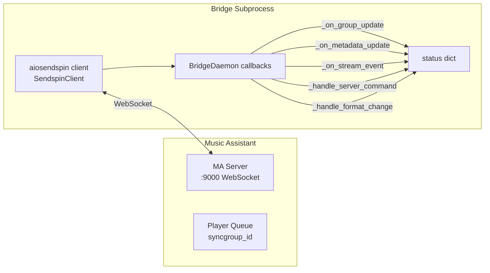
```mermaid
graph LR
    subgraph "Music Assistant"
        MA_SRV[MA Server<br/>:9000 WebSocket]
        MA_QUEUE[Player Queue<br/>syncgroup_id]
    end

    subgraph "Bridge Subprocess"
        AC[aiosendspin client<br/>SendspinClient]
        BD[BridgeDaemon callbacks]
        AC <-->|WebSocket| MA_SRV
        AC --> BD
        BD -->|_on_group_update| STATUS[status dict]
        BD -->|_on_metadata_update| STATUS
        BD -->|_on_stream_event| STATUS
        BD -->|_handle_server_command| STATUS
        BD -->|_handle_format_change| STATUS
    end
```

### MA REST API Integration (MaMonitor)

When `MA_API_URL` and `MA_API_TOKEN` are configured (auto-created via "Sign in with Home Assistant" in addon mode, or set manually), the main process runs a `MaMonitor` task that maintains a persistent **WebSocket connection to MA's `/ws` endpoint** for real-time event subscription.

**Supported MA auth providers:**

| Method | Endpoint | Use case |
|---|---|---|
| Direct MA credentials | `POST /api/ma/login` | Standalone installs — username + password sent to MA |
| HA OAuth (browser-based) | `GET /api/ma/ha-auth-page` → callback | "Sign in with Home Assistant" button in the UI |
| HA credentials via MA | `POST /api/ma/ha-login` | Username + password forwarded to HA `login_flow` through MA |
| Silent HA auth (addon mode) | `POST /api/ma/ha-silent-auth` | Automatic — uses Ingress headers, no user interaction |

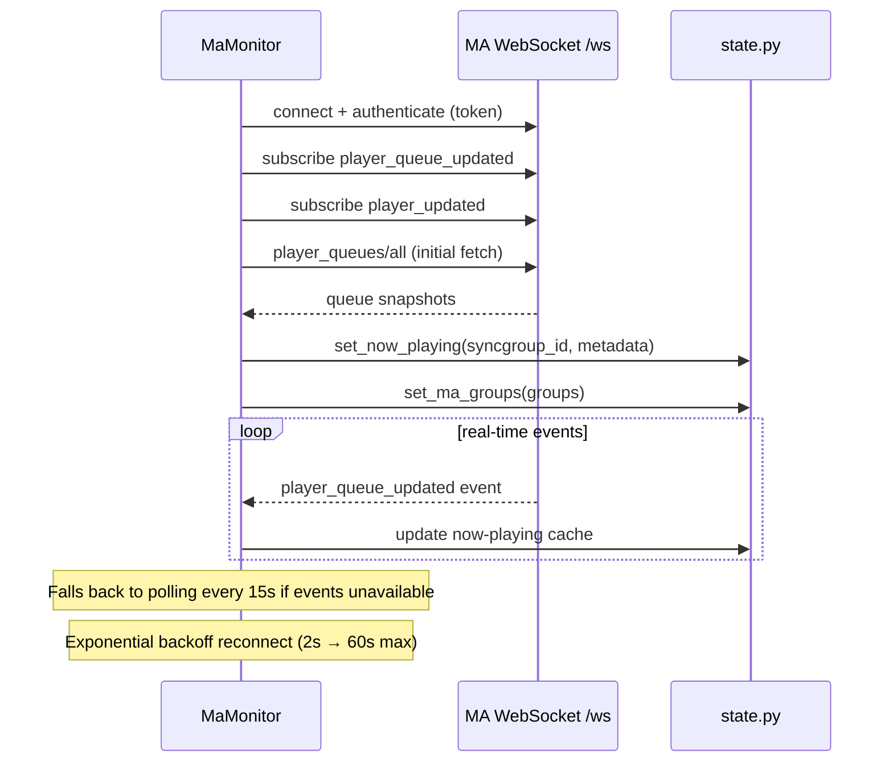
```mermaid
sequenceDiagram
    participant MM as MaMonitor
    participant MA as MA WebSocket /ws
    participant ST as state.py

    MM->>MA: connect + authenticate (token)
    MM->>MA: subscribe player_queue_updated
    MM->>MA: subscribe player_updated
    MM->>MA: player_queues/all (initial fetch)
    MA-->>MM: queue snapshots
    MM->>ST: set_now_playing(syncgroup_id, metadata)
    MM->>ST: set_ma_groups(groups)
    loop real-time events
        MA-->>MM: player_queue_updated event
        MM->>ST: update now-playing cache
    end
    Note over MM: Falls back to polling every 15s if events unavailable
    Note over MM: Exponential backoff reconnect (2s → 60s max)
```

### Group Resume Flow

When MA resumes a syncgroup (e.g., after device reconnect), the bridge can trigger group playback via the REST API:

```
POST /api/ma/queue/cmd
  {"syncgroup_id": "syncgroup_uwkgkafx", "command": "play"}

→ ma_client.ma_group_play(url, token, syncgroup_id)
→ POST {MA_API_URL}/api/players/cmd/play?player_id={syncgroup_id}
```

### Passwordless MA Auth (Addon Mode)

In HA addon mode, the bridge creates an MA API token automatically via MA's Ingress JSONRPC — no manual token setup needed.

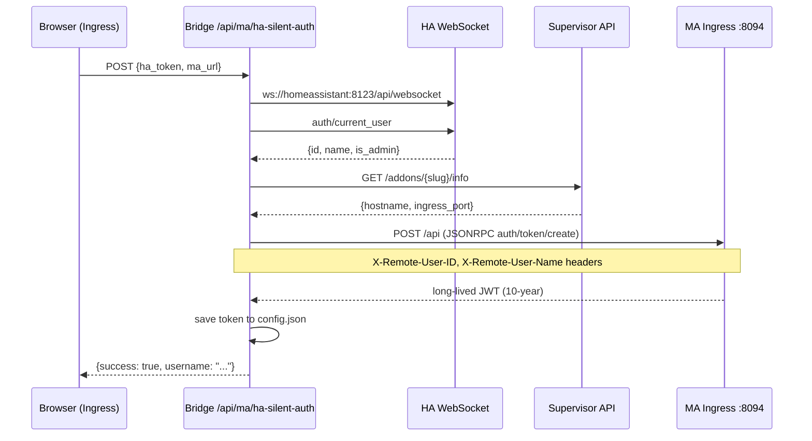
```mermaid
sequenceDiagram
    participant UI as Browser (Ingress)
    participant API as Bridge /api/ma/ha-silent-auth
    participant HA as HA WebSocket
    participant SUP as Supervisor API
    participant MA as MA Ingress :8094

    UI->>API: POST {ha_token, ma_url}
    API->>HA: ws://homeassistant:8123/api/websocket
    API->>HA: auth/current_user
    HA-->>API: {id, name, is_admin}
    API->>SUP: GET /addons/{slug}/info
    SUP-->>API: {hostname, ingress_port}
    API->>MA: POST /api (JSONRPC auth/token/create)
    Note over API,MA: X-Remote-User-ID, X-Remote-User-Name headers
    MA-->>API: long-lived JWT (10-year)
    API->>API: save token to config.json
    API-->>UI: {success: true, username: "..."}
```

---

## State Management

`state.py` is the **single source of truth** for shared runtime state, accessed by the Flask API threads, the asyncio loop, and D-Bus callbacks concurrently.


```mermaid
graph TD
    subgraph "state.py"
        CL[clients: list&#91;SendspinClient&#93;]
        CL_LOCK[_clients_lock: threading.Lock]
        SSE[_status_version: int<br/>_status_condition: threading.Condition]
        SCAN[scan_jobs: dict<br/>TTL = 2 min]
        GROUPS[_ma_groups: list&#91;dict&#93;<br/>_now_playing: dict]
        ADAPTER[_adapter_cache: str<br/>_adapter_cache_lock: threading.Lock]
    end

    SC[SendspinClient._update_status&#40;&#41;] -->|notify_status_changed&#40;&#41;| SSE
    FLASK[Flask /api/status/stream] -->|wait on Condition| SSE
    MM[MaMonitor] -->|set_ma_groups / set_now_playing| GROUPS
    BP_API[routes/api.py] -->|get_clients&#40;&#41;| CL
    BP_API -->|create_scan_job / finish_scan_job| SCAN
```

### SSE Real-Time Updates

`GET /api/status/stream` uses **Server-Sent Events** with `threading.Condition` to push live status to the web UI without polling:

```python
# Server side (state.py)
def notify_status_changed():
    with _status_condition:
        _status_version += 1
        _status_condition.notify_all()

# Flask SSE handler (api_status.py)
def api_status_stream():
    def generate():
        last_version = 0
        while True:
            with _status_condition:
                _status_condition.wait_for(lambda: _status_version > last_version, timeout=25)
                last_version = _status_version
            yield f"data: {json.dumps(get_client_status())}\n\n"
    return Response(generate(), mimetype="text/event-stream")
```

Events are batched with a **100 ms debounce window** — `notify_status_changed()` coalesces rapid-fire updates (e.g., volume slider drag, multiple devices reconnecting) into a single SSE push to prevent event storms.

The initial SSE response includes a **2 KB padding comment** (`<!-- ... -->`) to flush HA Ingress proxy buffers, ensuring the first real event is delivered immediately rather than being buffered by the reverse proxy.

---

## Web API

37 API endpoints are split across **5 route modules** (Flask Blueprints), mounted on the Flask app created in `web_interface.py` and served by **Waitress** on port 8080.

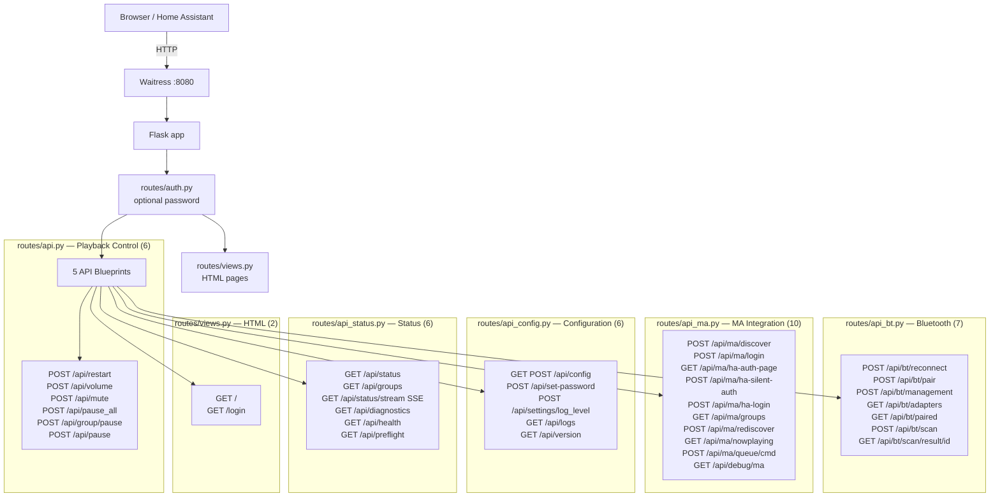
```mermaid
graph TD
    CLIENT[Browser / Home Assistant] -->|HTTP| WAITRESS[Waitress :8080]
    WAITRESS --> FLASK[Flask app]
    FLASK --> AUTH[routes/auth.py<br/>optional password]
    AUTH --> VIEW[routes/views.py<br/>HTML pages]
    AUTH --> API_MOD[5 API Blueprints]

    subgraph "routes/api.py — Playback Control (6)"
        API_MOD --> CTRL[POST /api/restart<br/>POST /api/volume<br/>POST /api/mute<br/>POST /api/pause_all<br/>POST /api/group/pause<br/>POST /api/pause]
    end

    subgraph "routes/api_bt.py — Bluetooth (7)"
        API_MOD --> BT[POST /api/bt/reconnect<br/>POST /api/bt/pair<br/>POST /api/bt/management<br/>GET /api/bt/adapters<br/>GET /api/bt/paired<br/>POST /api/bt/scan<br/>GET /api/bt/scan/result/id]
    end

    subgraph "routes/api_ma.py — MA Integration (10)"
        API_MOD --> MAAPI[POST /api/ma/discover<br/>POST /api/ma/login<br/>GET /api/ma/ha-auth-page<br/>POST /api/ma/ha-silent-auth<br/>POST /api/ma/ha-login<br/>GET /api/ma/groups<br/>POST /api/ma/rediscover<br/>GET /api/ma/nowplaying<br/>POST /api/ma/queue/cmd<br/>GET /api/debug/ma]
    end

    subgraph "routes/api_config.py — Configuration (6)"
        API_MOD --> CFG[GET POST /api/config<br/>POST /api/set-password<br/>POST /api/settings/log_level<br/>GET /api/logs<br/>GET /api/version]
    end

    subgraph "routes/api_status.py — Status (6)"
        API_MOD --> STATUS[GET /api/status<br/>GET /api/groups<br/>GET /api/status/stream SSE<br/>GET /api/diagnostics<br/>GET /api/health<br/>GET /api/preflight]
    end

    subgraph "routes/views.py — HTML (2)"
        API_MOD --> VIEWS[GET /<br/>GET /login]
    end
```

### Async BT Scan

Bluetooth scan is a 10-second blocking operation. The API handles it asynchronously:

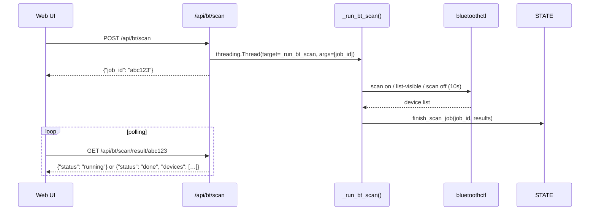
```mermaid
sequenceDiagram
    participant UI as Web UI
    participant API as /api/bt/scan
    participant SCAN as _run_bt_scan()
    participant BC as bluetoothctl

    UI->>API: POST /api/bt/scan
    API->>SCAN: threading.Thread(target=_run_bt_scan, args=[job_id])
    API-->>UI: {"job_id": "abc123"}
    SCAN->>BC: scan on / list-visible / scan off (10s)
    BC-->>SCAN: device list
    SCAN->>STATE: finish_scan_job(job_id, results)
    loop polling
        UI->>API: GET /api/bt/scan/result/abc123
        API-->>UI: {"status": "running"} or {"status": "done", "devices": […]}
    end
```

---

## Configuration System


```mermaid
graph TD
    subgraph "config.py"
        LOAD[load_config&#40;&#41;<br/>reads config.json]
        SAVE[save_device_volume&#40;&#41;<br/>debounced 1s write]
        LOCK[config_lock<br/>threading.Lock]
    end

    subgraph "config.json fields"
        GLOBAL[Global:<br/>SENDSPIN_SERVER · SENDSPIN_PORT<br/>PULSE_LATENCY_MSEC · BT_CHECK_INTERVAL<br/>BT_MAX_RECONNECT_FAILS · PREFER_SBC_CODEC<br/>MA_API_URL · MA_API_TOKEN<br/>LOG_LEVEL · AUTH_PASSWORD_HASH<br/>BRIDGE_NAME · TIMEZONE]
        DEVICES[Bluetooth Devices:<br/>name · mac · adapter · listen_host<br/>listen_port · static_delay_ms<br/>preferred_format · keepalive_interval<br/>bt_management_enabled · LAST_VOLUME]
        ADAPTERS[Bluetooth Adapters:<br/>hci_name · mac · display_name]
    end

    JSON["/config/config.json"] --> LOAD
    LOAD --> GLOBAL
    LOAD --> DEVICES
    LOAD --> ADAPTERS
    BP_API[POST /api/config] -->|validate + write| JSON
    SAVE -->|thread-safe| JSON

    subgraph "HA Addon Path"
        HA_OPT["/data/options.json<br/>written by HA Supervisor"]
        HA_SCRIPT[scripts/translate_ha_config.py]
        HA_OPT --> HA_SCRIPT
        HA_SCRIPT -->|generates| HA_JSON["/data/config.json"]
        HA_JSON --> LOAD
    end
```

### Config Load → Device Spawn


```mermaid
flowchart TD
    CF[config.json] -->|load_config&#40;&#41;| CONFIG
    CONFIG --> DEVS[BLUETOOTH_DEVICES list]
    DEVS --> D1[device 0]
    DEVS --> D2[device 1]
    DEVS --> DN[device N]

    D1 --> BM1[BluetoothManager<br/>mac · adapter · check_interval<br/>prefer_sbc · max_fails]
    D1 --> SC1[SendspinClient<br/>player_name · listen_port<br/>static_delay_ms · keepalive]

    BM1 -.->|bt_manager=| SC1

    SC1 --> RUN1[SC.run&#40;&#41;<br/>asyncio loop]
    RUN1 --> MON1[monitor_and_reconnect&#40;&#41;<br/>asyncio loop]
    RUN1 --> SUB1[daemon subprocess<br/>PULSE_SINK=…]
```

---

## Startup Sequence

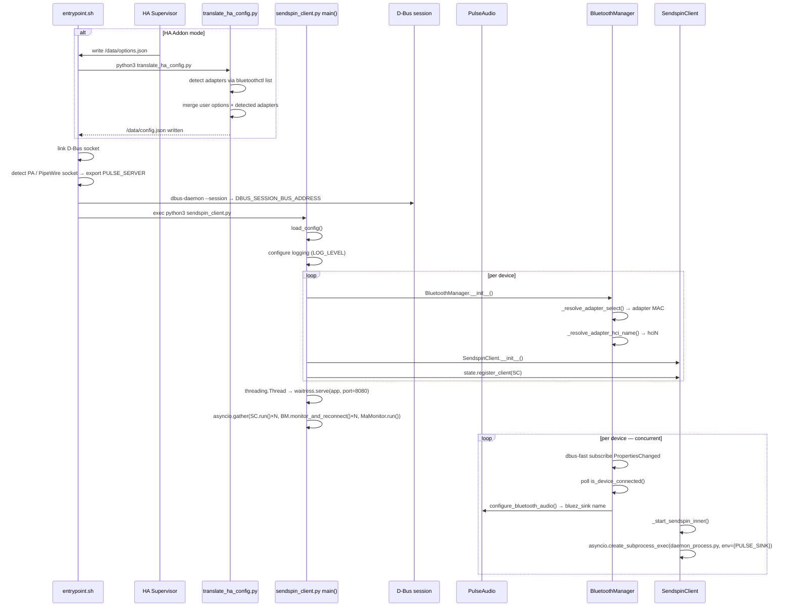
```mermaid
sequenceDiagram
    participant SH as entrypoint.sh
    participant HA as HA Supervisor
    participant TR as translate_ha_config.py
    participant PY as sendspin_client.py main()
    participant DB as D-Bus session
    participant PA as PulseAudio
    participant BM as BluetoothManager
    participant SC as SendspinClient

    alt HA Addon mode
        HA->>SH: write /data/options.json
        SH->>TR: python3 translate_ha_config.py
        TR->>TR: detect adapters via bluetoothctl list
        TR->>TR: merge user options + detected adapters
        TR-->>SH: /data/config.json written
    end

    SH->>SH: link D-Bus socket
    SH->>SH: detect PA / PipeWire socket → export PULSE_SERVER
    SH->>DB: dbus-daemon --session → DBUS_SESSION_BUS_ADDRESS

    SH->>PY: exec python3 sendspin_client.py
    PY->>PY: load_config()
    PY->>PY: configure logging (LOG_LEVEL)

    loop per device
        PY->>BM: BluetoothManager.__init__()
        BM->>BM: _resolve_adapter_select() → adapter MAC
        BM->>BM: _resolve_adapter_hci_name() → hciN
        PY->>SC: SendspinClient.__init__()
        PY->>SC: state.register_client(SC)
    end

    PY->>PY: threading.Thread → waitress.serve(app, port=8080)
    PY->>PY: asyncio.gather(SC.run()×N, BM.monitor_and_reconnect()×N, MaMonitor.run())

    loop per device — concurrent
        BM->>BM: dbus-fast subscribe PropertiesChanged
        BM->>BM: poll is_device_connected()
        BM->>PA: configure_bluetooth_audio() → bluez_sink name
        SC->>SC: _start_sendspin_inner()
        SC->>SC: asyncio.create_subprocess_exec(daemon_process.py, env={PULSE_SINK})
    end
```

---

## Authentication

The web UI supports **optional password protection** via `routes/auth.py`. Authentication is disabled by default (`AUTH_ENABLED = False`) and enabled the moment a password is set via the Configuration panel.

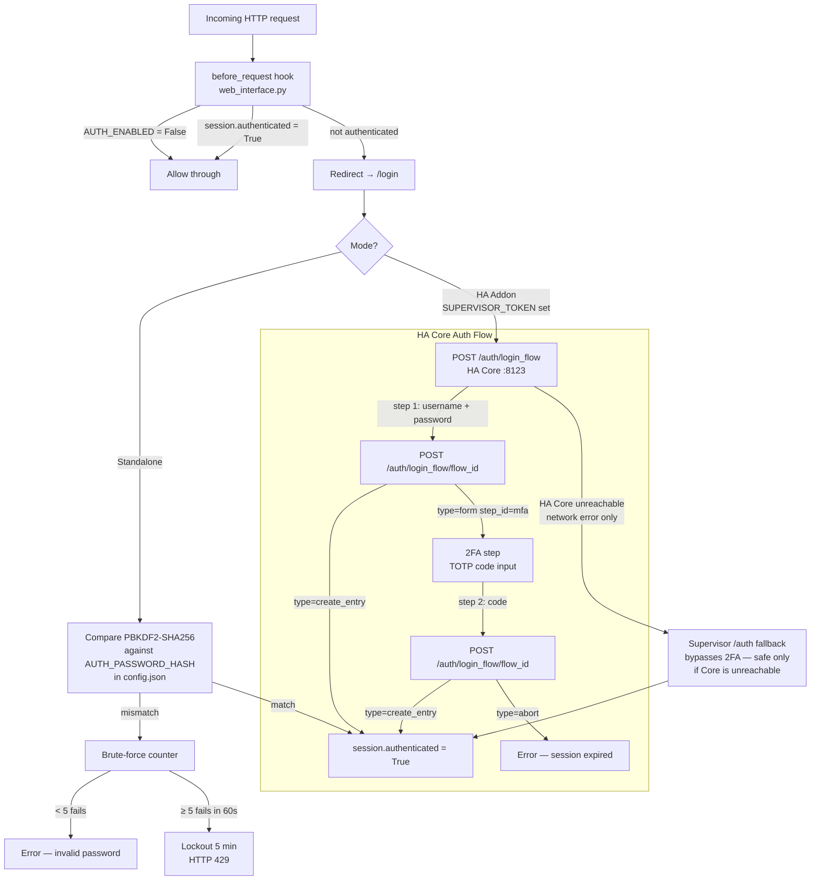
```mermaid
flowchart TD
    REQ[Incoming HTTP request] --> HOOK[before_request hook<br/>web_interface.py]
    HOOK -->|AUTH_ENABLED = False| PASS[Allow through]
    HOOK -->|session.authenticated = True| PASS
    HOOK -->|not authenticated| LOGIN[Redirect → /login]

    LOGIN --> MODE{Mode?}
    MODE -->|Standalone| PBKDF2[Compare PBKDF2-SHA256<br/>against AUTH_PASSWORD_HASH<br/>in config.json]
    MODE -->|HA Addon<br/>SUPERVISOR_TOKEN set| HA_FLOW

    subgraph "HA Core Auth Flow"
        HA_FLOW[POST /auth/login_flow<br/>HA Core :8123]
        HA_FLOW -->|step 1: username + password| HA_STEP[POST /auth/login_flow/flow_id]
        HA_STEP -->|type=create_entry| OK[session.authenticated = True]
        HA_STEP -->|type=form step_id=mfa| MFA[2FA step<br/>TOTP code input]
        MFA -->|step 2: code| HA_STEP2[POST /auth/login_flow/flow_id]
        HA_STEP2 -->|type=create_entry| OK
        HA_STEP2 -->|type=abort| FAIL[Error — session expired]
    end

    HA_FLOW -->|HA Core unreachable<br/>network error only| SUPER[Supervisor /auth fallback<br/>bypasses 2FA — safe only<br/>if Core is unreachable]
    SUPER --> OK

    PBKDF2 -->|match| OK
    PBKDF2 -->|mismatch| BF[Brute-force counter]
    BF -->|< 5 fails| FAIL2[Error — invalid password]
    BF -->|≥ 5 fails in 60s| LOCK[Lockout 5 min<br/>HTTP 429]
```

### Brute-Force Protection

In-memory rate limiter (`_failed` dict in `routes/auth.py`) tracks failures per client IP:

| Threshold | Window | Action |
|---|---|---|
| 5 failed attempts | 60 seconds | IP locked out for 5 minutes |
| 1 successful login | — | Failure counter cleared |
| 5-minute lockout expires | — | Counter reset automatically |

### HA Addon Auth (2FA-aware)

When `SUPERVISOR_TOKEN` is present, the bridge authenticates against **HA Core** (not just the Supervisor API) to support **2FA / TOTP**:

1. Start a login flow via `POST {HA_CORE_URL}/auth/login_flow`
2. Submit credentials via `POST {HA_CORE_URL}/auth/login_flow/{flow_id}`
3. If the response is `type=form, step_id=mfa` → prompt for TOTP code
4. Submit code via another flow step

**Fallback to Supervisor `/auth`** is only used if HA Core is **network-unreachable** (DNS failure, connection refused). If HA Core responds with an HTTP error, the fallback is **blocked** to prevent MFA bypass.

### Session

Flask server-side session with a randomly generated `SECRET_KEY` stored in `config.json`. The key persists across restarts (generated once on first start and saved). Session cookies are `HttpOnly` and expire when the browser closes.

---

## Keepalive Silence

Some Bluetooth speakers auto-disconnect after a period of silence. When `keepalive_interval` (≥ 30 s) is configured for a device, the main process periodically sends a short burst of silent PCM audio to prevent disconnection.

```
device.keepalive_interval = 30  →  silence burst every 30 s
device.keepalive_interval = 0   →  disabled (default)
```

---

## Graceful Degradation

The bridge is designed to remain functional when optional system libraries or services are unavailable. Each optional dependency has a defined fallback:

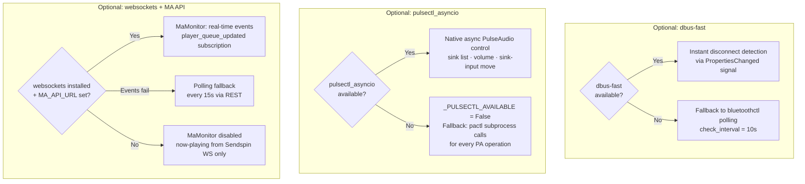
```mermaid
graph TD
    subgraph "Optional: dbus-fast"
        DBUS_CHK{dbus-fast<br/>available?}
        DBUS_CHK -->|Yes| DBUS_ON[Instant disconnect detection<br/>via PropertiesChanged signal]
        DBUS_CHK -->|No| DBUS_OFF[Fallback to bluetoothctl polling<br/>check_interval = 10s]
    end

    subgraph "Optional: pulsectl_asyncio"
        PA_CHK{pulsectl_asyncio<br/>available?}
        PA_CHK -->|Yes| PA_ON[Native async PulseAudio control<br/>sink list · volume · sink-input move]
        PA_CHK -->|No| PA_OFF[_PULSECTL_AVAILABLE = False<br/>Fallback: pactl subprocess calls<br/>for every PA operation]
    end

    subgraph "Optional: websockets + MA API"
        WS_CHK{websockets installed<br/>+ MA_API_URL set?}
        WS_CHK -->|Yes| WS_ON[MaMonitor: real-time events<br/>player_queue_updated subscription]
        WS_CHK -->|Events fail| WS_POLL[Polling fallback<br/>every 15s via REST]
        WS_CHK -->|No| WS_OFF[MaMonitor disabled<br/>now-playing from Sendspin WS only]
    end
```

| Optional Dependency | Flag / Check | Full Mode | Degraded Mode |
|---|---|---|---|
| `dbus-fast` (async D-Bus) | `ImportError` on import | Instant BT disconnect via `PropertiesChanged` signal | `bluetoothctl` polling every `check_interval` (10 s) |
| `pulsectl_asyncio` | `_PULSECTL_AVAILABLE` | Native async PulseAudio: sink list, volume, move sink-inputs | All PA operations fall back to `pactl` subprocess calls |
| `websockets` + `MA_API_URL` configured | `ImportError` + config check | Real-time MA events (`player_queue_updated`) | Polling every 15 s; if MA API not configured, MaMonitor disabled entirely |

> **Note:** All fallbacks are logged at `WARNING` or `INFO` level at startup so operators can diagnose which features are active. Check container logs for lines like `"pulsectl_asyncio unavailable — falling back to pactl subprocess"` or `"D-Bus monitor unavailable — using bluetoothctl polling"`.

---

## Thread & Task Model


```mermaid
graph TD
    subgraph "Main Thread — asyncio event loop"
        EL[asyncio.get_event_loop&#40;&#41;]
        EL --> T1[SendspinClient.run&#40;&#41; × N<br/>coroutine]
        EL --> T2[BluetoothManager.monitor_and_reconnect&#40;&#41; × N<br/>coroutine]
        EL --> T3[MaMonitor.run&#40;&#41;<br/>coroutine]
        T1 --> T4[_read_subprocess_output&#40;&#41;<br/>asyncio.Task]
        T1 --> T5[_read_subprocess_stderr&#40;&#41;<br/>asyncio.Task]
        T1 --> T6[_status_monitor_loop&#40;&#41;<br/>asyncio.Task]
        T2 --> T7[run_in_executor&#40;bluetoothctl&#41;<br/>ThreadPoolExecutor]
    end

    subgraph "Daemon Thread — Waitress"
        WT[waitress.serve&#40;&#41;<br/>WSGI thread pool]
        WT --> W1[Flask request handler × M<br/>WSGI worker threads]
    end

    subgraph "Background Threads"
        BT1[_run_bt_scan&#40;&#41;<br/>threading.Thread<br/>per scan request]
    end

    LOCK[threading.Lock<br/>state._clients_lock<br/>config.config_lock<br/>SendspinClient._status_lock]

    W1 <-->|acquire| LOCK
    T7 <-->|acquire| LOCK
```

> **Note:** All `bluetoothctl` subprocess calls in the async BT monitor loop are dispatched via `loop.run_in_executor(None, …)` to avoid blocking the event loop. The `_bt_executor` is a dedicated `ThreadPoolExecutor(max_workers=2)`.

---

## Reliability Subsystems

### Zombie Playback Watchdog

The main process runs a periodic status monitor (`_status_monitor_loop`) that detects **zombie playback** — situations where `playing=True` but `streaming=False` for more than 15 seconds. This catches broken audio pipelines where the sendspin connection is alive but no audio data flows.

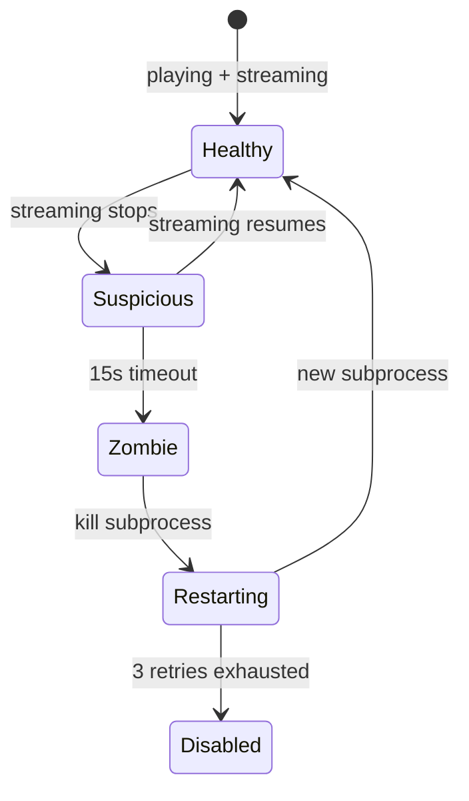
```mermaid
stateDiagram-v2
    [*] --> Healthy: playing + streaming
    Healthy --> Suspicious: streaming stops
    Suspicious --> Healthy: streaming resumes
    Suspicious --> Zombie: 15s timeout
    Zombie --> Restarting: kill subprocess
    Restarting --> Healthy: new subprocess
    Restarting --> Disabled: 3 retries exhausted
```

On detection, the subprocess is killed and restarted, up to 3 retries. After 3 failures, the watchdog stops retrying for that device.

### BT Churn Isolation

Optional feature (`BT_CHURN_THRESHOLD`, default 0 = disabled) that tracks reconnection frequency per device within a sliding window (`BT_CHURN_WINDOW`, default 300 s). If a device reconnects more than the threshold within the window, BT management is automatically disabled for that device — preventing a flaky speaker from consuming adapter time and destabilizing other speakers.

---

## Dependency Graph

```mermaid
graph LR
    SC[sendspin_client.py] --> BM[bluetooth_manager.py]
    SC --> ST[state.py]
    SC --> CFG[config.py]
    SC --> SVC_BD[services/bridge_daemon.py]

    WI[web_interface.py] --> FLASK[Flask + Waitress]
    WI --> R_API[routes/api.py]
    WI --> R_BT[routes/api_bt.py]
    WI --> R_MA[routes/api_ma.py]
    WI --> R_CFG[routes/api_config.py]
    WI --> R_STS[routes/api_status.py]
    WI --> R_VIEW[routes/views.py]
    WI --> R_AUTH[routes/auth.py]

    R_API --> ST
    R_API --> CFG
    R_MA --> SVC_MAC[services/ma_client.py]
    R_BT --> SVC_BT[services/bluetooth.py]

    BM --> SVC_PA[services/pulse.py]
    BM --> SVC_BT

    SVC_BD --> SVC_PA
    SVC_BD --> SENDSPIN[sendspin-cli<br/>aiosendspin]

    DP[services/daemon_process.py] --> SVC_BD
    DP --> SENDSPIN

    ST --> MM[services/ma_monitor.py]
    MM --> SVC_MAC

    CFG -.->|config.json| JSON[(config.json)]
    HA_SCRIPT[scripts/translate_ha_config.py] -.->|options.json→config.json| JSON
```

---

## External Dependencies

| Package | Role |
|---|---|
| `aiosendspin` | Async Sendspin WebSocket client library |
| `sendspin` (local) | CLI + daemon runner (`SendspinDaemon`) |
| `Flask` + `Waitress` | Web UI and REST API server |
| `pulsectl_asyncio` | Async PulseAudio control (sink routing, volume) |
| `dbus-fast` | Async D-Bus for instant BT disconnect detection |
| `websockets` | MA API WebSocket connection in `MaMonitor` |
| `aiohttp` / `httpx` | MA REST API calls in `ma_client.py` |
| `bluetoothctl` | System BT management (subprocess) |
| `pactl` | Audio sink discovery (subprocess, legacy path) |
