## Обзор

`sendspin-bt-bridge` — это **многопроцессный Python-бридж**, который соединяет аудиопротокол Sendspin Music Assistant с Bluetooth-колонками. Основной процесс теперь загружается через `BridgeOrchestrator`, который отвечает за bridge-wide runtime setup (загрузка конфига, channel-aware дефолты, публикацию lifecycle-state, bootstrap MA, запуск веб-сервера и сборку долгоживущих задач). Каждая настроенная колонка по-прежнему работает в собственном **изолированном подпроцессе** с выделенным контекстом PulseAudio, что обеспечивает корректную маршрутизацию аудио без взаимных помех между устройствами.

```
┌─────────────────────────────────────────────────────────────────┐
│                   Docker / LXC / HA Addon                       │
│                                                                 │
│  ┌──────────────────────────────────────────────────────────┐   │
│  │              Main Python Process                         │   │
│  │  sendspin_client.py  ·  asyncio event loop               │   │
│  │  Flask/Waitress API  ·  BluetoothManager × N             │   │
│  │  MaMonitor  ·  state.py                                   │   │
│  └───────────────┬──────────────────────────────────────────┘   │
│                  │ asyncio.create_subprocess_exec (per device)  │
│        ┌─────────┼─────────┐                                    │
│        ▼         ▼         ▼                                    │
│  ┌──────────┐ ┌──────────┐ ┌──────────┐                        │
│  │ daemon   │ │ daemon   │ │ daemon   │  PULSE_SINK=bluez_sink… │
│  │ process  │ │ process  │ │ process  │  per subprocess         │
│  │ ENEBY20  │ │ Yandex   │ │ Lenco    │                        │
│  └────┬─────┘ └────┬─────┘ └────┬─────┘                        │
│       │             │             │                              │
│       └──── Sendspin WebSocket ───┘                             │
│             (aiosendspin / Music Assistant)                      │
└─────────────────────────────────────────────────────────────────┘
         │                        │
    Bluetooth                PulseAudio / PipeWire
    (bluetoothctl             (bluez_sink.XX.a2dp_sink)
     + D-Bus)
```

---

## Схема компонентов


```mermaid
graph TD
    subgraph "Container / Host"
        EP[entrypoint.sh<br/>D-Bus · Audio · HA config]
        EP --> MP

        subgraph "Main Process — sendspin_client.py"
            MP[main&#40;&#41;<br/>asyncio event loop]
            MP --> BO[BridgeOrchestrator]
            BO --> CFG[config.py<br/>load_config · port/channel defaults]
            BO --> LS[BridgeLifecycleState<br/>startup/runtime publication]
            BO --> MIS[BridgeMaIntegrationService<br/>MA URL/token/groups]
            BO --> SC[SendspinClient × N]
            BO --> BM[BluetoothManager × N]
            BO --> WS[Waitress HTTP server<br/>daemon thread]
            BO --> MM[MaMonitor<br/>asyncio task]
            BO --> UC[update_checker<br/>asyncio task]

            SC -->|delegates| SUBSVC[SubprocessCommand / IPC / Stderr / Stop services]
            SUBSVC <-->|JSON stdin/stdout| DP
            SC --> PH[PlaybackHealthMonitor]
            SC --> SEB[StatusEventBuilder]
            SC --- ST[state.py<br/>shared runtime state]
            BM --- ST
            LS --- ST
            MM --> ST
            UC --> ST

            WS --> FLASK[Flask app<br/>web_interface.py]
            FLASK --> BP_API[routes/api.py<br/>Blueprint]
            FLASK --> BP_BT[routes/api_bt.py<br/>Blueprint]
            FLASK --> BP_MA[routes/api_ma.py<br/>Blueprint]
            FLASK --> BP_CFG[routes/api_config.py<br/>Blueprint]
            FLASK --> BP_STS[routes/api_status.py<br/>Blueprint]
            FLASK --> BP_VIEW[routes/views.py<br/>Blueprint]
            FLASK --> BP_AUTH[routes/auth.py<br/>Blueprint]
        end

        subgraph "Subprocess per Device"
            DP[daemon_process.py<br/>asyncio event loop]
            DP --> BD[BridgeDaemon<br/>services/bridge_daemon.py]
            BD --> SD[SendspinDaemon<br/>sendspin-cli]
            SD <-->|WebSocket| MA[Music Assistant]
            BD --> PA[PulseAudio context<br/>PULSE_SINK=bluez_sink…]
        end

        subgraph "services/"
            SVC_BT[bluetooth.py<br/>BT helpers]
            SVC_PA[pulse.py<br/>PulseAudio helpers]
            SVC_MAC[ma_client.py<br/>MA REST API]
            SVC_IPC[ipc_protocol.py<br/>protocol_version envelope]
        end

        BM --> SVC_BT
        BM --> SVC_PA
        BD --> SVC_PA
        MM --> SVC_MAC
        BP_API --> SVC_MAC
        SUBSVC --> SVC_IPC
    end

    BT_HW[Bluetooth Hardware<br/>hci0 / hci1 / …]
    PA_HW[PulseAudio / PipeWire]

    BM <-->|bluetoothctl + D-Bus| BT_HW
    PA --> PA_HW
    BT_HW <-->|A2DP| SPK[Bluetooth Speaker]
    PA_HW --> SPK
```

---

## Архитектура процессов

### Основной процесс

Точка входа runtime (`sendspin_client.py` `main()`) теперь остаётся намеренно тонкой. Основная последовательность запуска вынесена в `BridgeOrchestrator`: он загружает конфиг, рассчитывает channel-aware дефолты, публикует lifecycle-state, поднимает веб-сервер, инициализирует опциональную интеграцию с MA и собирает долгоживущие runtime-задачи.

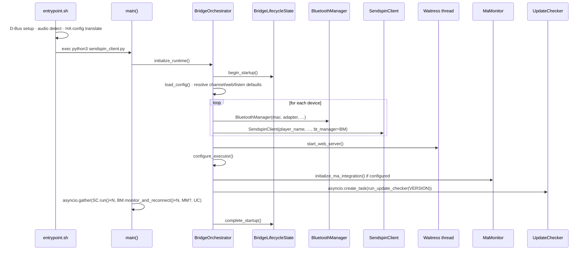
```mermaid
sequenceDiagram
    participant SH as entrypoint.sh
    participant MP as main()
    participant BO as BridgeOrchestrator
    participant LS as BridgeLifecycleState
    participant BM as BluetoothManager
    participant SC as SendspinClient
    participant WS as Waitress thread
    participant MM as MaMonitor
    participant UC as UpdateChecker

    SH->>SH: D-Bus setup · audio detect · HA config translate
    SH->>MP: exec python3 sendspin_client.py
    MP->>BO: initialize_runtime()
    BO->>LS: begin_startup()
    BO->>BO: load_config() · resolve channel/web/listen defaults
    loop for each device
        BO->>BM: BluetoothManager(mac, adapter, …)
        BO->>SC: SendspinClient(player_name, …, bt_manager=BM)
    end
    BO->>WS: start_web_server()
    BO->>BO: configure_executor()
    BO->>MM: initialize_ma_integration() if configured
    BO->>UC: asyncio.create_task(run_update_checker(VERSION))
    MP->>MP: asyncio.gather(SC.run()×N, BM.monitor_and_reconnect()×N, MM?, UC)
    BO->>LS: complete_startup()
```

### Bridge-wide orchestration и service seams

Несколько явных сервисных швов теперь позволяют развивать runtime без изменения device-контракта:

- `BridgeOrchestrator` владеет bootstrap-ом моста, signal handling, сборкой задач и channel-aware дефолтами.
- `BridgeLifecycleState` публикует startup/runtime progress в `state.py` для `/api/startup-progress`, diagnostics и UI.
- `BridgeMaIntegrationService` разрешает MA API credentials, предзагружает sync groups и решает, нужно ли запускать `MaMonitor`.
- `SendspinClient` сохраняет ownership жизненного цикла отдельной колонки, но делегирует сфокусированные subprocess-задачи в `SubprocessCommandService`, `SubprocessIpcService`, `SubprocessStderrService` и `SubprocessStopService`.
- `PlaybackHealthMonitor` и `StatusEventBuilder` держат watchdog/error/event-логику вне транспортного пути.

### Подпроцесс для каждого устройства

Каждый `SendspinClient.run()` порождает `daemon_process.py` как **изолированный подпроцесс**. Подпроцесс получает `PULSE_SINK=bluez_sink.<MAC>.a2dp_sink` внедрённым в своё окружение ещё до того, как установлено соединение с PulseAudio — это гарантирует корректную маршрутизацию звука с самого первого семпла, без необходимости вызова `move-sink-input`.

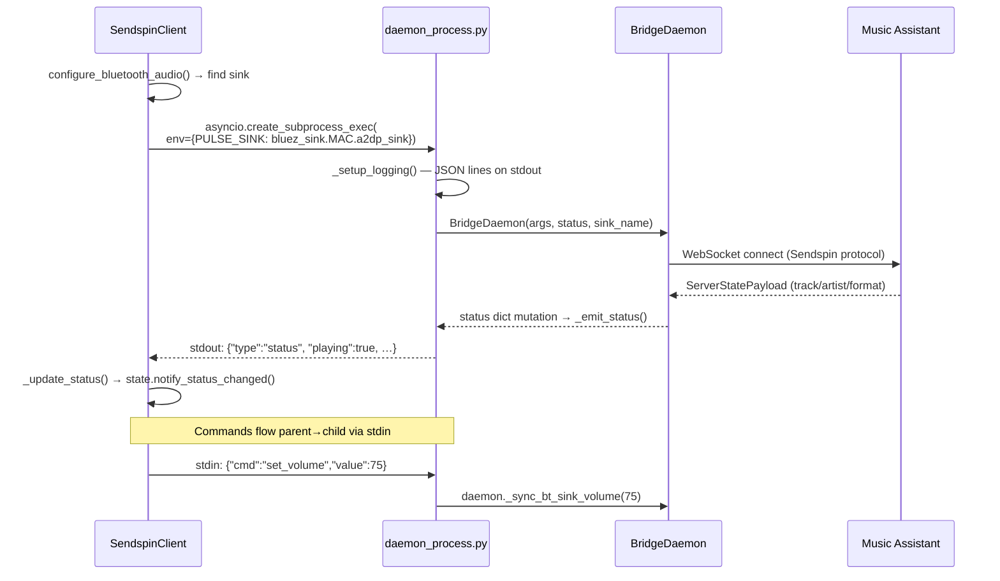
```mermaid
sequenceDiagram
    participant SC as SendspinClient
    participant DP as daemon_process.py
    participant BD as BridgeDaemon
    participant MA as Music Assistant

    SC->>SC: configure_bluetooth_audio() → find sink
    SC->>DP: asyncio.create_subprocess_exec(<br/>env={PULSE_SINK: bluez_sink.MAC.a2dp_sink})
    DP->>DP: _setup_logging() — JSON lines on stdout
    DP->>BD: BridgeDaemon(args, status, sink_name)
    BD->>MA: WebSocket connect (Sendspin protocol)
    MA-->>BD: ServerStatePayload (track/artist/format)
    BD-->>DP: status dict mutation → _emit_status()
    DP-->>SC: stdout: {"type":"status", "playing":true, …}
    SC->>SC: _update_status() → state.notify_status_changed()
    Note over SC,DP: Commands flow parent→child via stdin
    SC->>DP: stdin: {"cmd":"set_volume","value":75}
    DP->>BD: daemon._sync_bt_sink_volume(75)
```

---

## IPC-протокол (stdin / stdout)

Всё межпроцессное взаимодействие между основным процессом и каждым подпроцессом-демоном использует **JSON-конверты, разделённые переводом строки**, описанные в `services.ipc_protocol`.

Текущий контракт помечает сообщения полем `protocol_version: 1`, но родитель и подпроцесс остаются обратно совместимыми с legacy-сообщениями без этого поля.

### Подпроцесс → Родитель (stdout)

| `type` | Поля | Когда |
|---|---|---|
| `status` | Полный словарь `DeviceStatus` + `protocol_version` | При любом изменении состояния (с дедупликацией) |
| `log` | `level`, `name`, `msg`, `protocol_version` | Каждая проксируемая запись лога |
| `error` | `message`, `details?`, `protocol_version` | Фатальные daemon/bootstrap ошибки, которые нужно поднять как структурированный сигнал |

```json
{"type": "status", "protocol_version": 1, "playing": true, "volume": 75, "current_track": "Mooncalf"}
{"type": "log", "protocol_version": 1, "level": "info", "name": "__main__", "msg": "[ENEBY20] Stream started"}
{"type": "error", "protocol_version": 1, "message": "Unsupported sink", "details": {"sink": "bluez_sink..."}}
```

`SubprocessIpcService` разбирает эти конверты, применяет policy для версии протокола и возвращает status/log/error payloads обратно в состояние `SendspinClient`.

### Родитель → Подпроцесс (stdin)

| `cmd` | Дополнительные поля | Эффект |
|---|---|---|
| `set_volume` | `value: int`, `protocol_version` | Устанавливает громкость PA-синка + уведомляет MA |
| `set_mute` | `muted: bool`, `protocol_version` | Переключает mute |
| `stop` | `protocol_version` | Чистое завершение |
| `pause` / `play` | `protocol_version` | Отправляет `MediaCommand` в MA |
| `reconnect` | `protocol_version` | Отключается от MA (вызывает переподключение) |
| `set_log_level` | `level: str`, `protocol_version` | Немедленно меняет уровень корневого логгера |

```json
{"cmd": "set_volume", "value": 60, "protocol_version": 1}
{"cmd": "stop", "protocol_version": 1}
```

`SubprocessCommandService` сериализует command-конверты, а `SubprocessStopService` координирует graceful stop / terminate fallback при рестарте и shutdown.

---

## Маршрутизация аудио

Ключевой принцип: **каждый подпроцесс получает собственный клиентский контекст PulseAudio** с предустановленным `PULSE_SINK`. Это устраняет состояние гонки, при котором аудио могло начать воспроизводиться через синк по умолчанию до того, как бридж успевал его переключить.

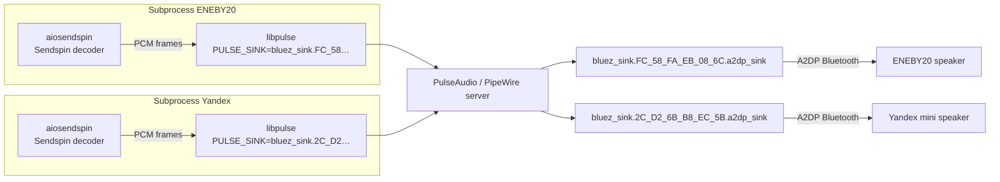
```mermaid
graph LR
    subgraph "Subprocess ENEBY20"
        A1[aiosendspin<br/>Sendspin decoder] -->|PCM frames| PA1[libpulse<br/>PULSE_SINK=bluez_sink.FC_58…]
    end
    subgraph "Subprocess Yandex"
        A2[aiosendspin<br/>Sendspin decoder] -->|PCM frames| PA2[libpulse<br/>PULSE_SINK=bluez_sink.2C_D2…]
    end

    PA1 --> PAS[PulseAudio / PipeWire server]
    PA2 --> PAS

    PAS --> S1[bluez_sink.FC_58_FA_EB_08_6C.a2dp_sink]
    PAS --> S2[bluez_sink.2C_D2_6B_B8_EC_5B.a2dp_sink]

    S1 -->|A2DP Bluetooth| SPK1[ENEBY20 speaker]
    S2 -->|A2DP Bluetooth| SPK2[Yandex mini speaker]
```

### Обнаружение синка

`BluetoothManager.configure_bluetooth_audio()` последовательно пробует четыре шаблона имён синков, пока `pactl list short sinks` не подтвердит наличие одного из них:

```
bluez_output.{MAC_UNDERSCORED}.1          # PipeWire
bluez_output.{MAC_UNDERSCORED}.a2dp-sink  # PipeWire alt
bluez_sink.{MAC_UNDERSCORED}.a2dp_sink    # PulseAudio (HAOS)
bluez_sink.{MAC_UNDERSCORED}              # PulseAudio fallback
```

Выполняет до **3 повторных попыток** с паузами по 3 секунды (A2DP-синк появляется через несколько секунд после установления BT-соединения).

### Исправление PA module-rescue-streams

При переподключении Bluetooth модуль PulseAudio `module-rescue-streams` может переместить sink-inputs на синк по умолчанию. `BridgeDaemon._ensure_sink_routing()` исправляет это один раз при запуске потока — флаг `_sink_routed` предотвращает повторные корректировки в цикле.

### Управление громкостью (архитектура единственного писателя)

Громкость и mute управляются по модели **единственного писателя**: только `bridge_daemon` (внутри каждого подпроцесса) записывает в PulseAudio. Это устраняет петли обратной связи, при которых несколько писателей конкурировали и вызывали «прыжки» громкости.

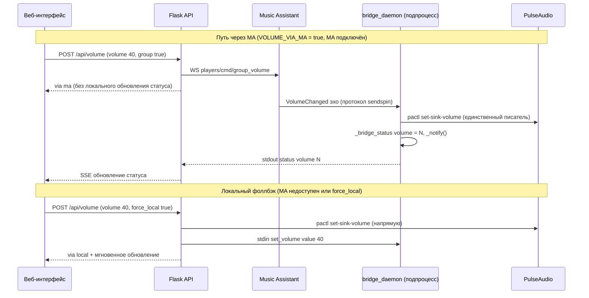
```mermaid
sequenceDiagram
    participant UI as Веб-интерфейс
    participant API as Flask API
    participant MA as Music Assistant
    participant BD as bridge_daemon (подпроцесс)
    participant PA as PulseAudio

    Note over UI,PA: Путь через MA (VOLUME_VIA_MA = true, MA подключён)
    UI->>API: POST /api/volume (volume 40, group true)
    API->>MA: WS players/cmd/group_volume
    API-->>UI: via ma (без локального обновления статуса)
    MA->>BD: VolumeChanged эхо (протокол sendspin)
    BD->>PA: pactl set-sink-volume (единственный писатель)
    BD->>BD: _bridge_status volume = N, _notify()
    BD-->>API: stdout status volume N
    API-->>UI: SSE обновление статуса

    Note over UI,PA: Локальный фоллбэк (MA недоступен или force_local)
    UI->>API: POST /api/volume (volume 40, force_local true)
    API->>PA: pactl set-sink-volume (напрямую)
    API->>BD: stdin set_volume value 40
    API-->>UI: via local + мгновенное обновление
```

**Маршрутизация групповой громкости:**

| Тип устройства | Метод | Поведение |
|---|---|---|
| В группе синхронизации MA | MA `group_volume` (один вызов на уникальную группу) | Пропорциональная дельта — сохраняет соотношение громкости между колонками |
| Одиночное (без группы) | Прямой PulseAudio (`pactl`) | Точное значение — значение слайдера = громкость колонки |

Параметр конфигурации `VOLUME_VIA_MA` (по умолчанию: `true`) определяет, маршрутизируются ли изменения громкости через MA. Установите `false` для прямого использования PulseAudio — при этом MA не будет отражать изменения громкости, сделанные через бридж.

`MUTE_VIA_MA` (по умолчанию: `false`) управляет маршрутизацией mute независимо. При `false` команды mute идут напрямую в PulseAudio для мгновенного отклика. При `true` mute маршрутизируется через MA API — полезно для синхронизации UI MA, но добавляет сетевую задержку.

---

## Управление Bluetooth

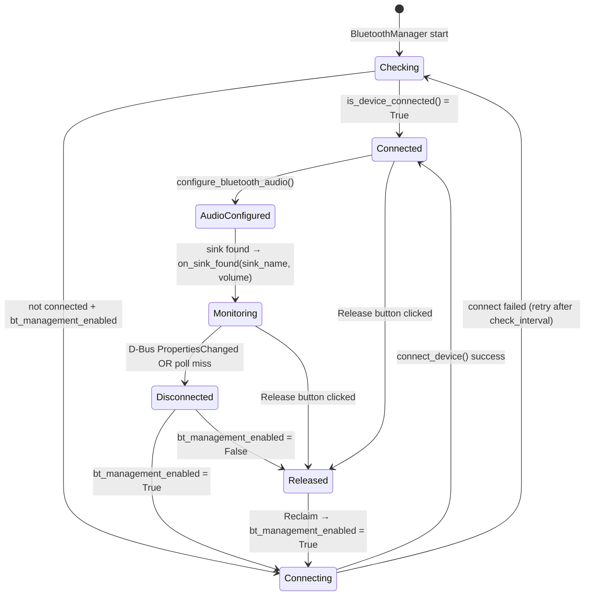
```mermaid
stateDiagram-v2
    [*] --> Checking: BluetoothManager start

    Checking --> Connected: is_device_connected() = True
    Checking --> Connecting: not connected + bt_management_enabled

    Connecting --> Connected: connect_device() success
    Connecting --> Checking: connect failed (retry after check_interval)

    Connected --> AudioConfigured: configure_bluetooth_audio()
    AudioConfigured --> Monitoring: sink found → on_sink_found(sink_name, volume)

    Monitoring --> Disconnected: D-Bus PropertiesChanged OR poll miss
    Disconnected --> Connecting: bt_management_enabled = True
    Disconnected --> Released: bt_management_enabled = False

    Released --> Connecting: Reclaim → bt_management_enabled = True

    Monitoring --> Released: Release button clicked
    Connected --> Released: Release button clicked
```

### Процесс подключения

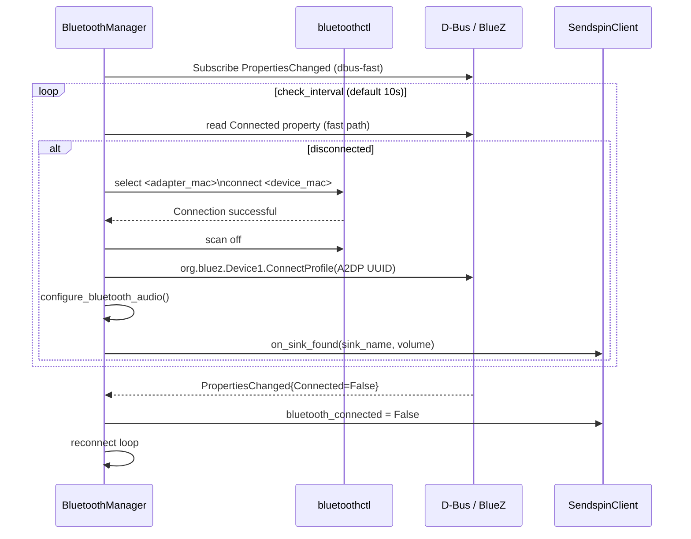
```mermaid
sequenceDiagram
    participant BM as BluetoothManager
    participant BC as bluetoothctl
    participant DBUS as D-Bus / BlueZ
    participant SC as SendspinClient

    BM->>DBUS: Subscribe PropertiesChanged (dbus-fast)
    loop check_interval (default 10s)
        BM->>DBUS: read Connected property (fast path)
        alt disconnected
            BM->>BC: select <adapter_mac>\nconnect <device_mac>
            BC-->>BM: Connection successful
            BM->>BC: scan off
            BM->>DBUS: org.bluez.Device1.ConnectProfile(A2DP UUID)
            BM->>BM: configure_bluetooth_audio()
            BM->>SC: on_sink_found(sink_name, volume)
        end
    end
    DBUS-->>BM: PropertiesChanged{Connected=False}
    BM->>SC: bluetooth_connected = False
    BM->>BM: reconnect loop
```

### Принудительный выбор кодека SBC

При `prefer_sbc: true` после каждого подключения `BluetoothManager` выполняет:
```bash
pactl send-message /card/<card>/bluez5/set_codec a2dp_sink SBC
```
Это принудительно устанавливает простейший обязательный кодек A2DP, снижая нагрузку на CPU слабого железа. Требуется PulseAudio 15+.

### Мгновенное обнаружение отключения через D-Bus

`bluetooth_manager.py` использует `dbus-fast` (async) для подписки на `org.freedesktop.DBus.Properties.PropertiesChanged` по пути устройства `/org/bluez/<hci>/dev_XX_XX_XX_XX_XX_XX`. Это обеспечивает **мгновенное** обнаружение отключения вместо ожидания следующего цикла опроса.

При недоступности `dbus-fast` переключается на опрос через `bluetoothctl`.

---

## Интеграция с Music Assistant

### Протокол Sendspin (для каждого подпроцесса)

Каждый подпроцесс подключается к MA как **Sendspin-плеер** через WebSocket. `BridgeDaemon` переопределяет ключевые методы `SendspinDaemon` для перехвата обратных вызовов и обновления общего словаря состояния.

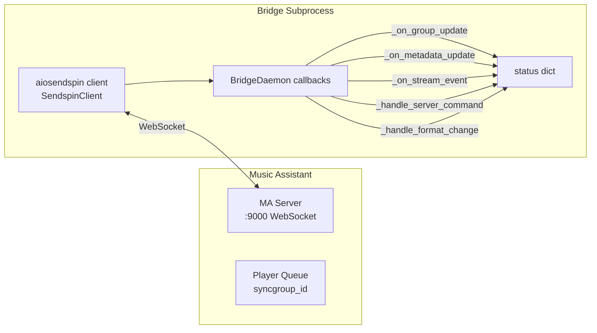
```mermaid
graph LR
    subgraph "Music Assistant"
        MA_SRV[MA Server<br/>:9000 WebSocket]
        MA_QUEUE[Player Queue<br/>syncgroup_id]
    end

    subgraph "Bridge Subprocess"
        AC[aiosendspin client<br/>SendspinClient]
        BD[BridgeDaemon callbacks]
        AC <-->|WebSocket| MA_SRV
        AC --> BD
        BD -->|_on_group_update| STATUS[status dict]
        BD -->|_on_metadata_update| STATUS
        BD -->|_on_stream_event| STATUS
        BD -->|_handle_server_command| STATUS
        BD -->|_handle_format_change| STATUS
    end
```

### Интеграция с MA REST API (MaMonitor)

При настроенных `MA_API_URL` и `MA_API_TOKEN` основной процесс запускает задачу `MaMonitor`, которая поддерживает постоянное **WebSocket-соединение с конечной точкой `/ws` MA** для подписки на события в реальном времени.

**Поддерживаемые провайдеры аутентификации MA:**

| Метод | Эндпоинт | Сценарий |
|---|---|---|
| Прямые учётные данные MA | `POST /api/ma/login` | Автономная установка — логин и пароль отправляются в MA |
| HA OAuth (через браузер) | `GET /api/ma/ha-auth-page` → callback | Кнопка «Войти через Home Assistant» в интерфейсе |
| Учётные данные HA через MA | `POST /api/ma/ha-login` | Логин и пароль пересылаются в HA `login_flow` через MA |
| Тихая аутентификация HA (аддон) | `POST /api/ma/ha-silent-auth` | Автоматически — через заголовки Ingress, без участия пользователя |

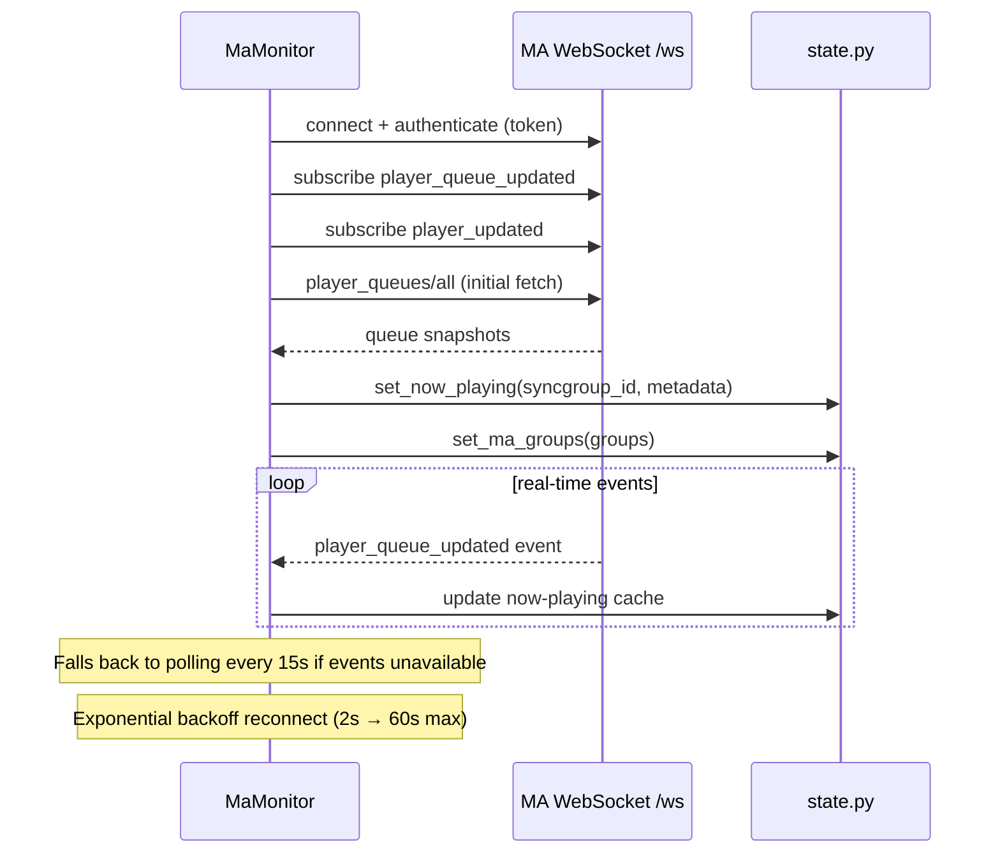
```mermaid
sequenceDiagram
    participant MM as MaMonitor
    participant MA as MA WebSocket /ws
    participant ST as state.py

    MM->>MA: connect + authenticate (token)
    MM->>MA: subscribe player_queue_updated
    MM->>MA: subscribe player_updated
    MM->>MA: player_queues/all (initial fetch)
    MA-->>MM: queue snapshots
    MM->>ST: set_now_playing(syncgroup_id, metadata)
    MM->>ST: set_ma_groups(groups)
    loop real-time events
        MA-->>MM: player_queue_updated event
        MM->>ST: update now-playing cache
    end
    Note over MM: Falls back to polling every 15s if events unavailable
    Note over MM: Exponential backoff reconnect (2s → 60s max)
```

### Процесс возобновления воспроизведения группы

Когда MA возобновляет синкгруппу (например, после переподключения устройства), бридж может инициировать групповое воспроизведение через REST API:

```
POST /api/ma/queue/cmd
  {"syncgroup_id": "syncgroup_uwkgkafx", "command": "play"}

→ ma_client.ma_group_play(url, token, syncgroup_id)
→ POST {MA_API_URL}/api/players/cmd/play?player_id={syncgroup_id}
```

### Авторизация в MA без пароля (режим аддона)

В режиме HA add-on бридж автоматически создаёт MA API-токен через Ingress JSONRPC MA — ручная настройка токена не требуется.

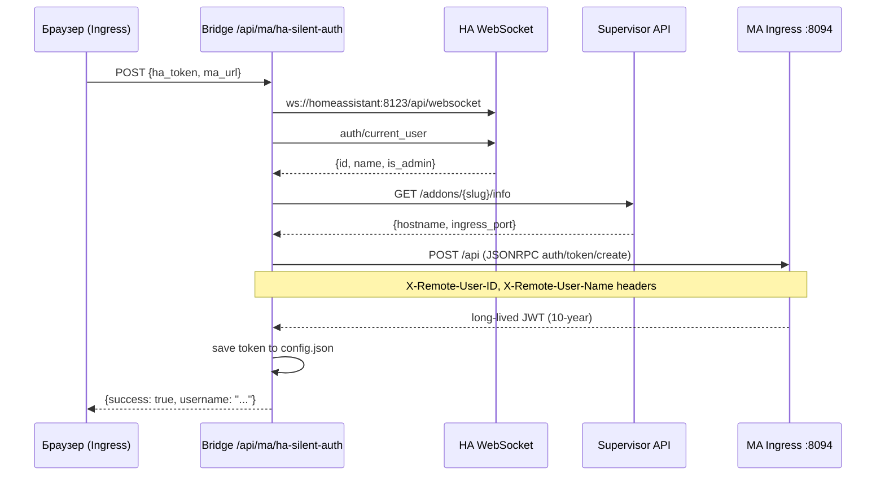
```mermaid
sequenceDiagram
    participant UI as Браузер (Ingress)
    participant API as Bridge /api/ma/ha-silent-auth
    participant HA as HA WebSocket
    participant SUP as Supervisor API
    participant MA as MA Ingress :8094

    UI->>API: POST {ha_token, ma_url}
    API->>HA: ws://homeassistant:8123/api/websocket
    API->>HA: auth/current_user
    HA-->>API: {id, name, is_admin}
    API->>SUP: GET /addons/{slug}/info
    SUP-->>API: {hostname, ingress_port}
    API->>MA: POST /api (JSONRPC auth/token/create)
    Note over API,MA: X-Remote-User-ID, X-Remote-User-Name headers
    MA-->>API: long-lived JWT (10-year)
    API->>API: save token to config.json
    API-->>UI: {success: true, username: "..."}
```

---

## Управление состоянием

`state.py` является **единственным источником истины** для общего состояния во время выполнения, к которому параллельно обращаются потоки Flask API, asyncio-цикл и D-Bus-коллбэки.


```mermaid
graph TD
    subgraph "state.py"
        CL[clients: list&#91;SendspinClient&#93;]
        CL_LOCK[_clients_lock: threading.Lock]
        SSE[_status_version: int<br/>_status_condition: threading.Condition]
        SCAN[scan_jobs: dict<br/>TTL = 2 min]
        GROUPS[_ma_groups: list&#91;dict&#93;<br/>_now_playing: dict]
        ADAPTER[_adapter_cache: str<br/>_adapter_cache_lock: threading.Lock]
    end

    SC[SendspinClient._update_status&#40;&#41;] -->|notify_status_changed&#40;&#41;| SSE
    FLASK[Flask /api/status/stream] -->|wait on Condition| SSE
    MM[MaMonitor] -->|set_ma_groups / set_now_playing| GROUPS
    BP_API[routes/api.py] -->|get_clients&#40;&#41;| CL
    BP_API -->|create_scan_job / finish_scan_job| SCAN
```

### Обновления в реальном времени через SSE

`GET /api/status/stream` использует **Server-Sent Events** с `threading.Condition` для отправки актуального состояния в веб-интерфейс без опроса:

```python
# Server side (state.py)
def notify_status_changed():
    with _status_condition:
        _status_version += 1
        _status_condition.notify_all()

# Flask SSE handler (api_status.py)
def api_status_stream():
    def generate():
        last_version = 0
        while True:
            with _status_condition:
                _status_condition.wait_for(lambda: _status_version > last_version, timeout=25)
                last_version = _status_version
            yield f"data: {json.dumps(get_client_status())}\n\n"
    return Response(generate(), mimetype="text/event-stream")
```

События объединяются с **окном дебаунса 100 мс** — `notify_status_changed()` группирует частые обновления (перетаскивание ползунка громкости, переподключение нескольких устройств) в одну SSE-отправку для предотвращения шторма событий.

Первый SSE-ответ включает **2 КБ комментария-заполнителя** (`<!-- ... -->`), который сбрасывает буферы прокси HA Ingress — первое реальное событие доставляется немедленно, а не задерживается обратным прокси.

---

## Веб-API

Flask-приложение, создаваемое в `web_interface.py`, обслуживается через **Waitress** и разделено на **5 API blueprints плюс views/auth routes**. Поверхности маршрутов сгруппированы по ownership, а не по экрану UI, чтобы оркестрация, Bluetooth, Music Assistant, config и status могли развиваться независимо.

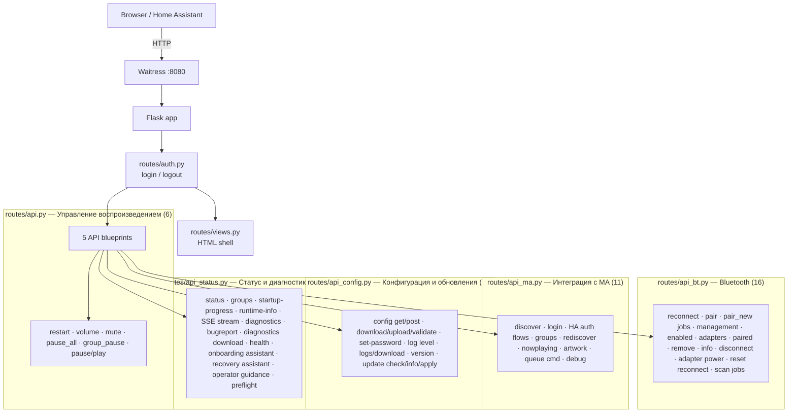
```mermaid
graph TD
    CLIENT[Browser / Home Assistant] -->|HTTP| WAITRESS[Waitress :8080]
    WAITRESS --> FLASK[Flask app]
    FLASK --> AUTH[routes/auth.py<br/>login / logout]
    AUTH --> VIEW[routes/views.py<br/>HTML shell]
    AUTH --> API_MOD[5 API blueprints]

    subgraph "routes/api.py — Управление воспроизведением (6)"
        API_MOD --> CTRL[restart · volume · mute · pause_all · group_pause · pause/play]
    end

    subgraph "routes/api_bt.py — Bluetooth (16)"
        API_MOD --> BT[reconnect · pair · pair_new jobs · management · enabled · adapters · paired · remove · info · disconnect · adapter power · reset reconnect · scan jobs]
    end

    subgraph "routes/api_ma.py — Интеграция с MA (11)"
        API_MOD --> MAAPI[discover · login · HA auth flows · groups · rediscover · nowplaying · artwork · queue cmd · debug]
    end

    subgraph "routes/api_config.py — Конфигурация и обновления (12)"
        API_MOD --> CFG[config get/post · download/upload/validate · set-password · log level · logs/download · version · update check/info/apply]
    end

    subgraph "routes/api_status.py — Статус и диагностика (13)"
        API_MOD --> STATUS[status · groups · startup-progress · runtime-info · SSE stream · diagnostics · bugreport · diagnostics download · health · onboarding assistant · recovery assistant · operator guidance · preflight]
    end
```

### Асинхронное BT-сканирование

Сканирование Bluetooth — операция, блокирующая на 10 секунд. API обрабатывает её асинхронно:

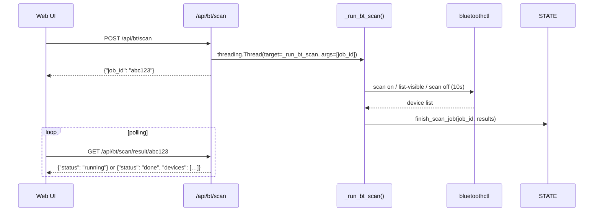
```mermaid
sequenceDiagram
    participant UI as Web UI
    participant API as /api/bt/scan
    participant SCAN as _run_bt_scan()
    participant BC as bluetoothctl

    UI->>API: POST /api/bt/scan
    API->>SCAN: threading.Thread(target=_run_bt_scan, args=[job_id])
    API-->>UI: {"job_id": "abc123"}
    SCAN->>BC: scan on / list-visible / scan off (10s)
    BC-->>SCAN: device list
    SCAN->>STATE: finish_scan_job(job_id, results)
    loop polling
        UI->>API: GET /api/bt/scan/result/abc123
        API-->>UI: {"status": "running"} or {"status": "done", "devices": […]}
    end
```

### Operator guidance и сборка bug-report

`routes/api_status.py` теперь делает больше, чем просто отдаёт сырой status snapshot:

- **Onboarding assistant** превращает runtime/config состояние в пошаговые setup-рекомендации.
- **Recovery assistant** группирует actionable runtime-проблемы вроде disconnected speakers, released devices и missing sinks.
- **Operator guidance** — верхнеуровневый UI-контракт для шапки и notice stack, который решает, что показать оператору в первую очередь.
- **Bug report assembly** собирает masked diagnostics и recent issue-worthy logs в machine-readable payload и в редактируемое `suggested_description` для GitHub issue flow.

За счёт этого UI guidance, diagnostics download и bug-report dialog используют одну и ту же runtime truth, а не строят независимые эвристики в браузере.

---

## Система конфигурации


```mermaid
graph TD
    subgraph "config.py"
        LOAD[load_config&#40;&#41;<br/>reads config.json]
        SAVE[save_device_volume&#40;&#41;<br/>debounced 1s write]
        UPDATE[update_config&#40;&#41;<br/>validated merge]
        PORTS[detect_ha_addon_channel&#40;&#41;<br/>resolve_web_port / resolve_base_listen_port]
        LOCK[config_lock<br/>threading.Lock]
    end

    subgraph "config.json fields"
        GLOBAL[Global:<br/>SENDSPIN_SERVER · SENDSPIN_PORT · WEB_PORT · BASE_LISTEN_PORT<br/>PULSE_LATENCY_MSEC · BT_CHECK_INTERVAL · BT_MAX_RECONNECT_FAILS<br/>UPDATE_CHANNEL · CHECK_UPDATES · AUTO_UPDATE<br/>MA_API_URL · MA_API_TOKEN · MA_WEBSOCKET_MONITOR<br/>LOG_LEVEL · AUTH_PASSWORD_HASH · SECRET_KEY · CONFIG_SCHEMA_VERSION]
        DEVICES[Bluetooth Devices:<br/>player_name · mac · adapter · listen_host · listen_port<br/>static_delay_ms · preferred_format · keepalive_silence<br/>keepalive_interval · enabled · LAST_VOLUME]
        ADAPTERS[Bluetooth Adapters:<br/>id · mac · name]
    end

    JSON["/config/config.json"] --> LOAD
    LOAD --> GLOBAL
    LOAD --> DEVICES
    LOAD --> ADAPTERS
    BP_CFG[POST /api/config<br/>POST /api/config/validate] --> UPDATE
    UPDATE -->|thread-safe| JSON
    SAVE -->|thread-safe| JSON
    PORTS --> LOAD

    subgraph "HA Addon Path"
        HA_OPT["/data/options.json<br/>written by HA Supervisor"]
        HA_SCRIPT[scripts/translate_ha_config.py]
        HA_OPT --> HA_SCRIPT
        HA_SCRIPT -->|generates| HA_JSON["/data/config.json"]
        HA_JSON --> LOAD
    end
```

### Channel-aware дефолты и семантика add-on

В режиме Home Assistant add-on функция `detect_ha_addon_channel()` определяет **установленный трек аддона** по суффиксу hostname контейнера (`-rc`, `-beta`) и затем подбирает дефолты по треку:

| Track | Ingress-порт по умолчанию | Базовый порт плееров |
|---|---|---|
| `stable` | `8080` | `8928` |
| `rc` | `8081` | `9028` |
| `beta` | `8082` | `9128` |

`UPDATE_CHANNEL` — отдельная сущность: он влияет только на prerelease lookup / warning surfaces для update checker. Изменение `UPDATE_CHANNEL` **не** переключает установленный вариант HA add-on.

Если в режиме add-on явно задан `WEB_PORT` и он отличается от дефолта текущего трека, `resolve_additional_web_port()` открывает второй прямой host-network listener, а HA ingress продолжает использовать фиксированный порт этого трека.

### Загрузка конфигурации → Запуск устройств


```mermaid
flowchart TD
    CF[config.json] -->|load_config&#40;&#41;| CONFIG
    CONFIG --> DEVS[BLUETOOTH_DEVICES list]
    DEVS --> D1[device 0]
    DEVS --> D2[device 1]
    DEVS --> DN[device N]

    D1 --> BM1[BluetoothManager<br/>mac · adapter · check_interval<br/>prefer_sbc · max_fails]
    D1 --> SC1[SendspinClient<br/>player_name · listen_port<br/>static_delay_ms · keepalive]

    BM1 -.->|bt_manager=| SC1

    SC1 --> RUN1[SC.run&#40;&#41;<br/>asyncio loop]
    RUN1 --> MON1[monitor_and_reconnect&#40;&#41;<br/>asyncio loop]
    RUN1 --> SUB1[daemon subprocess<br/>PULSE_SINK=…]
```

---

## Последовательность запуска

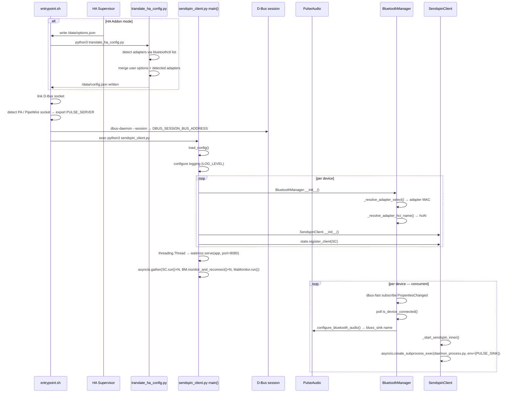
```mermaid
sequenceDiagram
    participant SH as entrypoint.sh
    participant HA as HA Supervisor
    participant TR as translate_ha_config.py
    participant PY as sendspin_client.py main()
    participant DB as D-Bus session
    participant PA as PulseAudio
    participant BM as BluetoothManager
    participant SC as SendspinClient

    alt HA Addon mode
        HA->>SH: write /data/options.json
        SH->>TR: python3 translate_ha_config.py
        TR->>TR: detect adapters via bluetoothctl list
        TR->>TR: merge user options + detected adapters
        TR-->>SH: /data/config.json written
    end

    SH->>SH: link D-Bus socket
    SH->>SH: detect PA / PipeWire socket → export PULSE_SERVER
    SH->>DB: dbus-daemon --session → DBUS_SESSION_BUS_ADDRESS

    SH->>PY: exec python3 sendspin_client.py
    PY->>PY: load_config()
    PY->>PY: configure logging (LOG_LEVEL)

    loop per device
        PY->>BM: BluetoothManager.__init__()
        BM->>BM: _resolve_adapter_select() → adapter MAC
        BM->>BM: _resolve_adapter_hci_name() → hciN
        PY->>SC: SendspinClient.__init__()
        PY->>SC: state.register_client(SC)
    end

    PY->>PY: threading.Thread → waitress.serve(app, port=8080)
    PY->>PY: asyncio.gather(SC.run()×N, BM.monitor_and_reconnect()×N, MaMonitor.run())

    loop per device — concurrent
        BM->>BM: dbus-fast subscribe PropertiesChanged
        BM->>BM: poll is_device_connected()
        BM->>PA: configure_bluetooth_audio() → bluez_sink name
        SC->>SC: _start_sendspin_inner()
        SC->>SC: asyncio.create_subprocess_exec(daemon_process.py, env={PULSE_SINK})
    end
```

---

## Аутентификация

Веб-интерфейс поддерживает **опциональную парольную защиту** через `routes/auth.py`. По умолчанию аутентификация отключена (`AUTH_ENABLED = False`) и включается в момент установки пароля через панель конфигурации.

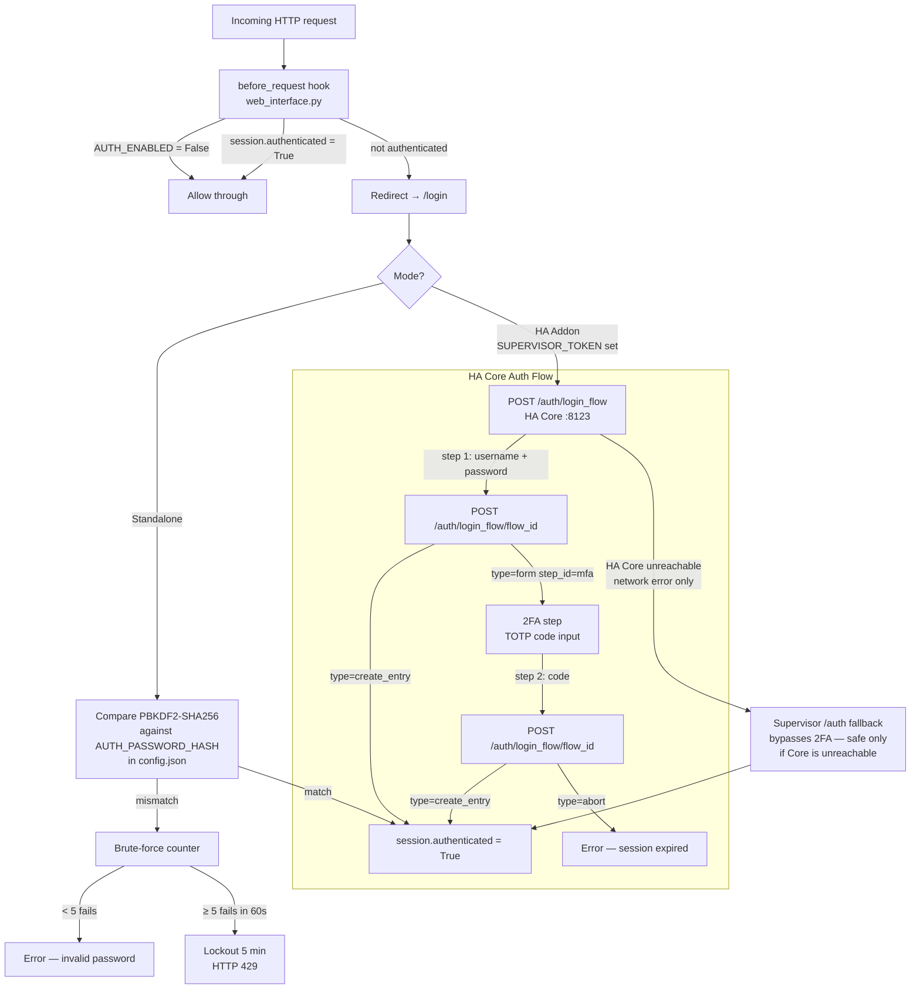
```mermaid
flowchart TD
    REQ[Incoming HTTP request] --> HOOK[before_request hook<br/>web_interface.py]
    HOOK -->|AUTH_ENABLED = False| PASS[Allow through]
    HOOK -->|session.authenticated = True| PASS
    HOOK -->|not authenticated| LOGIN[Redirect → /login]

    LOGIN --> MODE{Mode?}
    MODE -->|Standalone| PBKDF2[Compare PBKDF2-SHA256<br/>against AUTH_PASSWORD_HASH<br/>in config.json]
    MODE -->|HA Addon<br/>SUPERVISOR_TOKEN set| HA_FLOW

    subgraph "HA Core Auth Flow"
        HA_FLOW[POST /auth/login_flow<br/>HA Core :8123]
        HA_FLOW -->|step 1: username + password| HA_STEP[POST /auth/login_flow/flow_id]
        HA_STEP -->|type=create_entry| OK[session.authenticated = True]
        HA_STEP -->|type=form step_id=mfa| MFA[2FA step<br/>TOTP code input]
        MFA -->|step 2: code| HA_STEP2[POST /auth/login_flow/flow_id]
        HA_STEP2 -->|type=create_entry| OK
        HA_STEP2 -->|type=abort| FAIL[Error — session expired]
    end

    HA_FLOW -->|HA Core unreachable<br/>network error only| SUPER[Supervisor /auth fallback<br/>bypasses 2FA — safe only<br/>if Core is unreachable]
    SUPER --> OK

    PBKDF2 -->|match| OK
    PBKDF2 -->|mismatch| BF[Brute-force counter]
    BF -->|< 5 fails| FAIL2[Error — invalid password]
    BF -->|≥ 5 fails in 60s| LOCK[Lockout 5 min<br/>HTTP 429]
```

### Защита от перебора

Ограничитель скорости запросов в памяти (словарь `_failed` в `routes/auth.py`) отслеживает ошибки по IP клиента:

| Порог | Окно | Действие |
|---|---|---|
| 5 неудачных попыток | 60 секунд | IP блокируется на 5 минут |
| 1 успешный вход | — | Счётчик ошибок сбрасывается |
| Истечение 5-минутной блокировки | — | Счётчик автоматически сбрасывается |

### Аутентификация HA Addon с поддержкой 2FA

При наличии `SUPERVISOR_TOKEN` бридж аутентифицируется через **HA Core** (а не только через Supervisor API) для поддержки **2FA / TOTP**:

1. Начало процесса входа через `POST {HA_CORE_URL}/auth/login_flow`
2. Отправка учётных данных через `POST {HA_CORE_URL}/auth/login_flow/{flow_id}`
3. Если ответ `type=form, step_id=mfa` → запрос TOTP-кода
4. Отправка кода через ещё один шаг процесса

**Откат к Supervisor `/auth`** используется только если HA Core **недостижим по сети** (ошибка DNS, отказ соединения). Если HA Core отвечает HTTP-ошибкой, откат **заблокирован** для предотвращения обхода MFA.

### Сессия

Серверная Flask-сессия со случайно сгенерированным `SECRET_KEY`, хранящимся в `config.json`. Ключ сохраняется между перезапусками (генерируется один раз при первом запуске и сохраняется). Сессионные куки помечены `HttpOnly` и истекают при закрытии браузера.

---

## Keepalive-тишина

Некоторые Bluetooth-колонки автоматически отключаются после периода тишины. Когда для устройства настроен `keepalive_interval` (≥ 30 с), основной процесс периодически отправляет короткий пакет тихого PCM-аудио для предотвращения отключения.

```
device.keepalive_interval = 30  →  silence burst every 30 s
device.keepalive_interval = 0   →  disabled (default)
```

---

## Деградация без сбоев

Бридж разработан так, чтобы оставаться функциональным при недоступности опциональных системных библиотек или сервисов. У каждой опциональной зависимости есть определённый запасной вариант:

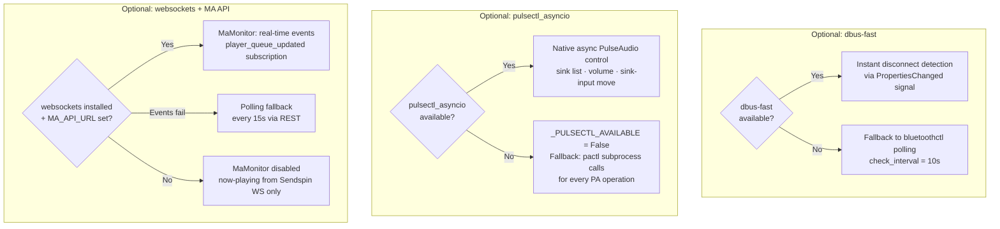
```mermaid
graph TD
    subgraph "Optional: dbus-fast"
        DBUS_CHK{dbus-fast<br/>available?}
        DBUS_CHK -->|Yes| DBUS_ON[Instant disconnect detection<br/>via PropertiesChanged signal]
        DBUS_CHK -->|No| DBUS_OFF[Fallback to bluetoothctl polling<br/>check_interval = 10s]
    end

    subgraph "Optional: pulsectl_asyncio"
        PA_CHK{pulsectl_asyncio<br/>available?}
        PA_CHK -->|Yes| PA_ON[Native async PulseAudio control<br/>sink list · volume · sink-input move]
        PA_CHK -->|No| PA_OFF[_PULSECTL_AVAILABLE = False<br/>Fallback: pactl subprocess calls<br/>for every PA operation]
    end

    subgraph "Optional: websockets + MA API"
        WS_CHK{websockets installed<br/>+ MA_API_URL set?}
        WS_CHK -->|Yes| WS_ON[MaMonitor: real-time events<br/>player_queue_updated subscription]
        WS_CHK -->|Events fail| WS_POLL[Polling fallback<br/>every 15s via REST]
        WS_CHK -->|No| WS_OFF[MaMonitor disabled<br/>now-playing from Sendspin WS only]
    end
```

| Опциональная зависимость | Флаг / Проверка | Полный режим | Режим деградации |
|---|---|---|---|
| `dbus-fast` (async D-Bus) | `ImportError` при импорте | Мгновенное обнаружение отключения BT через сигнал `PropertiesChanged` | Опрос через `bluetoothctl` каждые `check_interval` (10 с) |
| `pulsectl_asyncio` | `_PULSECTL_AVAILABLE` | Нативный async PulseAudio: список синков, громкость, перемещение sink-inputs | Все PA-операции через подпроцессы `pactl` |
| `websockets` + настроенный `MA_API_URL` | `ImportError` + проверка конфигурации | События MA в реальном времени (`player_queue_updated`) | Опрос каждые 15 с; без настроенного MA API — MaMonitor полностью отключён |

> **Примечание:** При запуске все откаты записываются в лог на уровне `WARNING` или `INFO`, чтобы операторы могли диагностировать активные функции. Проверьте логи контейнера на наличие строк вида `"pulsectl_asyncio unavailable — falling back to pactl subprocess"` или `"D-Bus monitor unavailable — using bluetoothctl polling"`.

---

## Модель потоков и задач


```mermaid
graph TD
    subgraph "Main Thread — asyncio event loop"
        EL[asyncio.get_event_loop&#40;&#41;]
        EL --> T1[SendspinClient.run&#40;&#41; × N<br/>coroutine]
        EL --> T2[BluetoothManager.monitor_and_reconnect&#40;&#41; × N<br/>coroutine]
        EL --> T3[MaMonitor.run&#40;&#41;<br/>coroutine]
        T1 --> T4[_read_subprocess_output&#40;&#41;<br/>asyncio.Task]
        T1 --> T5[_read_subprocess_stderr&#40;&#41;<br/>asyncio.Task]
        T1 --> T6[_status_monitor_loop&#40;&#41;<br/>asyncio.Task]
        T2 --> T7[run_in_executor&#40;bluetoothctl&#41;<br/>ThreadPoolExecutor]
    end

    subgraph "Daemon Thread — Waitress"
        WT[waitress.serve&#40;&#41;<br/>WSGI thread pool]
        WT --> W1[Flask request handler × M<br/>WSGI worker threads]
    end

    subgraph "Background Threads"
        BT1[_run_bt_scan&#40;&#41;<br/>threading.Thread<br/>per scan request]
    end

    LOCK[threading.Lock<br/>state._clients_lock<br/>config.config_lock<br/>SendspinClient._status_lock]

    W1 <-->|acquire| LOCK
    T7 <-->|acquire| LOCK
```

> **Примечание:** Все вызовы подпроцесса `bluetoothctl` в асинхронном цикле мониторинга BT диспетчеризируются через `loop.run_in_executor(None, …)` для предотвращения блокировки event loop. `_bt_executor` — это выделенный `ThreadPoolExecutor(max_workers=2)`.

---

## Подсистемы надёжности

### Watchdog зомби-воспроизведения

Главный процесс запускает периодический мониторинг статуса (`_status_monitor_loop`), который обнаруживает **зомби-воспроизведение** — ситуации, когда `playing=True`, но `streaming=False` более 15 секунд. Это отлавливает сломанные аудио-пайплайны, где соединение sendspin живо, но аудиоданные не поступают.

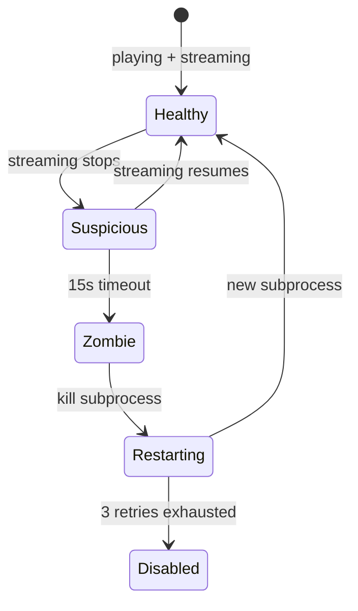
```mermaid
stateDiagram-v2
    [*] --> Healthy: playing + streaming
    Healthy --> Suspicious: streaming stops
    Suspicious --> Healthy: streaming resumes
    Suspicious --> Zombie: 15s timeout
    Zombie --> Restarting: kill subprocess
    Restarting --> Healthy: new subprocess
    Restarting --> Disabled: 3 retries exhausted
```

При обнаружении подпроцесс убивается и перезапускается, до 3 попыток. После 3 неудач watchdog прекращает попытки для этого устройства.

### Изоляция BT Churn

Опциональная функция (`BT_CHURN_THRESHOLD`, по умолчанию 0 = отключено), отслеживающая частоту переподключений устройства в скользящем окне (`BT_CHURN_WINDOW`, по умолчанию 300 с). Если устройство переподключается чаще порога в пределах окна, BT-управление автоматически отключается — предотвращая ситуацию, когда нестабильная колонка занимает адаптер и дестабилизирует другие динамики.

---

## Граф зависимостей

```mermaid
graph LR
    SC[sendspin_client.py] --> BM[bluetooth_manager.py]
    SC --> ST[state.py]
    SC --> CFG[config.py]
    SC --> SVC_BD[services/bridge_daemon.py]

    WI[web_interface.py] --> FLASK[Flask + Waitress]
    WI --> R_API[routes/api.py]
    WI --> R_BT[routes/api_bt.py]
    WI --> R_MA[routes/api_ma.py]
    WI --> R_CFG[routes/api_config.py]
    WI --> R_STS[routes/api_status.py]
    WI --> R_VIEW[routes/views.py]
    WI --> R_AUTH[routes/auth.py]

    R_API --> ST
    R_API --> CFG
    R_MA --> SVC_MAC[services/ma_client.py]
    R_BT --> SVC_BT[services/bluetooth.py]

    BM --> SVC_PA[services/pulse.py]
    BM --> SVC_BT

    SVC_BD --> SVC_PA
    SVC_BD --> SENDSPIN[sendspin-cli<br/>aiosendspin]

    DP[services/daemon_process.py] --> SVC_BD
    DP --> SENDSPIN

    ST --> MM[services/ma_monitor.py]
    MM --> SVC_MAC

    SC --> UC[services/update_checker.py]
    UC -.->|GitHub API| GH[(GitHub Releases)]

    DEMO[demo/__init__.py] -.->|patches| SC
    DEMO -.->|patches| BM
    DEMO -.->|patches| SVC_PA
    DEMO_SIM[demo/simulator.py] --> ST
    DEMO_FIX[demo/fixtures.py] --> DEMO

    CFG -.->|config.json| JSON[(config.json)]
    HA_SCRIPT[scripts/translate_ha_config.py] -.->|options.json→config.json| JSON
```

---

## Внешние зависимости

| Пакет | Роль |
|---|---|
| `aiosendspin` | Асинхронная клиентская библиотека Sendspin WebSocket |
| `sendspin` (local) | CLI + средство запуска демона (`SendspinDaemon`) |
| `Flask` + `Waitress` | Веб-интерфейс и REST API сервер |
| `pulsectl_asyncio` | Асинхронное управление PulseAudio (маршрутизация синков, громкость) |
| `dbus-fast` | Async D-Bus для мгновенного обнаружения отключения BT |
| `websockets` | WebSocket-соединение MA API в `MaMonitor` |
| `aiohttp` / `httpx` | Вызовы MA REST API в `ma_client.py` |
| `bluetoothctl` | Системное управление BT (подпроцесс) |
| `pactl` | Обнаружение аудио-синков (подпроцесс, устаревший путь) |

---

## Диаграмма контекста C4

Высокоуровневый обзор sendspin-bt-bridge и его внешних взаимодействий.

```mermaid
C4Context
    title System Context — Sendspin Bluetooth Bridge

    Person(user, "Пользователь", "Управляет колонками через<br/>веб-интерфейс или панель HA")

    System(bridge, "Sendspin BT Bridge", "Многопроцессный Python-сервис,<br/>соединяющий аудио MA → BT-колонки")

    System_Ext(ma, "Music Assistant", "Сервер потоковой музыки<br/>протокол Sendspin (WS + FLAC)")
    System_Ext(ha, "Home Assistant", "Платформа умного дома<br/>хост аддона / провайдер аутентификации")
    System_Ext(bt, "Bluetooth-колонки", "A2DP-аудиосинки<br/>через BlueZ / PulseAudio")
    System_Ext(github, "GitHub Releases", "Проверка обновлений<br/>опрос API каждый час")

    Rel(user, bridge, "Веб-интерфейс / REST API", "HTTP / SSE")
    Rel(user, ha, "Панель Home Assistant", "HTTP")
    Rel(bridge, ma, "WebSocket Sendspin", "WS + FLAC/RAW")
    Rel(bridge, ma, "MA REST API", "HTTP")
    Rel(bridge, bt, "A2DP-аудиопоток", "Bluetooth")
    Rel(bridge, ha, "Ingress / Auth", "HTTP")
    Rel(bridge, github, "Проверка обновлений", "HTTPS")
    Rel(ha, ma, "Интеграция", "API")
```

---

## IPC-последовательность — изменение громкости

Сквозной сценарий, когда пользователь меняет громкость через веб-интерфейс.

```mermaid
sequenceDiagram
    participant UI as Web UI (браузер)
    participant API as Flask API<br/>routes/api.py
    participant SC as SendspinClient
    participant DP as daemon_process.py<br/>(подпроцесс)
    participant PA as PulseAudio
    participant MA as Music Assistant

    UI->>API: POST /api/volume {mac, volume: 60}
    API->>SC: send_command({cmd: set_volume, value: 60})
    SC->>DP: stdin JSON: {"cmd":"set_volume","value":60}
    DP->>PA: pulsectl set_sink_volume(60)
    PA-->>DP: OK
    DP->>MA: MediaCommand.VOLUME_SET (если VOLUME_VIA_MA)
    DP-->>SC: stdout JSON: {"type":"status","volume":60}
    SC->>SC: _update_status({volume: 60})
    SC->>SC: save_device_volume(mac, 60) [дебаунс 1 с]
    SC-->>API: notify_status_changed()
    API-->>UI: SSE event: {"volume": 60, ...}
```

---

## Поток работы проверки обновлений

Фоновый опрос версий теперь использует **channel-aware выбор релизов**, а не только stable-эндпоинт `releases/latest`.

```mermaid
flowchart TD
    START([startup main&#40;&#41;]) --> DELAY[Ждать 30 с<br/>дать приложению инициализироваться]
    DELAY --> LOADCFG[load_config&#40;&#41; · нормализовать UPDATE_CHANNEL]
    LOADCFG --> FETCH[Получить список GitHub Releases<br/>api.github.com/repos/.../releases?per_page=100]
    FETCH --> FILTER[Игнорировать drafts · оставить теги нужного канала]
    FILTER --> PICK[Выбрать максимальный semver<br/>для stable / rc / beta]
    PICK --> CMP{remote > current?}

    CMP -->|Да| FOUND[Сохранить update info в state.py<br/>version · url · body · channel]
    CMP -->|Нет| CLEAR[Сбросить update_available]

    FOUND --> BADGE[UI: channel-aware бейдж обновления]
    CLEAR --> SLEEP
    BADGE --> SLEEP[Спать 3600 с]
    SLEEP --> LOADCFG

    subgraph "Действия пользователя"
        BADGE --> CLICK[Пользователь открывает модалку обновления]
        CLICK --> MODAL{GET /api/update/info<br/>определить runtime}
        MODAL -->|systemd / LXC| LXC_BTN["POST /api/update/apply<br/>ставит upgrade.sh в очередь через systemd-run"]
        MODAL -->|docker| DOCKER_CMD["Показать channel-aware подсказку по образам<br/>stable / rc / beta tag"]
        MODAL -->|ha_addon| HA_MSG["Отправить в UI аддонов HA<br/>там обновляется установленный трек"]
    end
```

Для Home Assistant установленный трек аддона по-прежнему определяет, что именно будет обновлять Supervisor. Внутренний параметр `UPDATE_CHANNEL` меняет только то, какой канал GitHub-релизов подсвечивается в UI и API бриджа.

## Архитектура демо-режима

Когда `DEMO_MODE=true`, бридж запускается с полностью эмулированным оборудованием (v2.23.0+).

```mermaid
graph TD
    subgraph "Патчи демо-режима — demo/__init__.py"
        INSTALL["install(config)<br/>вызывается из main()"]
        INSTALL --> BT_PATCH[Патч BluetoothManager<br/>Эмуляция connect/disconnect<br/>Случайный заряд батареи]
        INSTALL --> PULSE_PATCH[Патч services.pulse<br/>Состояние volume/mute на словарях<br/>Отслеживание по sink]
        INSTALL --> CLIENT_PATCH[Патч SendspinClient<br/>Без реального подпроцесса<br/>_FakeProc sentinel]
        INSTALL --> MA_PATCH[Патч команд MA<br/>send_player_cmd → noop<br/>ma_group_play → распространение по группе]
        INSTALL --> FIXTURES[Загрузить fixtures.py<br/>5 устройств + 3 sync groups<br/>BT-адаптеры + MA discovery]
    end

    subgraph "Симулятор демо — demo/simulator.py"
        SIM[run_simulator] --> TRACKS[Подобранный плейлист<br/>10 реальных треков с метаданными]
        SIM --> CYCLE[Ротация треков по устройствам<br/>Обновление elapsed_ms на каждом тике]
        SIM --> PLAY_PAUSE[Случайные play/pause-переходы<br/>Реалистичный тайминг]
    end

    subgraph "Результат"
        WEB[Веб-интерфейс на :8080<br/>Все функции работают]
        SSE[SSE-обновления<br/>Изменения статуса в реальном времени]
        API[REST API<br/>Отвечают все 42 эндпоинта]
    end

    INSTALL --> SIM
    SIM --> WEB
    SIM --> SSE
    SIM --> API
```
