Референсное развёртывание, используемое при разработке и тестировании Sendspin BT Bridge v2.12.2.

## Физическая топология

```mermaid
graph TB
    subgraph net["LAN 192.168.10.0/24"]
        direction TB

        subgraph turris["Turris Omnia — Marvell Armada 385 ARMv7 / 2 ГБ ОЗУ"]
            direction TB
            T_HOST["TurrisOS 9.0.4 / OpenWrt<br/>turris.my.lan<br/>роутер + DHCP + DNS"]
            T_USB["USB: CSR8510 A10<br/>0a12:0001"]
            subgraph T_LXC["LXC sendspin — Ubuntu 24.04 armv7l — turris-lxc.my.lan"]
                T_DBUS["D-Bus system bus<br/>bind-mount с хоста"]
                T_PA["PulseAudio 16.1 --system<br/>user pulse uid=109"]
                T_BLUEZ["BlueZ 5.72<br/>bluetoothctl"]
                T_SBB["SBB v2.12.2<br/>Python 3.12.3<br/>aiosendspin 4.3.2"]
                T_WEB["Flask 3.1.3 + Waitress 3.0.2<br/>:8080"]
                T_DBUS --> T_BLUEZ
                T_DBUS --> T_PA
                T_PA --> T_SBB
                T_BLUEZ --> T_SBB
                T_SBB --> T_WEB
            end
            T_HOST --> T_USB
            T_USB -.->|D-Bus passthrough| T_DBUS
        end

        subgraph proxmox["HP ProLiant MicroServer Gen8 — Celeron G1610T 2.3 ГГц / 16 ГБ ОЗУ"]
            direction TB
            P_HOST["Proxmox VE 8.4.16<br/>Debian 12 Bookworm<br/>Kernel 6.8.12-18-pve<br/>proxmox.my.lan"]
            P_USB1["USB Bus 4: CSR8510 A10<br/>PVE mapping: Audio"]
            P_USB2["USB Bus 2: CSR8510 A10<br/>PVE mapping: aTick"]
            P_ZIG["USB: SONOFF Zigbee 3.0<br/>1a86:55d4"]

            subgraph P_VM["VM 104 haos — QEMU/KVM — 2 vCPU / 6 ГБ ОЗУ / 64 ГБ диск"]
                P_HAOS["Home Assistant OS<br/>haos.my.lan"]
                P_ADDON["SBB v2.12.2 addon<br/>85b1ecde-sendspin-bt-bridge<br/>3 устройства / группа синхронизации"]
                P_HAOS --> P_ADDON
            end

            subgraph P_CT["CT 101 sendspin — LXC — 2 vCPU / 1 ГБ ОЗУ / 8 ГБ диск"]
                P_DBUS["D-Bus system bus"]
                P_PA["PulseAudio 16.1"]
                P_BLUEZ2["BlueZ 5.72"]
                P_SBB["SBB v2.12.2<br/>Ubuntu 24.04 x86_64<br/>Python 3.12.3"]
                P_WEB2["Flask 3.1.3 + Waitress 3.0.2<br/>:8080"]
                P_DBUS --> P_BLUEZ2
                P_DBUS --> P_PA
                P_PA --> P_SBB
                P_BLUEZ2 --> P_SBB
                P_SBB --> P_WEB2
            end

            P_HOST --> P_USB1
            P_HOST --> P_USB2
            P_HOST --> P_ZIG
            P_USB1 -->|USB passthrough| P_VM
            P_USB2 -.->|D-Bus passthrough| P_DBUS
            P_ZIG -->|USB passthrough| P_VM
        end

        subgraph ma_box["Сервер Music Assistant"]
            MA["MA haos.my.lan:8095<br/>Sendspin protocol :9000<br/>mDNS auto-discovery"]
        end
    end

    P_ADDON -->|"WS :8928 :8929 :8932"| MA
    P_SBB -->|"WS :8928"| MA
    T_SBB -->|"WS :8928"| MA

    style net fill:none,stroke:#666
    style turris fill:#1a3a1a,stroke:#4a4
    style proxmox fill:#1a1a3a,stroke:#44a
    style ma_box fill:#3a1a1a,stroke:#a44
    style P_VM fill:#2a2a1a,stroke:#aa4
    style P_CT fill:#1a2a2a,stroke:#4aa
    style T_LXC fill:#1a2a2a,stroke:#4aa
```

## Маршрутизация аудио

```mermaid
graph LR
    subgraph haos_bridge["HAOS Addon — hci0 C0:FB:F9:62:D6:9D"]
        direction TB
        H_MA["MA :9000"] -->|FLAC 44100/16/2| H_D1["daemon :8928<br/>PULSE_SINK=bluez_sink<br/>.FC_58_FA_EB_08_6C<br/>.a2dp_sink"]
        H_MA -->|FLAC 44100/16/2| H_D2["daemon :8929<br/>PULSE_SINK=bluez_sink<br/>.2C_D2_6B_B8_EC_5B<br/>.a2dp_sink"]
        H_MA -->|FLAC 44100/16/2| H_D3["daemon :8932<br/>PULSE_SINK=bluez_sink<br/>.30_21_0E_0A_AE_5A<br/>.a2dp_sink"]
    end

    subgraph proxmox_bridge["Proxmox LXC — hci0 00:15:83:FF:8F:2B"]
        P_MA["MA :9000"] -->|FLAC 44100/16/2| P_D1["daemon :8928<br/>PULSE_SINK=bluez_sink<br/>.6C_5C_3D_35_17_99<br/>.a2dp_sink"]
    end

    subgraph turris_bridge["Turris LXC — hci0 C0:FB:F9:62:D7:D6"]
        T_MA["MA :9000"] -->|FLAC 44100/16/2| T_D1["daemon :8928<br/>PULSE_SINK=bluez_sink<br/>.20_74_CF_61_FB_D8<br/>.a2dp_sink"]
    end

    H_D1 -->|"A2DP / -500ms"| S1["ENEBY20<br/>58%"]
    H_D2 -->|"A2DP / -500ms"| S2["Yandex mini<br/>52%"]
    H_D3 -->|"A2DP / -500ms"| S3["Lenco LS-500<br/>52%"]
    P_D1 -->|"A2DP / -900ms"| S4["ENEBY Portable<br/>59%"]
    T_D1 -->|"A2DP / -500ms"| S5["AfterShokz<br/>67%"]

    style haos_bridge fill:#2a2a1a,stroke:#aa4
    style proxmox_bridge fill:#1a2a2a,stroke:#4aa
    style turris_bridge fill:#1a3a1a,stroke:#4a4
```

## Реестр плееров MA

```mermaid
graph TB
    subgraph ma_players["Music Assistant — 9 зарегистрированных плееров"]
        direction TB

        subgraph sync_group["Группа синхронизации: Sendspin BT"]
            SG["мультирум на весь дом"]
        end

        subgraph bt_players["Плееры Sendspin BT Bridge"]
            direction LR
            P1["ENEBY20 @ HAOS<br/>host: 85b1ecde"]
            P2["Yandex mini @ HAOS<br/>host: 85b1ecde"]
            P3["Lenco LS-500 @ HAOS<br/>host: 85b1ecde"]
            P4["ENEBY Portable @ LXC<br/>host: sendspin"]
            P5["AfterShokz @ OpenWRT<br/>host: ubuntu"]
        end

        subgraph other_players["Прочие плееры"]
            direction LR
            P6["MacBook Pro<br/>Sendspin desktop"]
            P7["Web Chrome x2<br/>браузерные плееры"]
        end

        SG ---|участник| P1
        SG ---|участник| P2
        SG ---|участник| P3
        SG ---|участник| P4
        SG ---|участник| P5
    end

    style ma_players fill:none,stroke:#666
    style sync_group fill:#3a1a1a,stroke:#a44
    style bt_players fill:#1a1a3a,stroke:#44a
    style other_players fill:#1a1a1a,stroke:#666
```

## Экземпляры мостов

### 1. HAOS Addon — `haos.my.lan:8080`

Работает как аддон Home Assistant внутри ВМ HAOS на Proxmox.

| Параметр | Значение |
|----------|----------|
| **Хост** | Proxmox VE 8.4.16, VM 104 (HAOS), 2 ядра, 6 ГБ ОЗУ |
| **Платформа** | Home Assistant OS |
| **Имя хоста** | `85b1ecde-sendspin-bt-bridge` |
| **Версия моста** | 2.12.2 (сборка 2026-03-05) |
| **BT адаптер** | CSR8510 A10 через USB passthrough (`C0:FB:F9:62:D6:9D`, hci0) |
| **Аудио** | PulseAudio 16.1, A2DP sinks |
| **Сервер MA** | auto:9000 (mDNS) |

**Устройства (3):**

| Плеер | BT MAC | Порт Sendspin | PA sink | Громкость | Задержка |
|-------|--------|---------------|---------|-----------|----------|
| ENEBY20 @ HAOS | `FC:58:FA:EB:08:6C` | 8928 | `bluez_sink.FC_58_FA_EB_08_6C.a2dp_sink` | 58% | −500 мс |
| Yandex mini @ HAOS | `2C:D2:6B:B8:EC:5B` | 8929 | `bluez_sink.2C_D2_6B_B8_EC_5B.a2dp_sink` | 52% | −500 мс |
| Lenco LS-500 @ HAOS | `30:21:0E:0A:AE:5A` | 8932 | `bluez_sink.30_21_0E_0A_AE_5A.a2dp_sink` | 52% | −500 мс |

Все 3 устройства объединены в группу синхронизации MA `b55d7f67-acc2-4cba-b37e-9fbd3eb3b410` для мультирум-воспроизведения. Интеграция MA API активна (двусторонняя синхронизация громкости и управления).

### 2. Proxmox LXC — `proxmox-lxc.my.lan:8080`

Работает как systemd-сервис внутри LXC-контейнера на Proxmox.

| Параметр | Значение |
|----------|----------|
| **Хост** | Proxmox VE 8.4.16, CT 101, 2 ядра, 1 ГБ ОЗУ, 8 ГБ диск |
| **ОС** | Ubuntu 24.04 LTS (Noble Numbat), x86_64 |
| **Имя хоста** | `sendspin` |
| **Версия моста** | 2.12.2 (сборка 2026-03-05) |
| **Python** | 3.12.3 |
| **BlueZ** | 5.72 |
| **PulseAudio** | 16.1 |
| **aiosendspin** | 4.3.2 |
| **Flask** | 3.1.3, Waitress 3.0.2 |
| **BT адаптер** | CSR8510 A10 (`00:15:83:FF:8F:2B`, hci0) |
| **Сервер MA** | auto:9000 (mDNS) |

**Устройства (1):**

| Плеер | BT MAC | Порт Sendspin | PA sink | Громкость | Задержка |
|-------|--------|---------------|---------|-----------|----------|
| ENEBY Portable @ LXC | `6C:5C:3D:35:17:99` | 8928 | `bluez_sink.6C_5C_3D_35_17_99.a2dp_sink` | 59% | −900 мс |

Интеграция MA API активна.

### 3. Turris LXC — `turris-lxc.my.lan:8080`

Работает как systemd-сервис внутри LXC-контейнера на роутере Turris Omnia (OpenWrt).

| Параметр | Значение |
|----------|----------|
| **Хост** | Turris Omnia, TurrisOS 9.0.4 (OpenWrt), Marvell Armada 385 ARMv7, 2 ГБ ОЗУ, 8 ГБ eMMC |
| **ОС** | Ubuntu 24.04.4 LTS (Noble Numbat), armv7l |
| **Имя хоста** | `ubuntu` |
| **Версия моста** | 2.12.2 (сборка 2026-03-05) |
| **Python** | 3.12.3 |
| **BlueZ** | 5.72 |
| **PulseAudio** | 16.1 |
| **aiosendspin** | 4.3.2 |
| **Flask** | 3.1.3, Waitress 3.0.2 |
| **BT адаптер** | CSR8510 A10 USB (`C0:FB:F9:62:D7:D6`, hci0) |
| **Сервер MA** | auto:9000 (mDNS) |

**Устройства (1):**

| Плеер | BT MAC | Порт Sendspin | PA sink | Громкость | Задержка |
|-------|--------|---------------|---------|-----------|----------|
| AfterShokz @ OpenWRT | `20:74:CF:61:FB:D8` | 8928 | `bluez_sink.20_74_CF_61_FB_D8.a2dp_sink` | 67% | −500 мс |

:::note[Особенности OpenWrt]
На хосте требуется пользователь `pulse` (uid 109) в `/etc/passwd` для аутентификации D-Bus EXTERNAL.
Без него PulseAudio внутри контейнера не может загрузить `module-bluez5-discover`, и аудиопрофили BT падают с ошибкой `br-connection-profile-unavailable`. См. [OpenWrt LXC README](https://github.com/trudenboy/sendspin-bt-bridge/blob/main/lxc/openwrt/README.md).
:::

## Сводка по оборудованию

### Хосты

| Хост | Оборудование | CPU | ОЗУ | Роль |
|------|-------------|-----|-----|------|
| **Proxmox** | HP ProLiant MicroServer Gen8 | Intel Celeron G1610T 2.3 ГГц, 2 ядра | 16 ГБ | Гипервизор ВМ/контейнеров |
| **Turris Omnia** | CZ.NIC Turris Omnia | Marvell Armada 385 ARMv7 1.6 ГГц, 2 ядра | 2 ГБ | Роутер + хост LXC |

### Bluetooth-адаптеры

Все адаптеры — CSR8510 A10 (Cambridge Silicon Radio) USB-донглы, USB ID `0a12:0001`.

| MAC адаптера | Расположение | Колонки |
|-------------|-------------|---------|
| `C0:FB:F9:62:D6:9D` | Proxmox → HAOS VM 104 (USB passthrough) | ENEBY20, Yandex mini, Lenco LS-500 |
| `00:15:83:FF:8F:2B` | Proxmox → CT 101 | ENEBY Portable |
| `C0:FB:F9:62:D7:D6` | Turris Omnia USB | AfterShokz |

### Bluetooth-колонки

| Колонка | Тип | BT MAC | Мост | Примечания |
|---------|-----|--------|------|------------|
| **IKEA ENEBY20** | Полочная колонка | `FC:58:FA:EB:08:6C` | HAOS | Участник мультирум-группы |
| **Yandex Station mini** | Умная колонка | `2C:D2:6B:B8:EC:5B` | HAOS | Участник мультирум-группы |
| **Lenco LS-500** | Проигрыватель с BT | `30:21:0E:0A:AE:5A` | HAOS | Участник мультирум-группы |
| **IKEA ENEBY Portable** | Портативная колонка | `6C:5C:3D:35:17:99` | Proxmox LXC | Автономный |
| **AfterShokz** | Наушники с костной проводимостью | `20:74:CF:61:FB:D8` | Turris LXC | Автономный |

## Music Assistant

| Параметр | Значение |
|----------|----------|
| **URL** | `http://haos.my.lan:8095` |
| **Хост** | HAOS VM 104 на Proxmox |
| **Всего плееров** | 9 (5 BT-мостов + 1 группа синхронизации + 2 веб + 1 десктоп) |
| **Группа синхронизации** | «Sendspin BT» — объединяет все колонки для мультирум |

## Сеть

Все устройства в плоской сети `192.168.10.0/24`. Turris Omnia — роутер/шлюз по адресу `turris.my.lan`.

| IP | Хост | Сервис |
|----|------|--------|
| `turris.my.lan` | Turris Omnia | Роутер, хост LXC |
| `haos.my.lan` | HAOS VM | Music Assistant (:8095), аддон моста (:8080) |
| `proxmox.my.lan` | Proxmox VE | Веб-интерфейс гипервизора (:8006) |
| `turris-lxc.my.lan` | Turris LXC | Мост (:8080) |
| `proxmox-lxc.my.lan` | Proxmox CT 101 | Мост (:8080) |

## Общий программный стек

Все LXC-экземпляры моста используют одинаковый стек:

| Компонент | Версия |
|-----------|--------|
| **Sendspin BT Bridge** | 2.12.2 |
| **Ubuntu** | 24.04 LTS |
| **Python** | 3.12.3 |
| **BlueZ** | 5.72 |
| **PulseAudio** | 16.1 |
| **aiosendspin** | 4.3.2 |
| **Flask** | 3.1.3 |
| **Waitress** | 3.0.2 |
